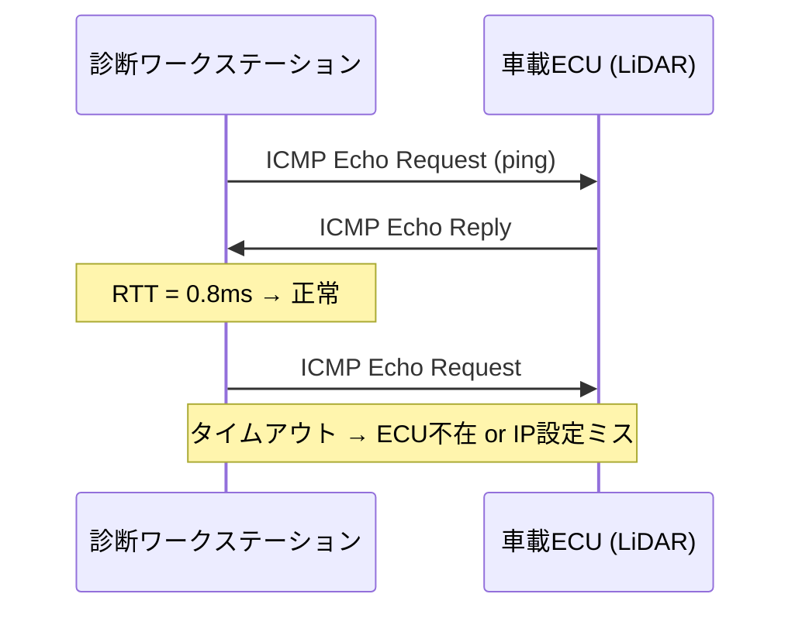

## 概要
ICMP(Internet Control Message Protocol)は、[[ip]] 通信のエラー通知や制御メッセージをやり取りするプロトコルです。最も身近な用途が `ping` で、相手に到達できるか・往復にどれだけ時間がかかるかを調べます。

## なぜ必要か
通信がうまくいかないとき、まず「相手まで届くのか」を確認する必要があります。ICMP(ping)は到達性と遅延を手早く確認できる、ネットワーク診断の第一歩です。

## 自動運転での利用例
車載Ethernetの立ち上げ時、各ECUにpingを打って到達性とIP設定を確認します。応答が無ければ配線・IP・VLAN設定のいずれかを疑う、という切り分けの起点になります。

## 関連用語
土台が [[ip]]、通信の中身を観測するのが [[wireshark]] です。

## 次に学ぶべき内容
IPアドレスの範囲を扱う [[subnet]] を学びましょう。

## 図解

