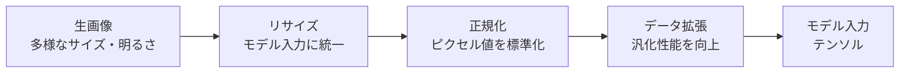

## 概要
深層学習で画像を扱う際には、モデルに合わせた前処理（リサイズ・正規化・データ拡張）が精度に大きく影響します。PyTorchの `torchvision.transforms` と OpenCV を組み合わせた実践的な前処理パイプラインを解説します。

## 前処理が重要な理由



## 可視化


## torchvision.transforms の基本

```python
import torchvision.transforms as T
from PIL import Image
import torch

# 学習時の変換パイプライン
train_transform = T.Compose([
    T.Resize((256, 256)),
    T.RandomCrop(224),                        # ランダムクロップ
    T.RandomHorizontalFlip(p=0.5),
    T.RandomRotation(degrees=15),
    T.ColorJitter(brightness=0.3, contrast=0.3, saturation=0.2, hue=0.1),
    T.ToTensor(),                             # PIL → [0,1] Tensor
    T.Normalize(mean=[0.485, 0.456, 0.406],  # ImageNet 統計値
                std =[0.229, 0.224, 0.225]),
])

# 検証・推論時（データ拡張なし）
val_transform = T.Compose([
    T.Resize(256),
    T.CenterCrop(224),
    T.ToTensor(),
    T.Normalize([0.485, 0.456, 0.406],
                [0.229, 0.224, 0.225]),
])

# 適用
img   = Image.open("photo.jpg").convert("RGB")
x     = train_transform(img)   # (3, 224, 224) Tensor
print(x.shape, x.min().item(), x.max().item())
```

**数式で表すと**

`ToTensor` で \([0,1]\) にスケールした後、チャンネルごとに平均 \(\mu_c\)・標準偏差 \(\sigma_c\) で標準化します：

$$
x'_{c} = \frac{x_c - \mu_c}{\sigma_c}
$$

各チャンネルの分布を平均0・分散1付近に揃えることで、学習が安定し収束が速くなります。

## Albumentations — 高速・高機能なデータ拡張

```python
import albumentations as A
import albumentations.pytorch as AP
import cv2
import numpy as np

# albumentations は numpy array (H, W, C) を入力とする
train_aug = A.Compose([
    A.Resize(256, 256),
    A.RandomCrop(224, 224),
    A.HorizontalFlip(p=0.5),
    A.VerticalFlip(p=0.2),
    A.Rotate(limit=20, p=0.5),

    # 色・明るさ系
    A.RandomBrightnessContrast(p=0.4),
    A.HueSaturationValue(p=0.3),
    A.CLAHE(p=0.2),

    # ノイズ・ブラー
    A.GaussNoise(p=0.2),
    A.MotionBlur(blur_limit=5, p=0.2),

    # カットアウト系（物体の一部を隠す）
    A.CoarseDropout(max_holes=8, max_height=32, max_width=32, p=0.3),
    A.GridDistortion(p=0.1),

    A.Normalize(mean=[0.485, 0.456, 0.406],
                std =[0.229, 0.224, 0.225]),
    AP.ToTensorV2(),
])

img_np = cv2.cvtColor(cv2.imread("photo.jpg"), cv2.COLOR_BGR2RGB)
result = train_aug(image=img_np)
tensor = result["image"]   # (3, 224, 224)
```

## カスタムDataset

```python
from torch.utils.data import Dataset, DataLoader
from pathlib import Path
from PIL import Image

class ImageDataset(Dataset):
    def __init__(self, root: str, split: str = "train", transform=None):
        root_path = Path(root) / split
        self.paths   = sorted(root_path.rglob("*.jpg"))
        self.labels  = [int(p.parent.name) for p in self.paths]  # フォルダ名=クラスID
        self.transform = transform

    def __len__(self):
        return len(self.paths)

    def __getitem__(self, idx):
        img   = Image.open(self.paths[idx]).convert("RGB")
        label = self.labels[idx]
        if self.transform:
            img = self.transform(img)
        return img, label

train_ds = ImageDataset("data/", split="train", transform=train_transform)
val_ds   = ImageDataset("data/", split="val",   transform=val_transform)

train_loader = DataLoader(train_ds, batch_size=32, shuffle=True,
                          num_workers=4, pin_memory=True)
```

## 画像正規化の仕組み

```python
import numpy as np
import matplotlib.pyplot as plt

# ピクセル統計の計算（大量データから）
def compute_stats(loader):
    mean = torch.zeros(3)
    std  = torch.zeros(3)
    n    = 0
    for imgs, _ in loader:
        b, c, h, w = imgs.shape
        mean += imgs.mean([0, 2, 3]) * b
        std  += imgs.std([0, 2, 3])  * b
        n    += b
    return (mean / n).tolist(), (std / n).tolist()

# 独自データのmean/stdを計算
# mean, std = compute_stats(loader_no_norm)

# 正規化の前後を比較
fig, axes = plt.subplots(1, 2, figsize=(10, 4))
img = Image.open("photo.jpg").convert("RGB")
x_raw  = T.ToTensor()(img).permute(1, 2, 0).numpy()
x_norm = val_transform(img).permute(1, 2, 0).numpy()
x_norm = (x_norm - x_norm.min()) / (x_norm.max() - x_norm.min())   # 表示用

axes[0].imshow(x_raw)
axes[0].set_title("正規化前")
axes[1].imshow(x_norm)
axes[1].set_title("正規化後（表示用に逆変換）")
plt.tight_layout()
plt.show()
```

## 特徴マップの可視化（Grad-CAM）

```python
import torch
import torchvision.models as models

class GradCAM:
    def __init__(self, model, target_layer):
        self.model = model
        self.grads  = None
        self.acts   = None
        target_layer.register_forward_hook(
            lambda m, i, o: setattr(self, "acts", o.detach())
        )
        target_layer.register_backward_hook(
            lambda m, gi, go: setattr(self, "grads", go[0].detach())
        )

    def generate(self, x, class_idx=None):
        self.model.eval()
        logits = self.model(x)
        if class_idx is None:
            class_idx = logits.argmax(1).item()
        logits[:, class_idx].sum().backward()

        weights = self.grads.mean(dim=[2, 3], keepdim=True)  # GAP
        cam     = (weights * self.acts).sum(dim=1, keepdim=True)
        cam     = torch.relu(cam)
        cam     = cam / (cam.max() + 1e-8)
        return cam.squeeze().cpu().numpy()
```

**数式で表すと**

各チャンネルの勾配を大域平均プーリングして重み \(\alpha_k\) とし、活性化マップ \(A^k\) の重み付き和に ReLU を適用します：

$$
\alpha_k = \frac{1}{HW}\sum_{i}\sum_{j}\frac{\partial y^c}{\partial A^k_{ij}}, \qquad L_{\text{Grad-CAM}}^c = \mathrm{ReLU}\!\left(\sum_k \alpha_k A^k\right)
$$

クラス \(c\) のスコアへの寄与が大きい特徴マップほど強調され、モデルが注目した領域が可視化されます。

```python
# 使用例
backbone   = models.resnet18(weights=models.ResNet18_Weights.DEFAULT)
grad_cam   = GradCAM(backbone, backbone.layer4[-1].conv2)

x = val_transform(Image.open("photo.jpg")).unsqueeze(0)
x.requires_grad_(True)
cam = grad_cam.generate(x)

# CAMを元画像に重ねる
import cv2
heatmap = cv2.applyColorMap(
    np.uint8(255 * cv2.resize(cam, (224, 224))),
    cv2.COLORMAP_JET
)
original = np.uint8(x.squeeze().permute(1,2,0).numpy() * 255)
overlay  = cv2.addWeighted(original, 0.6, heatmap, 0.4, 0)

plt.imshow(cv2.cvtColor(overlay, cv2.COLOR_BGR2RGB))
plt.title("Grad-CAM: モデルが注目している領域")
plt.show()
```

## 前処理パイプラインの設計指針

| 項目 | 推奨 |
|---|---|
| 入力サイズ | 224×224（ResNet系）/ 384×384（ViT系） |
| 正規化 | ImageNet統計値（転移学習時）、独自データ統計値（ゼロから学習時）|
| 基本拡張 | RandomCrop, HorizontalFlip はほぼ必須 |
| 強力な拡張 | RandAugment, CutMix, MixUp（精度を上げたい場合）|
| バッチサイズ | 32〜256（GPUメモリに合わせる）|
| num_workers | CPU コア数の半分程度 |
