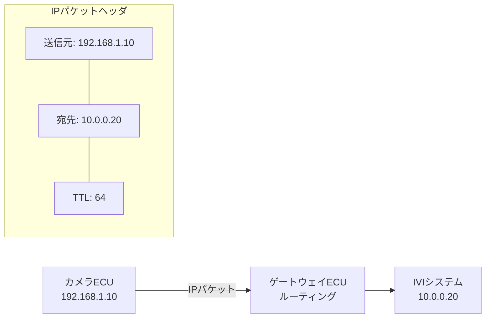

## 概要
IP(Internet Protocol)はOSIのネットワーク層(L3)を担い、データを「パケット」にして送信元IPから宛先IPへ届けます。ネットワークをまたいだ転送(ルーティング)を可能にする中核プロトコルです。IPv4とIPv6があります。

## なぜ必要か
[[mac-address]] は同じネットワーク内でしか使えませんが、IPは異なるネットワーク間でも宛先を指定できます。車内の複数ドメイン(サブネット)をまたいだECU間通信には不可欠です。

## 自動運転での利用例
車載Ethernetでは各ECUにIPアドレスが割り当てられ、SOME/IPやDoIP診断通信がIP上で動きます。ゾーンアーキテクチャでは、ゾーンごとにサブネットを分けて管理することもあります。

## 関連用語
IPの上で動く代表的なプロトコルが [[tcp]] と [[udp]] です。下位の物理転送は [[mac-address]] と [[ethernet]] が担います。

## 次に学ぶべき内容
信頼性の高い通信を実現する [[tcp]] を学びましょう。

## 図解

