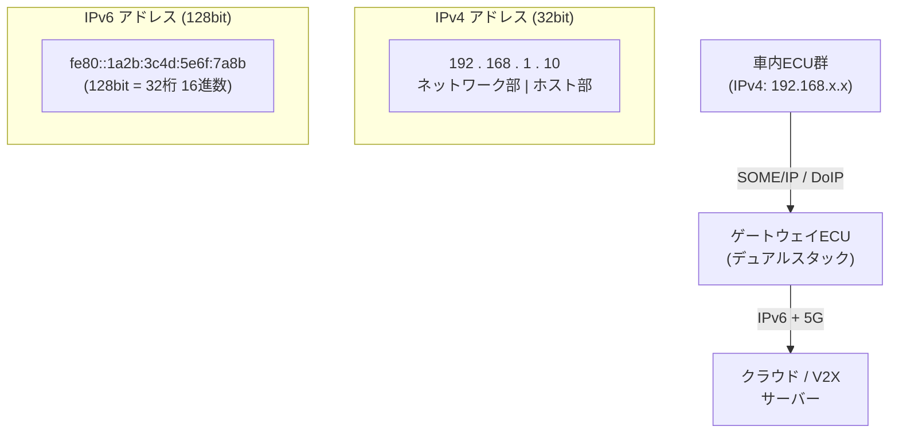

## 概要

**IPv4**（Internet Protocol version 4）と**IPv6**（Internet Protocol version 6）はどちらもネットワーク層でデバイスを識別し、パケットを届けるプロトコルです。アドレス枯渇問題を解決するためIPv6が設計されましたが、現在は両者が共存しています。

## アドレス空間の違い

| 項目 | IPv4 | IPv6 |
|------|------|------|
| アドレス長 | **32ビット** | **128ビット** |
| 表記 | `192.168.1.10` | `fe80::1a2b:3c4d:5e6f:7a8b` |
| 総アドレス数 | 約**43億** | 約**340澗**（340兆×1兆×1兆） |
| プレフィックス例 | `192.168.1.0/24` | `fd00::/8`（ユニークローカル） |

## ヘッダの違い

**IPv4ヘッダ**（20〜60バイト）にはチェックサムや断片化フィールドが含まれていますが、**IPv6ヘッダ**は**40バイト固定**でシンプルです。チェックサムは削除され、断片化はエンドポイントが行います。これにより**ルータの処理負荷が軽減**されます。

## 主な改善点（IPv6）

- **アドレス自動設定（SLAAC）**: DHCPなしでアドレスを自動生成
- **IPsec標準サポート**: セキュリティが設計段階から組み込まれている
- **マルチキャスト強化**: ブロードキャストを廃止し、マルチキャストに統一
- **フロールーベル**: リアルタイムトラフィックにQoS優先度を付与
- **拡張ヘッダ**: オプションを拡張ヘッダに分離し、基本ヘッダをシンプルに

## 車載ネットワークでの使い分け

現在の車載Ethernetは主に**IPv4**が使用されていますが、V2X・クラウド連携・5Gを活用する次世代SDVでは**IPv6**への移行が進んでいます。

| 用途 | プロトコル | 理由 |
|------|-----------|------|
| 車内ECU間通信 | IPv4 | 既存AUTOSAR・SOME/IP実装 |
| DoIP診断 | IPv4 | ISO 13400規格で定義 |
| V2X通信 | IPv6 | アドレス枯渇対策・モバイルIPv6 |
| OTAクラウド接続 | IPv4/IPv6 | デュアルスタック |
| 5G通信 | IPv6優先 | 3GPP標準 |

## 移行戦略：デュアルスタック

多くのゲートウェイECUは**デュアルスタック**（IPv4とIPv6を同時に動作）で構成されており、段階的にIPv6へ移行できます。

```
ゲートウェイECU
├── eth0: 192.168.1.1/24 (IPv4 ← 車内ECU向け)
└── eth1: fd00::1/64 (IPv6 ← クラウド/V2X向け)
```

## 図解


