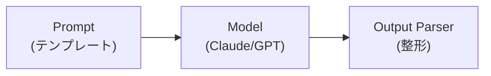
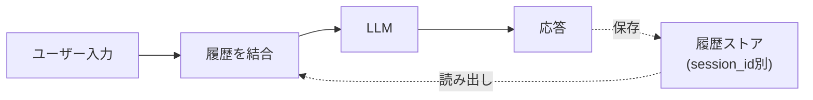
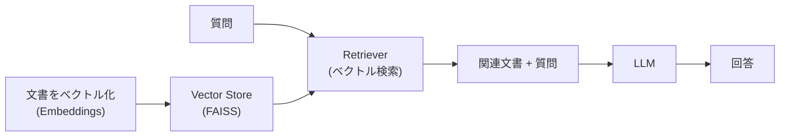
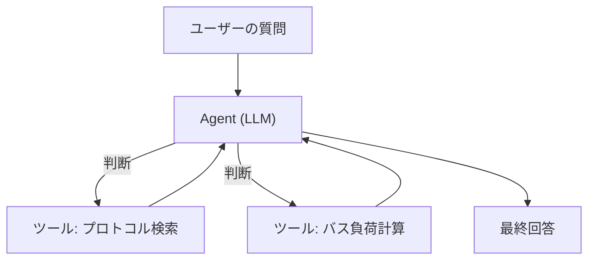

## 概要
LangChainはLLMを使ったアプリケーション開発を簡単にするPythonフレームワークです。プロンプト管理・チェーン処理・RAG（検索拡張生成）・エージェント・ツール呼び出しを統一したAPIで扱えます。OpenAI・Anthropic・ローカルLLMなど多様なモデルに対応します。

## LangChainの構成要素

LangChainは部品を組み合わせてLLMアプリを作る「レゴブロック」のような設計です。



| 要素 | 役割 |
|---|---|
| Model | LLM本体（ChatAnthropic / ChatOpenAI） |
| Prompt | 変数を埋め込めるテンプレート |
| Output Parser | 応答を文字列・JSON等に整形 |
| Retriever | 関連文書を検索（RAG用） |
| Tool / Agent | 外部処理の呼び出しと自律的な実行 |
| Memory | 会話履歴の保持 |

これらを `|`（パイプ）で繋ぐ記法を **LCEL（LangChain Expression Language）** と呼びます。

## 基本：モデル呼び出しとチェーン

最小構成は「プロンプト → モデル → パーサ」をパイプで繋ぐだけです。

```python
from langchain_anthropic import ChatAnthropic
from langchain_core.prompts import ChatPromptTemplate
from langchain_core.output_parsers import StrOutputParser

llm = ChatAnthropic(model="claude-opus-4-8", temperature=0.7)

prompt = ChatPromptTemplate.from_messages([
    ("system", "あなたは{domain}の専門家です。簡潔に答えてください。"),
    ("human",  "{question}"),
])

chain = prompt | llm | StrOutputParser()     # ← LCEL
print(chain.invoke({"domain": "車載ネットワーク", "question": "DoIPとは？"}))
```

変数（`{domain}` など）を `invoke` で渡すだけで、テンプレートが埋まりLLMに送られます。

## 会話履歴の管理

セッションIDごとに履歴を保持し、文脈を踏まえた応答ができます。仕組みは「過去のやり取りをプロンプトに差し込む」だけです。



`RunnableWithMessageHistory` でチェーンを包み、`session_id` を指定すると、前の発言を覚えたまま会話を続けられます。

## RAGパイプラインの構築

RAG（検索拡張生成）は、社内文書などからLLMに関連情報を渡して回答精度を上げる手法です。



| ステップ | 処理 |
|---|---|
| ① 文書をベクトル化 | Embeddingsモデルで数値ベクトルに変換 |
| ② ベクトルDBに格納 | FAISS等に保存 |
| ③ 質問で類似検索 | 質問に近い文書を取得 |
| ④ 文脈つきで生成 | 取得文書をプロンプトに入れLLMが回答 |

```python
from langchain_community.vectorstores import FAISS
from langchain_community.embeddings import HuggingFaceEmbeddings
from langchain.chains import create_retrieval_chain
from langchain.chains.combine_documents import create_stuff_documents_chain

emb = HuggingFaceEmbeddings(model_name="sentence-transformers/all-MiniLM-L6-v2")
retriever = FAISS.from_documents(docs, emb).as_retriever(search_kwargs={"k": 2})

qa_prompt = ChatPromptTemplate.from_messages([
    ("system", "コンテキストを使って答えてください:\n{context}"),
    ("human",  "{input}"),
])
rag = create_retrieval_chain(retriever, create_stuff_documents_chain(llm, qa_prompt))
print(rag.invoke({"input": "診断通信をEthernetで行うには？"})["answer"])
```

## ツール呼び出し（エージェント）

エージェントはLLMが「どのツールを使うべきか」を自分で判断し、計算やDB検索などを実行します。



`@tool` デコレータを付けた関数を渡すだけで、LLMが必要に応じて呼び出します。

```python
from langchain_core.tools import tool

@tool
def calculate_bus_load(rate: float, payload: int, kbps: float = 500) -> str:
    """CANバス負荷率を計算する"""
    bits = 47 + payload * 8            # フレームのオーバーヘッド込み
    return f"負荷率: {rate*bits/(kbps*1000)*100:.1f}%"
```

| 概念 | 説明 |
|---|---|
| Tool | LLMが呼べる関数（docstringが説明になる） |
| Agent | どのツールをどう使うか判断するLLM |
| AgentExecutor | 実際にツールを実行しループを回す |

## まとめ：何にLangChainを使うか

| やりたいこと | 使う機能 |
|---|---|
| 単発のQ&A | Prompt + Model + Parser |
| 文脈を覚える対話 | Memory（履歴管理） |
| 自社文書から回答 | RAG（Retriever + Vector Store） |
| 計算・検索を伴う処理 | Tool + Agent |
| リアルタイム表示 | `astream()` でストリーミング |

シンプルな用途ならLLMを直接呼ぶだけで十分ですが、RAGやエージェントのように複数部品を組み合わせる場面でLangChainの真価が出ます。
