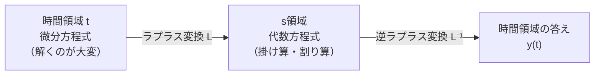

## ラプラス変換のひとことイメージ

**ラプラス変換（Laplace transform）** は、「時間 \(t\) の関数」を「複素数 \(s\) の関数」に変換する数学の道具です。いちばんのご利益は、

> **微分・積分という面倒な計算を、掛け算・割り算という簡単な代数計算に変えてしまう**

ことです。制御工学ではこの性質のおかげで、微分方程式で書かれたシステムの振る舞いを、代数式（伝達関数）として一気に扱えるようになります。



## 定義

時間関数 \(f(t)\)（\(t \ge 0\)）に対して、ラプラス変換 \(F(s)\) は次で定義されます。

$$
F(s) = \mathcal{L}\{f(t)\} = \int_0^{\infty} f(t)\, e^{-st}\, dt
$$

ここで \(s = \sigma + j\omega\) は複素数です。\(e^{-st}\) を掛けて積分することで、時間的な振る舞いを周波数と減衰の情報（複素平面上の点）に写し取ります。

> **フーリエ変換との関係**：フーリエ変換は \(s = j\omega\)（虚軸上）に限った特別な場合。ラプラス変換は実部 \(\sigma\) を加えて「減衰・発散する信号」まで扱えるように一般化したものです。[[fourier-analysis]] も参照。

## なぜ微分が掛け算になるのか

ラプラス変換の最重要公式が、微分の変換則です。

$$
\mathcal{L}\left\{ \frac{df}{dt} \right\} = s\,F(s) - f(0)
$$

$$
\mathcal{L}\left\{ \frac{d^2 f}{dt^2} \right\} = s^2 F(s) - s\,f(0) - f'(0)
$$

つまり **「微分する」＝「\(s\) を掛ける」**、**「積分する」＝「\(s\) で割る」** に対応します。初期値がゼロなら、\(n\) 階微分はただ \(s^n\) を掛けるだけです。これが微分方程式を代数方程式に変える魔法の正体です。

## よく使う変換ペア（変換表）

| 時間領域 \(f(t)\) | s領域 \(F(s)\) |
|---|---|
| \(\delta(t)\)（インパルス） | \(1\) |
| \(1\)（ステップ） | \(\dfrac{1}{s}\) |
| \(t\) | \(\dfrac{1}{s^2}\) |
| \(e^{-at}\) | \(\dfrac{1}{s+a}\) |
| \(\sin(\omega t)\) | \(\dfrac{\omega}{s^2+\omega^2}\) |
| \(\cos(\omega t)\) | \(\dfrac{s}{s^2+\omega^2}\) |
| \(e^{-at}\sin(\omega t)\) | \(\dfrac{\omega}{(s+a)^2+\omega^2}\) |

実務では、この表と部分分数分解を組み合わせて逆変換します。

## 例：微分方程式をラプラス変換で解く

**ばね・質量・ダンパ系**（自動車のサスペンションや、駐車時の車体の揺れのモデル）を考えます。

$$
m\ddot{y}(t) + c\dot{y}(t) + k y(t) = f(t)
$$

初期値ゼロでラプラス変換すると、微分が \(s\) の掛け算になり、

$$
(m s^2 + c s + k)\,Y(s) = F(s)
$$

$$
Y(s) = \frac{1}{m s^2 + c s + k}\, F(s)
$$

微分方程式が、ただの分数式になりました。この \(\dfrac{Y(s)}{F(s)}\) こそが **伝達関数** です（次の記事 [[transfer-function]] へ）。

## Python（SymPy）で確かめる

```python
import sympy as sp

t, s = sp.symbols("t s")
a, w = sp.symbols("a omega", positive=True)

# 代表的な関数のラプラス変換
for f in [sp.exp(-a*t), sp.sin(w*t), sp.cos(w*t), t]:
    F = sp.laplace_transform(f, t, s, noconds=True)
    print(f"L[{f}] = {F}")
```

```
L[exp(-a*t)] = 1/(a + s)
L[sin(omega*t)] = omega/(omega**2 + s**2)
L[cos(omega*t)] = s/(omega**2 + s**2)
L[t] = s**(-2)
```

**数式で表すと**、上のコードは変換表の各行

$$
\mathcal{L}\{e^{-at}\}=\frac{1}{s+a},\quad
\mathcal{L}\{\sin\omega t\}=\frac{\omega}{s^2+\omega^2}
$$

を数値的に再現しているだけです。

```python
# ばね・質量・ダンパ系の応答を逆ラプラス変換で求める
m, c, k = 1, 3, 2          # 質量・減衰・ばね定数
F = 1/s                    # 入力：単位ステップ力
Y = F / (m*s**2 + c*s + k) # 出力 Y(s)
y_t = sp.inverse_laplace_transform(Y, s, t)
print(sp.simplify(y_t))
```

```
(1/2 - exp(-t) + exp(-2*t)/2)*Heaviside(t)
```

**数式で表すと**、逆変換は部分分数分解

$$
Y(s)=\frac{1}{s(s+1)(s+2)}=\frac{1/2}{s}-\frac{1}{s+1}+\frac{1/2}{s+2}
$$

を各項の変換表対応に戻したもので、\(y(t)=\tfrac12 - e^{-t} + \tfrac12 e^{-2t}\) と求まります。

## ラプラス変換でできること

- **微分方程式を代数的に解く**（回路・機械・熱・流体など、あらゆる線形システム）
- **伝達関数**を作り、システムの入出力を分数式で表す → [[transfer-function]]
- **ブロック線図**でシステムを組み合わせる（掛け算・足し算で合成）→ [[block-diagram]]
- **安定性の判定**：分母 \(=0\) の根（極）が複素平面の左半面にあれば安定
- **過渡応答・定常応答の予測**：ステップ応答・インパルス応答の設計
- **PID制御などの制御系設計**（周波数特性、極配置）→ [[control-engineering]]

## まとめ

- ラプラス変換は時間領域 \(t\) を複素周波数領域 \(s\) に写す変換
- **微分 → \(s\) の掛け算**、**積分 → \(s\) で割る** に化けるのが最大の利点
- 微分方程式が代数方程式になり、システムを **伝達関数** として扱える
- 制御工学・信号処理・回路解析の共通言語であり、MATLAB/Simulink もこの上に成り立つ
