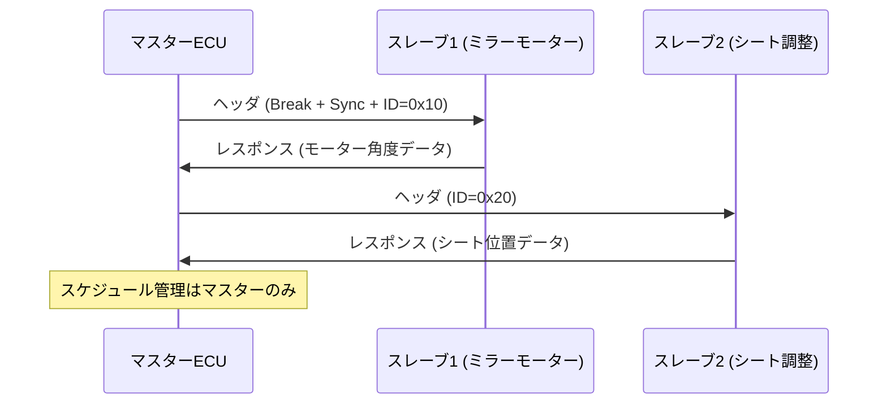

## 概要
LIN(Local Interconnect Network)は、**低コスト**・低速な車載シリアルバスです。1本のワイヤで最大19.2 kbpsの通信を行い、**マスター/スレーブ**構成で動作します。CANより安価で、シート調整・ドアミラー・ワイパーなどシンプルな制御に使われます。

## なぜ必要か
CANは信頼性が高い反面、トランシーバーや配線コストが高めです。LINは**シングルワイヤ**で12V電源ラインを使い回せるため、費用対効果の高い補助バスとして普及しました。1台の車に40本以上のLINバスが搭載されることもあります。

## 仕組み
マスターECUがヘッダ(Break+Sync+ID)を送り、スレーブがIDに応じてレスポンスを返します。スレーブはアドレスを持たず、IDで自分への呼びかけを認識します。衝突検知機構はなく、マスターがスケジューリングを管理します。

## 自動運転での利用例
ADAS ECUが主カメラをEthernetで制御する一方、サイドミラーの角度調整モーターはLINで制御するという混在構成が一般的です。LINは帯域が低いため、センサデータの転送ではなくアクチュエータ制御に限定されます。

## 関連用語
帯域が必要な用途は [[can]] や [[ethernet]] へ移行します。高速化版として [[can-fd]] があります。

## 次に学ぶべき内容
より高速で信頼性の高い [[can]] へ進みましょう。

## 図解

