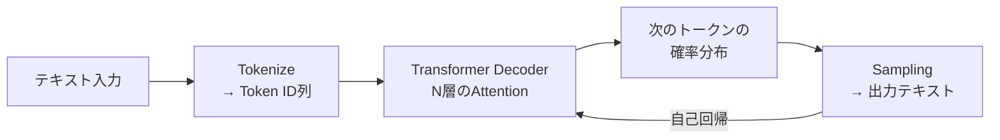

## 概要
LLM（Large Language Model）はTransformerをベースに、巨大なテキストコーパスで学習した言語モデルです。GPT-4・Claude・Gemini・Llama などが代表例で、翻訳・要約・コード生成・質問応答・創作など多様なタスクを単一モデルでこなします。

## 主要な数式

**言語モデルの確率分解**（次トークン予測）：

$$P(w_1, \dots, w_n) = \prod_{t=1}^{n} P(w_t \mid w_1, \dots, w_{t-1})$$

**学習の目的（負の対数尤度）**：

$$\mathcal{L} = -\sum_{t=1}^{n}\log P(w_t \mid w_{<t})$$

**パープレキシティ**（モデルの予測性能、低いほど良い）：

$$\mathrm{PPL} = \exp\!\left(-\frac{1}{n}\sum_{t=1}^{n}\log P(w_t \mid w_{<t})\right)$$

**温度付き softmax**（生成のランダム性を制御、$T$ が大きいほど多様）：

$$P(w_i) = \frac{\exp(z_i / T)}{\sum_j \exp(z_j / T)}$$

## 可視化


## LLMの仕組み



LLMは「次の単語（トークン）を予測する」タスクを繰り返して文章を生成します（自己回帰生成）。

## HuggingFace Transformers で LLM を使う

```python
from transformers import AutoTokenizer, AutoModelForCausalLM
import torch

# モデルの読み込み（例：小さなGPT-2）
model_id = "gpt2"
tokenizer = AutoTokenizer.from_pretrained(model_id)
model     = AutoModelForCausalLM.from_pretrained(model_id)
model.eval()

# テキスト生成
prompt = "The future of autonomous vehicles is"
inputs = tokenizer(prompt, return_tensors="pt")

with torch.no_grad():
    output = model.generate(
        **inputs,
        max_new_tokens  = 100,
        temperature     = 0.8,        # 高いほど多様・低いほど確実
        top_p           = 0.9,        # nucleus sampling
        do_sample       = True,
        repetition_penalty = 1.1,
    )

print(tokenizer.decode(output[0], skip_special_tokens=True))
```

## テキスト分類・埋め込み（BERT系）

```python
from transformers import AutoTokenizer, AutoModel
import torch
import torch.nn.functional as F

# Sentence-BERT: 文をベクトル化
model_id  = "sentence-transformers/all-MiniLM-L6-v2"
tokenizer = AutoTokenizer.from_pretrained(model_id)
model     = AutoModel.from_pretrained(model_id)
model.eval()

def encode(texts: list[str]) -> torch.Tensor:
    enc = tokenizer(texts, padding=True, truncation=True,
                    max_length=256, return_tensors="pt")
    with torch.no_grad():
        out = model(**enc).last_hidden_state
    # mean pooling
    mask    = enc["attention_mask"].unsqueeze(-1).float()
    vectors = (out * mask).sum(1) / mask.sum(1)
    return F.normalize(vectors, dim=-1)

sentences = [
    "CAN bus is used for in-vehicle communication",
    "Ethernet enables high-bandwidth automotive networks",
    "Python is a popular programming language",
]
vecs  = encode(sentences)
sims  = vecs @ vecs.T
print("コサイン類似度行列:")
print(sims.numpy().round(3))
```

## Anthropic Claude API の使い方

```python
import anthropic

client = anthropic.Anthropic(api_key="your-api-key")

# テキスト生成
message = client.messages.create(
    model="claude-opus-4-8",
    max_tokens=1024,
    messages=[
        {"role": "user", "content": "車載Ethernetと従来CANの違いを200字で説明してください。"}
    ]
)
print(message.content[0].text)

# ストリーミング
with client.messages.stream(
    model="claude-opus-4-8",
    max_tokens=512,
    messages=[{"role": "user", "content": "DoIPプロトコルの仕組みを説明してください。"}]
) as stream:
    for text in stream.text_stream:
        print(text, end="", flush=True)
```

## OpenAI API の使い方

```python
from openai import OpenAI

client = OpenAI(api_key="your-api-key")

# Chat Completion
response = client.chat.completions.create(
    model="gpt-4o",
    messages=[
        {"role": "system", "content": "あなたは車載ネットワークの専門家です。"},
        {"role": "user",   "content": "SOME/IPとDDSの主な違いを教えてください。"},
    ],
    temperature=0.3,
    max_tokens=512,
)
print(response.choices[0].message.content)

# 埋め込みベクトルの生成
emb_response = client.embeddings.create(
    model="text-embedding-3-small",
    input="Ethernet is a family of wired computer networking technologies",
)
vector = emb_response.data[0].embedding
print(f"次元数: {len(vector)}")  # 1536
```

## トークナイザーの仕組み

```python
from transformers import AutoTokenizer

tokenizer = AutoTokenizer.from_pretrained("gpt2")

text  = "Hello, I am learning about neural networks!"
tokens = tokenizer.tokenize(text)
ids    = tokenizer.encode(text)

print("トークン:", tokens)
print("ID:     ", ids)
print(f"文字数: {len(text)}  トークン数: {len(tokens)}")

# 日本語（トークン数が多くなりやすい）
jtext  = "深層学習は大変便利な技術です。"
jtokens = tokenizer.tokenize(jtext)
print(f"日本語トークン数: {len(jtokens)}")
```

## LLMの評価指標

| 指標 | 意味 | 用途 |
|---|---|---|
| Perplexity | 低いほど自然な文章 | 言語モデリング |
| BLEU | 参照文との n-gram 一致率 | 翻訳・要約 |
| ROUGE | 再現率ベースの重なり | 要約評価 |
| BERTScore | 意味的類似度 | 生成テキストの質 |
| Human Eval | 人手評価 | コード生成 |

## 次に学ぶべき内容
LLMへの指示の出し方 [[prompt-engineering]] と、知識を外部から与える [[rag]] を学びましょう。
