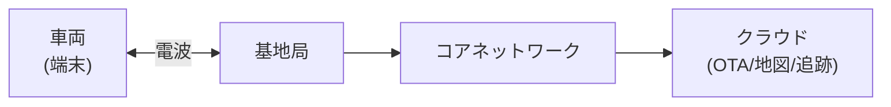

## 概要
LTE（4G）と5Gは全国規模のモバイル通信インフラです。自動車では「テレマティクス（位置情報・盗難追跡）」「OTA（Over-the-Air）アップデート」「コネクテッドカー」「C-V2X（Cellular V2X）」に活用されています。



## 主要な数式

**MIMO による容量向上**（$N_t$ 送信・$N_r$ 受信アンテナ）：

$$C = \min(N_t, N_r)\,B\log_2(1 + \mathrm{SNR})$$

空間多重化でアンテナ数に比例して速度が上がる（5Gの Massive MIMO の原理）。

**理論ピークレート**（変調多値数 $M$、レイヤ数 $L$、リソース要素数 $R$）：

$$R_{\text{peak}} \approx L \cdot \log_2(M) \cdot R \;\;[\text{bps}]$$

**ドップラーシフト**（移動速度 $v$、搬送波周波数 $f_c$）：

$$f_d = \frac{v}{c}\,f_c\cos\theta$$

高速移動する車両では周波数ずれの補正が必要になる。

## LTE の基本アーキテクチャ

```
LTE ネットワーク構成:

  UE（スマートフォン/車載TCU）
       ↕ 無線（LTE）
  eNodeB（基地局）
       ↕ X2インターフェース
  EPC（コアネットワーク）
  ├── MME（モビリティ管理）
  ├── SGW（サービングゲートウェイ）
  ├── PGW（PDNゲートウェイ → インターネット）
  └── HSS（加入者データベース）
```

```python
import numpy as np
import matplotlib.pyplot as plt

# LTE の周波数バンド（日本）
lte_bands = {
    "Band 1":  {"dl": (2110, 2170), "ul": (1920, 1980), "carrier": "ドコモ・au・SB"},
    "Band 3":  {"dl": (1805, 1880), "ul": (1710, 1785), "carrier": "SB・au"},
    "Band 8":  {"dl": ( 925,  960), "ul": ( 880,  915), "carrier": "SB"},
    "Band 19": {"dl": ( 875,  890), "ul": ( 830,  845), "carrier": "ドコモ"},
    "Band 21": {"dl": (1496, 1511), "ul": (1448, 1463), "carrier": "ドコモ"},
    "Band 42": {"dl": (3620, 3700), "ul": (3620, 3700), "carrier": "TDD（ドコモ等）"},
}

print("LTE 周波数バンド（日本）")
print(f"{'バンド':10s} {'下り [MHz]':15s} {'上り [MHz]':15s} {'キャリア'}")
for band, spec in lte_bands.items():
    dl = f"{spec['dl'][0]}〜{spec['dl'][1]}"
    ul = f"{spec['ul'][0]}〜{spec['ul'][1]}"
    print(f"{band:10s} {dl:15s} {ul:15s} {spec['carrier']}")
```

## LTE OFDMA の仕組み

```python
# LTE は下りに OFDMA、上りに SC-FDMA を使用
# リソースブロック（RB）= 12サブキャリア × 7シンボル = 1スロット（0.5ms）

def lte_throughput(n_rb, modulation, coding_rate, n_layers=1, bandwidth_mhz=20):
    """LTE 理論スループット計算"""
    # リソースブロック数と変調方式
    bits_per_re = {
        "QPSK": 2, "16QAM": 4, "64QAM": 6, "256QAM": 8
    }[modulation]

    # 1TTI(1ms)の送信ビット数
    # RB × 12sc × 14sym × bits × coding × layers
    bits_per_tti = n_rb * 12 * 14 * bits_per_re * coding_rate * n_layers
    throughput_mbps = bits_per_tti / 1e3   # 1000 TTI/s
    return throughput_mbps

print("LTE カテゴリ別スループット概算（20MHz）:")
configs = [
    ("Cat 4（一般端末）",  100, "64QAM",  3/4, 2),
    ("Cat 6（ハイエンド）",100, "64QAM",  3/4, 2),
    ("Cat 12（LTE-A）",   100, "256QAM", 5/6, 4),
]
for name, n_rb, mod, cr, layers in configs:
    tp = lte_throughput(n_rb, mod, cr, layers)
    print(f"  {name:20s}: ≈{tp:.0f} Mbps")
```

## 5G の3つのユースケース

```python
use_cases_5g = {
    "eMBB（超高速大容量）": {
        "英語":   "enhanced Mobile Broadband",
        "速度":   "最大20 Gbps（下り）",
        "遅延":   "数ms",
        "用途":   "4K/8K動画・VR/AR・車内コンテンツ配信",
        "車載":   "HDマップ高速ダウンロード・映像OTA・後席エンタメ",
    },
    "URLLC（超低遅延高信頼）": {
        "英語":   "Ultra-Reliable Low Latency Communications",
        "速度":   "数百Mbps",
        "遅延":   "1ms以下",
        "用途":   "自動運転・遠隔手術・工場制御",
        "車載":   "C-V2X（車車間・路車間）・遠隔運転",
    },
    "mMTC（大規模IoT）": {
        "英語":   "massive Machine Type Communications",
        "速度":   "低速",
        "遅延":   "秒〜分オーダー",
        "用途":   "センサーネットワーク・スマートメーター",
        "車載":   "駐車場センサー・道路状況モニタリング",
    },
}

for category, spec in use_cases_5g.items():
    print(f"\n【{category}】{spec['英語']}")
    print(f"  速度: {spec['速度']}  遅延: {spec['遅延']}")
    print(f"  一般用途: {spec['用途']}")
    print(f"  車載応用: {spec['車載']}")
```

## 5G NR（New Radio）の技術

```python
# 5G NR のフレーム構造とヌメロロジー
numerologies = {
    "μ=0": {"SCS_kHz": 15,   "slot_ms": 1.0,   "slots_10ms": 10,  "band": "Sub-1GHz"},
    "μ=1": {"SCS_kHz": 30,   "slot_ms": 0.5,   "slots_10ms": 20,  "band": "Sub-6GHz"},
    "μ=2": {"SCS_kHz": 60,   "slot_ms": 0.25,  "slots_10ms": 40,  "band": "Sub-6GHz/mmW"},
    "μ=3": {"SCS_kHz": 120,  "slot_ms": 0.125, "slots_10ms": 80,  "band": "mmW（24GHz+）"},
    "μ=4": {"SCS_kHz": 240,  "slot_ms": 0.0625,"slots_10ms": 160, "band": "mmW（将来）"},
}

print("5G NR ヌメロロジー（サブキャリア間隔の種類）")
print(f"{'μ':4s} {'SCS':8s} {'スロット長':12s} {'用途'}")
for mu, spec in numerologies.items():
    print(f"{mu:4s} {spec['SCS_kHz']:5d}kHz  {spec['slot_ms']*1000:.3f}ms      {spec['band']}")

print("\n→ μが大きいほど遅延が小さく（高周波数帯向け）")
print("→ URLLC（自動運転）では μ=3のmmWで1ms以下の遅延を実現")
```

## 車載テレマティクスユニット（TCU）

```python
# TCU（Telematics Control Unit）の構成
tcu_components = {
    "LTE/5Gモジュール": {
        "チップ": "Qualcomm Snapdragon X55/X65",
        "プロトコル": "TCP/IP over LTE",
        "接続先": "メーカーバックエンドサーバー（クラウド）",
    },
    "SIM（eSIM）": {
        "規格": "M2M eSIM（GSMA SGP.02）",
        "特徴": "物理SIM交換不要・遠隔でキャリア変更",
        "認証": "USIM認証（128bit AES）",
    },
    "GNSS（GPS）": {
        "精度": "3〜5m（単独測位）",
        "活用": "位置情報・走行ルート記録",
    },
    "CANインターフェース": {
        "接続": "車内CANネットワークへ接続",
        "目的": "走行データ・診断データの収集",
    },
}

for component, spec in tcu_components.items():
    print(f"\n【{component}】")
    for k, v in spec.items():
        print(f"  {k}: {v}")

# OTA（Over-the-Air）アップデートの通信量
print("\n=== OTA 通信量の概算 ===")
ota_packages = {
    "ECUファームウェア（1個）": 50,      # MB
    "地図データ（差分）":        500,
    "地図データ（全更新）":      10000,  # 10GB
    "ナビUI更新":               200,
}
for name, size_mb in ota_packages.items():
    time_4g = size_mb / 50   # LTE 50Mbps実効
    time_5g = size_mb / 500  # 5G 500Mbps実効
    print(f"  {name:20s}: {size_mb:6d}MB → LTE {time_4g:.1f}分 / 5G {time_5g:.1f}分")
```
