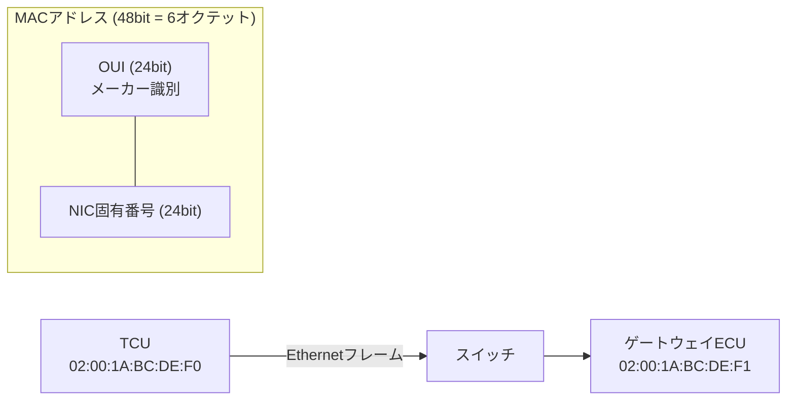

## 概要
MACアドレスは、ネットワーク機器に割り当てられた**48ビット**の物理アドレスです(例: `00:1A:2B:3C:4D:5E`)。[[ethernet]] フレームの送信元・宛先として使われ、同じネットワーク内で「どの機器宛か」を識別します。

## なぜ必要か
IPアドレスが「論理的な住所」なら、MACアドレスは「機器固有の番号」です。最終的にデータを物理的に届けるには、IPに対応するMACを知る必要があります(この変換がARP)。

## 自動運転での利用例
車載Ethernetスイッチは、各ポートに繋がるECUのMACアドレスを学習してフレームを適切なポートだけに転送します。これにより不要なトラフィックを抑え、帯域と安全性を確保します。

## 関連用語
MACは [[ethernet]] フレームの中に入り、その上位の論理アドレスが [[ip]] です。

## 次に学ぶべき内容
論理的な住所である [[ip]] へ進みましょう。

## 図解

