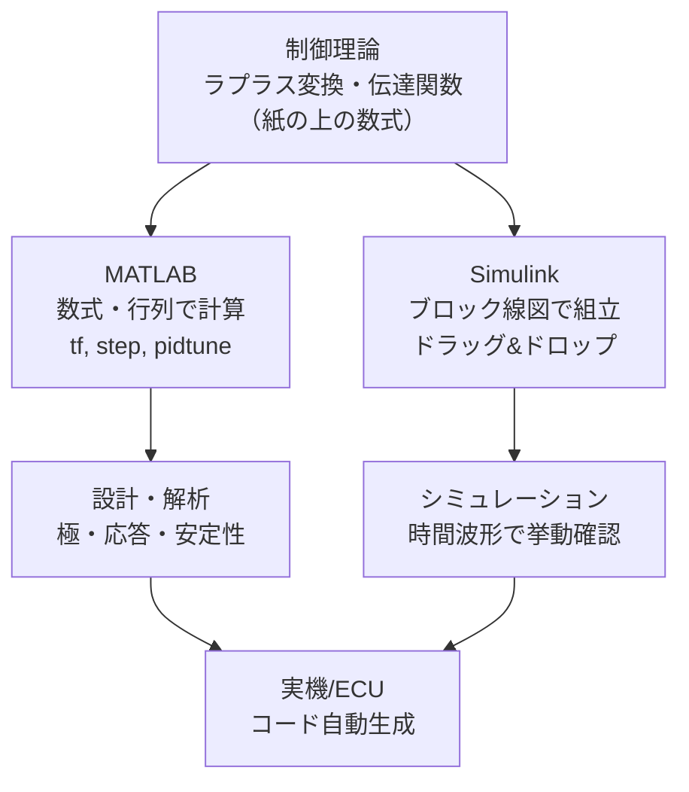
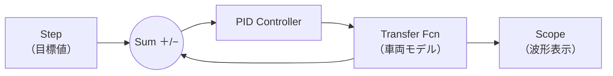

## MATLAB と Simulink の位置づけ

**MATLAB** は数値計算・行列演算・可視化のためのプログラミング環境、**Simulink** はその上で動く **ブロック線図ベースのシミュレーション環境** です。制御工学の理論（ラプラス変換・伝達関数・フィードバック）を、そのまま「動かして検証できる」形にしたものです。



## 制御工学の各概念がどう対応するか

| 制御理論の概念 | MATLAB / Simulink での姿 |
|---|---|
| 伝達関数 \(G(s)\) | `tf([分子],[分母])` / Transfer Fcn ブロック |
| ラプラス変換 | s領域のまま `tf`, `zpk` で扱う |
| ブロック線図（[[block-diagram]]） | Simulink のブロック配線そのもの |
| フィードバック結合 | `feedback()` / 配線でループを作る |
| ステップ応答 | `step(G)` / Scope ブロックで波形表示 |
| PID制御（[[control-engineering]]） | `pid()`, `pidtune()` / PID Controller ブロック |
| 安定性（極） | `pole(G)`, `rlocus(G)`, `bode(G)` |

理論で学ぶ数式と、ツールの機能がほぼ一対一で対応しているのがポイントです。

## MATLAB での制御系設計の例

```matlab
% 二次系の伝達関数 G(s) = wn^2 / (s^2 + 2*zeta*wn*s + wn^2)
wn = 2; zeta = 0.5;
G = tf(wn^2, [1, 2*zeta*wn, wn^2]);

% 極（安定性）とステップ応答
pole(G)          % → -1 ± 1.73i（左半面 = 安定）
step(G)          % ステップ応答をプロット

% PIDコントローラを自動チューニング
C = pidtune(G, 'PID');

% 閉ループを作って応答を比較
T = feedback(C*G, 1);
step(T)          % PID制御後のステップ応答
```

**数式で表すと**、`feedback(C*G, 1)` は負フィードバックの閉ループ

$$
T(s) = \frac{C(s)G(s)}{1 + C(s)G(s)}
$$

を計算しており、[[block-diagram]] のフィードバック公式そのものです。`pidtune` は目標の応答速度・安定余裕を満たすように \(K_p, K_i, K_d\) を最適化します。

> Python でも `python-control` ライブラリでほぼ同じことができます（本サイトのコード例は Python 中心）。`ct.tf`, `ct.step_response`, `ct.feedback` が MATLAB の `tf`, `step`, `feedback` に対応します。

## Simulink：ブロック線図を「動かす」

Simulink では、制御対象・制御器・センサをブロックで配置し、線でつないでシミュレーションします。[[block-diagram]] で描いた図が、そのまま実行可能なモデルになります。



主なブロック：

| ブロック | 役割 |
|---|---|
| **Step / Ramp / Signal** | 入力（目標値・外乱）を与える |
| **Sum** | 加え合わせ点（誤差 = 目標 − 実際） |
| **Transfer Fcn / State-Space** | 制御対象の伝達関数・状態方程式 |
| **PID Controller** | PID制御器（ゲイン調整・自動チューニング内蔵） |
| **Scope** | 出力波形の観察 |
| **Integrator / Gain** | 積分・比例など基本演算 |

## モデルベース開発（MBD）と自動車

自動車業界では **モデルベース開発（Model-Based Design, MBD）** が標準です。Simulink がその中核を担います。


- **MIL（Model-in-the-Loop）**：モデル同士でロジックを検証
- **SIL（Software-in-the-Loop）**：自動生成した C コードを検証
- **HIL（Hardware-in-the-Loop）**：実 ECU をつなぎ、車両を模擬した信号で検証（[[micro-autobox]] のようなリアルタイム機が使われる）

この流れにより、**手書きのCコードを書かずに、Simulinkモデルから車載ECU用コードを自動生成**でき、検証を前倒しできます。自動駐車の制御ロジックもこのプロセスで開発されます（[[auto-parking-control]]）。

## AUTOSAR との接続

生成コードは **AUTOSAR**（[[autosar]] / [[adaptive-autosar]]）のソフトウェアコンポーネントとして統合されます。Simulink が AUTOSAR 対応のインタフェースを出力するため、制御アルゴリズムを標準化された車載ソフト基盤に載せられます。

## まとめ

- MATLAB = 数式・行列で制御系を計算、Simulink = ブロック線図で動かす
- 伝達関数・フィードバック・PID など、理論の概念がツールの機能に一対一対応
- Simulink のモデルは [[block-diagram]] そのもので、実行・可視化できる
- 自動車では **モデルベース開発（MBD）** の中核。MIL→SIL→HIL→実車、コード自動生成
- 生成コードは [[autosar]] に統合され、[[auto-parking-control]] などのECU機能になる
