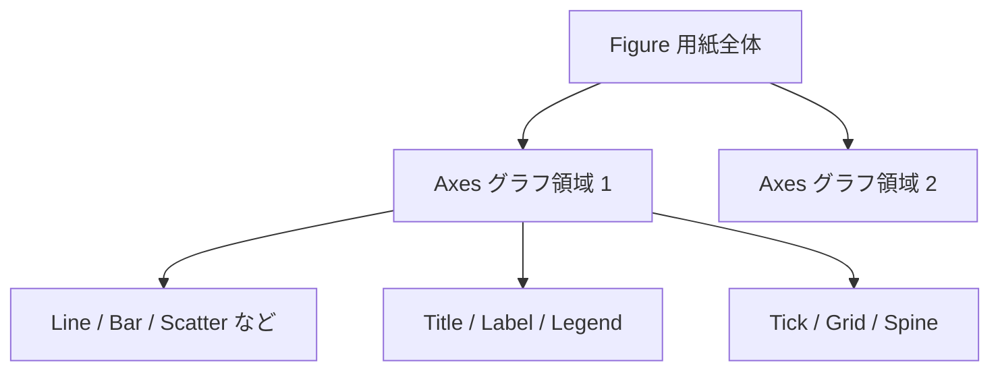

## 概要
Matplotlibはデータを視覚化する基本ライブラリです。折れ線グラフ・棒グラフ・散布図・ヒストグラム・円グラフなど幅広いグラフを、細部まで自由にカスタマイズして作成できます。PandasやSeabornの `plot()` も内部でMatplotlibを使っています。

## なぜ必要か
数値の羅列では気づけない傾向・外れ値・周期性も、グラフにすれば一目で把握できます。分析レポート・論文・プレゼン資料にグラフを貼るためには、PNG/PDF出力できるMatplotlibが必須です。まず「どのグラフをいつ使うか」を覚え、その後細かいスタイル調整を覚えるのが近道です。

## グラフの使い分け

| グラフ | 用途 | 関数 |
|---|---|---|
| 折れ線グラフ | 時系列・連続変化 | `plot()` |
| 棒グラフ | カテゴリ比較 | `bar()` / `barh()` |
| 散布図 | 2変数の相関 | `scatter()` |
| ヒストグラム | 分布の確認 | `hist()` |
| 箱ひげ図 | 分布・外れ値の比較 | `boxplot()` |
| 円グラフ | 割合 | `pie()` |

## 基本構造（Figure と Axes）

```python
import matplotlib.pyplot as plt
import numpy as np

# Figure（用紙）に Axes（グラフ領域）を配置するのが基本
fig, ax = plt.subplots(figsize=(8, 4))

x = np.linspace(0, 2 * np.pi, 200)
ax.plot(x, np.sin(x), label="sin(x)", color="royalblue", linewidth=2)
ax.plot(x, np.cos(x), label="cos(x)", color="tomato",    linewidth=2, linestyle="--")

ax.set_title("三角関数")
ax.set_xlabel("x（ラジアン）")
ax.set_ylabel("y")
ax.legend()
ax.grid(True, alpha=0.4)

plt.tight_layout()
plt.savefig("trigonometric.png", dpi=150)
plt.show()
```

## 折れ線グラフ — 時系列データ

```python
import pandas as pd

dates  = pd.date_range("2024-01", periods=12, freq="ME")
sales  = [120, 135, 128, 145, 160, 175, 168, 182, 155, 170, 190, 210]
budget = [130] * 12  # 目標値

fig, ax = plt.subplots(figsize=(10, 4))
ax.plot(dates, sales,  marker="o", label="実績", color="steelblue")
ax.plot(dates, budget, linestyle="--", label="目標", color="gray")

# 目標超過の月を塗りつぶし
ax.fill_between(dates, sales, budget,
                where=[s > b for s, b in zip(sales, budget)],
                alpha=0.15, color="green", label="超過分")

ax.set_title("月次売上 vs 目標")
ax.set_ylabel("売上（万円）")
ax.legend()
ax.grid(axis="y", alpha=0.3)
plt.tight_layout()
plt.show()
```

## 棒グラフ — カテゴリ比較

```python
categories = ["開発", "営業", "マーケ", "CS", "HR"]
q1_scores  = [88, 72, 65, 80, 77]
q2_scores  = [91, 78, 70, 83, 74]

x   = np.arange(len(categories))
w   = 0.35

fig, ax = plt.subplots(figsize=(8, 5))
bar1 = ax.bar(x - w/2, q1_scores, w, label="Q1", color="steelblue")
bar2 = ax.bar(x + w/2, q2_scores, w, label="Q2", color="coral")

# 棒の上に数値を表示
ax.bar_label(bar1, padding=3)
ax.bar_label(bar2, padding=3)

ax.set_xticks(x)
ax.set_xticklabels(categories)
ax.set_ylabel("スコア")
ax.set_title("部署別スコア（Q1 vs Q2）")
ax.legend()
ax.set_ylim(0, 110)
plt.tight_layout()
plt.show()
```

## 散布図 — 相関の可視化

```python
np.random.seed(42)
n = 80

# 勉強時間とスコアに相関を持たせる
study_hours = np.random.uniform(1, 10, n)
scores      = 50 + 5 * study_hours + np.random.randn(n) * 8

fig, ax = plt.subplots(figsize=(7, 5))
sc = ax.scatter(study_hours, scores,
                c=scores, cmap="viridis", alpha=0.7, edgecolors="white")

# 回帰直線を重ねる
z  = np.polyfit(study_hours, scores, 1)
p  = np.poly1d(z)
xs = np.linspace(1, 10, 100)
ax.plot(xs, p(xs), "r--", alpha=0.8, label=f"回帰: y={z[0]:.1f}x+{z[1]:.1f}")

plt.colorbar(sc, ax=ax, label="スコア")
ax.set_xlabel("勉強時間（時間/日）")
ax.set_ylabel("テストスコア")
ax.set_title("勉強時間とスコアの関係")
ax.legend()
plt.tight_layout()
plt.show()
```

## ヒストグラム — 分布の確認

```python
np.random.seed(0)
data_a = np.random.normal(70, 10, 300)   # グループA
data_b = np.random.normal(60, 15, 300)   # グループB

fig, ax = plt.subplots(figsize=(8, 5))
ax.hist(data_a, bins=30, alpha=0.6, color="steelblue", label="グループA")
ax.hist(data_b, bins=30, alpha=0.6, color="coral",     label="グループB")

# 平均線を引く
ax.axvline(data_a.mean(), color="blue", linestyle="--", linewidth=1.5,
           label=f"A平均: {data_a.mean():.1f}")
ax.axvline(data_b.mean(), color="red",  linestyle="--", linewidth=1.5,
           label=f"B平均: {data_b.mean():.1f}")

ax.set_xlabel("スコア")
ax.set_ylabel("頻度")
ax.set_title("スコア分布の比較")
ax.legend()
plt.tight_layout()
plt.show()
```

## 複数グラフを並べる（subplots）

```python
fig, axes = plt.subplots(2, 2, figsize=(12, 8))
fig.suptitle("データ分析ダッシュボード", fontsize=14)

# [0,0] 折れ線
axes[0, 0].plot(range(12), sales, marker="o")
axes[0, 0].set_title("月次売上")

# [0,1] ヒストグラム
axes[0, 1].hist(data_a, bins=20)
axes[0, 1].set_title("スコア分布")

# [1,0] 棒グラフ
axes[1, 0].bar(categories, q1_scores, color="steelblue")
axes[1, 0].set_title("部署別スコア")

# [1,1] 散布図
axes[1, 1].scatter(study_hours, scores, alpha=0.5)
axes[1, 1].set_title("勉強時間 vs スコア")

plt.tight_layout()
plt.savefig("dashboard.png", dpi=150, bbox_inches="tight")
plt.show()
```

## グラフのスタイル設定

```python
# テーマを適用
plt.style.use("seaborn-v0_8-whitegrid")   # 白地グリッド（見やすい）
plt.style.use("ggplot")                    # R の ggplot風

# フォントを日本語対応させる（環境に応じて設定）
plt.rcParams["font.family"] = "IPAexGothic"   # Linux
plt.rcParams["font.family"] = "MS Gothic"     # Windows
```

## Matplotlibのレイヤー構造



## 次に学ぶべき内容
より少ないコードで統計グラフを美しく描ける [[seaborn]] を学びましょう。
