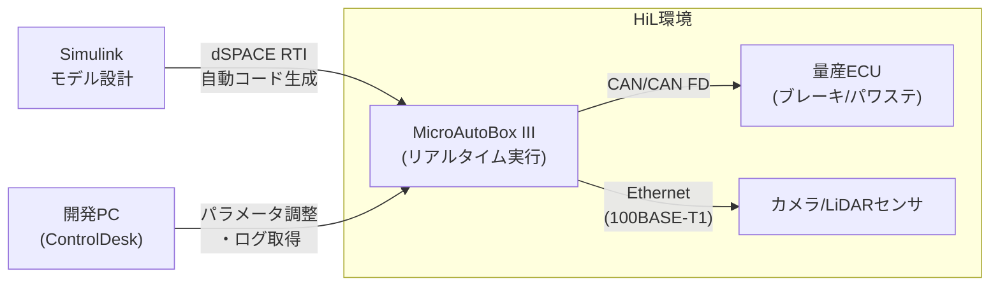

## 概要

**MicroAutoBox**（マイクロオートボックス）は、**dSPACE社**が提供する**ラピッドコントロールプロトタイピング（RCP）**および**ハードウェアインザループ（HiL）テスト**向けのリアルタイムコントローラです。ADASや自動運転アルゴリズムを実車または実機環境で素早く検証するために広く使用されています。

## 主な機能

- **リアルタイムOS**（RTOSベース）で制御アルゴリズムをマイクロ秒単位で実行
- **Simulink/MATLAB**モデルから自動コード生成（AUTOSAR対応）
- **CAN、CAN FD、LIN、FlexRay、Ethernet**など主要な車載バスをサポート
- **FPGA拡張ボード**（MicroAutoBox III）でセンサ処理や高速I/Oに対応
- **dSPACE SCALEXIO**との組み合わせでフルHiLテスト環境を構築可能

## 世代と仕様

| モデル | プロセッサ | Ethernet | CAN/FD | 主な用途 |
|--------|-----------|----------|--------|---------|
| MicroAutoBox II | PowerPC | なし | あり | 従来RCP |
| MicroAutoBox III | マルチコアARM | 最大4ポート | あり | ADAS/SDV RCP |

**MicroAutoBox III**では車載Ethernet（100BASE-T1/1000BASE-T1）に対応し、カメラ・LiDARなどの高帯域センサデータを扱うADASプロトタイピングに適しています。

## 開発フロー

1. **Simulinkでモデル設計** → 制御アルゴリズムをブロック線図で作成
2. **自動コード生成** → dSPACE RTI（Real-Time Interface）でCコード生成
3. **MicroAutoBoxへ書き込み** → リアルタイム実行
4. **ControlDeskで監視・調整** → パラメータをオンラインで変更・ログ取得
5. **実車/実機テスト** → 実際の車両ECUや模擬環境と接続して検証

## 自動運転・ADASでの利用

- **センサフュージョンアルゴリズム**の実車プロトタイピング（カメラ+レーダ統合）
- **車線維持・緊急ブレーキ（AEB）**などの機能安全ロジック検証
- **DoIP/UDS診断**の動作確認（ゲートウェイとして機能）
- **AUTOSAR Classic/Adaptive**ソフトウェアコンポーネントの事前検証
- 量産前に数週間でアルゴリズム改善サイクルを回せるのが最大のメリット

## 競合ツール

| ツール | メーカー | 特徴 |
|--------|---------|------|
| MicroAutoBox | dSPACE | 最もシェアが高い |
| SpeedGoat | Speedgoat | Simulinkネイティブ |
| PROVEtech:HiL | ETAS | AUTOSAR特化 |
| VT System | Vector | 車載バス特化 |

## 図解

