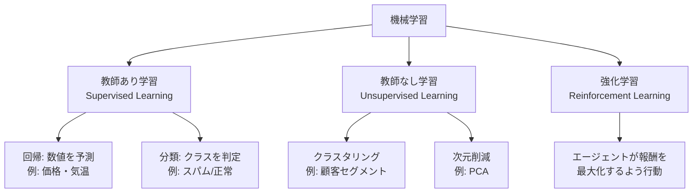
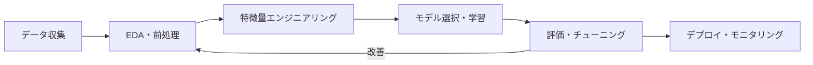

## 概要
機械学習（Machine Learning）とは、データからパターンを自動的に学習してタスクを解くアルゴリズムの総称です。ルールをプログラマが手書きするのではなく、大量のデータから「ルールそのもの」をコンピュータが見つけます。

## 機械学習の3つのパラダイム



## 教師あり学習（最も頻繁に使う）

学習データに「正解ラベル（y）」が付いている。

```python
import numpy as np
from sklearn.linear_model import LinearRegression
from sklearn.model_selection import train_test_split
from sklearn.metrics import mean_squared_error

# 特徴量 X と正解ラベル y を用意
X = np.array([[1], [2], [3], [4], [5], [6], [7], [8]])
y = np.array([2.1, 4.0, 5.9, 8.2, 9.8, 12.1, 14.0, 16.2])

# 訓練データとテストデータに分割（8:2）
X_train, X_test, y_train, y_test = train_test_split(
    X, y, test_size=0.2, random_state=42
)

# モデルを学習
model = LinearRegression()
model.fit(X_train, y_train)

# テストデータで評価
y_pred = model.predict(X_test)
rmse = mean_squared_error(y_test, y_pred) ** 0.5
print(f"RMSE: {rmse:.3f}")
```

## 機械学習の一般的なワークフロー



## 可視化


## 過学習と汎化

```python
import matplotlib.pyplot as plt
from sklearn.preprocessing import PolynomialFeatures
from sklearn.pipeline import make_pipeline

np.random.seed(0)
X = np.sort(np.random.rand(20, 1), axis=0)
y = np.sin(2 * np.pi * X).ravel() + np.random.randn(20) * 0.2

fig, axes = plt.subplots(1, 3, figsize=(14, 4))

for ax, degree, title in zip(axes, [1, 4, 15],
                              ["次数1: 過小適合", "次数4: 適切", "次数15: 過学習"]):
    model = make_pipeline(PolynomialFeatures(degree), LinearRegression())
    model.fit(X, y)
    X_plot = np.linspace(0, 1, 200).reshape(-1, 1)
    ax.scatter(X, y, color="steelblue", s=30)
    ax.plot(X_plot, model.predict(X_plot), color="tomato")
    ax.set_title(title)
    ax.set_ylim(-2, 2)

plt.tight_layout()
plt.show()
```

## 評価指標の使い分け

| タスク | 指標 | 意味 |
|---|---|---|
| 回帰 | RMSE | 予測誤差の大きさ（単位同じ） |
| 回帰 | MAE | 外れ値に強い平均絶対誤差 |
| 回帰 | R² | 1に近いほど良い（説明率）|
| 分類 | Accuracy | 正解率（クラス不均衡に弱い）|
| 分類 | F1スコア | 適合率と再現率の調和平均 |
| 分類 | AUC-ROC | 閾値なしの総合性能 |

## 次に学ぶべき内容
実際にモデルを動かす [[scikit-learn]] から始めましょう。
