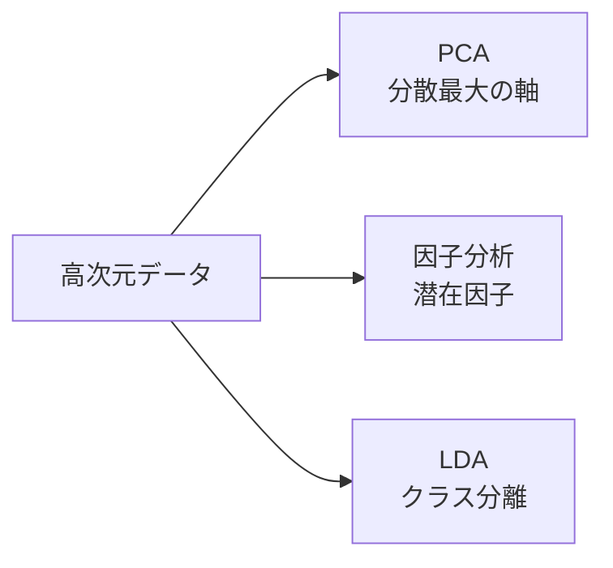

## 概要
多変量統計は「多数の変数を同時に扱う」手法群です。主成分分析（PCA）でデータを圧縮・可視化し、因子分析で潜在構造を発見し、判別分析で高精度な分類を行います。変数間の相関構造を活かすことが鍵です。



## 主要な数式

**分散共分散行列**（$d$ 変数、$\mathbf{x}_i \in \mathbb{R}^d$）：

$$\mathbf{\Sigma} = \frac{1}{n-1}\sum_{i=1}^{n}(\mathbf{x}_i - \bar{\mathbf{x}})(\mathbf{x}_i - \bar{\mathbf{x}})^\top$$

**主成分分析（PCA）**は共分散行列の固有値問題：

$$\mathbf{\Sigma}\,\mathbf{v}_k = \lambda_k\,\mathbf{v}_k$$

第 $k$ 主成分の**寄与率**は $\dfrac{\lambda_k}{\sum_{j=1}^{d}\lambda_j}$。

**マハラノビス距離**（相関構造を考慮した距離）：

$$D_M(\mathbf{x}) = \sqrt{(\mathbf{x} - \boldsymbol{\mu})^\top \mathbf{\Sigma}^{-1} (\mathbf{x} - \boldsymbol{\mu})}$$

**線形判別分析（LDA）**はクラス間分散 $\mathbf{S}_B$ とクラス内分散 $\mathbf{S}_W$ の比を最大化：

$$\mathbf{w}^\ast = \arg\max_{\mathbf{w}} \frac{\mathbf{w}^\top \mathbf{S}_B \mathbf{w}}{\mathbf{w}^\top \mathbf{S}_W \mathbf{w}}$$

## 主成分分析（PCA）

```python
import numpy as np
import pandas as pd
import matplotlib.pyplot as plt
from sklearn.preprocessing import StandardScaler
from sklearn.decomposition import PCA

# データ: 自動車のスペック（馬力・燃費・重量・最高速度・加速）
np.random.seed(42)
n = 100

# 潜在因子: "パワー系" と "エコノミー系"
power_factor  = np.random.normal(0, 1, n)
economy_factor = np.random.normal(0, 1, n)

data = pd.DataFrame({
    "horsepower": 200 + 50 * power_factor + np.random.normal(0, 10, n),
    "top_speed":  200 + 20 * power_factor + np.random.normal(0, 5, n),
    "weight":    1500 + 200 * power_factor - 50 * economy_factor + np.random.normal(0, 30, n),
    "fuel_eff":   15  - 3  * power_factor + 3 * economy_factor + np.random.normal(0, 1, n),
    "accel_0_100": 8  - 1.5 * power_factor + np.random.normal(0, 0.5, n),
})

# 標準化（単位・スケールが異なる変数を揃える）
scaler = StandardScaler()
X_scaled = scaler.fit_transform(data)

# PCA 実行
pca = PCA()
X_pca = pca.fit_transform(X_scaled)

# 寄与率
explained_var = pca.explained_variance_ratio_
cumulative_var = np.cumsum(explained_var)

fig, axes = plt.subplots(1, 2, figsize=(12, 5))

# スクリープロット
axes[0].bar(range(1, len(explained_var)+1), explained_var * 100, label="各成分")
axes[0].plot(range(1, len(cumulative_var)+1), cumulative_var * 100,
             "ro-", label="累積寄与率")
axes[0].axhline(80, color="gray", linestyle="--", label="80%ライン")
axes[0].set_xlabel("主成分番号")
axes[0].set_ylabel("寄与率 (%)")
axes[0].set_title("スクリープロット")
axes[0].legend()

# バイプロット
axes[1].scatter(X_pca[:, 0], X_pca[:, 1], alpha=0.6)
for i, col in enumerate(data.columns):
    axes[1].arrow(0, 0,
                  pca.components_[0, i] * 3,
                  pca.components_[1, i] * 3,
                  head_width=0.1, color="red")
    axes[1].text(pca.components_[0, i] * 3.2,
                 pca.components_[1, i] * 3.2, col, fontsize=9)
axes[1].set_xlabel(f"PC1 ({explained_var[0]*100:.1f}%)")
axes[1].set_ylabel(f"PC2 ({explained_var[1]*100:.1f}%)")
axes[1].set_title("バイプロット")
plt.tight_layout()
plt.show()

# 因子負荷量（各変数と主成分の相関）
loadings = pd.DataFrame(
    pca.components_.T * np.sqrt(pca.explained_variance_),
    index=data.columns,
    columns=[f"PC{i+1}" for i in range(len(pca.components_))],
)
print("因子負荷量（上位2成分）:")
print(loadings[["PC1", "PC2"]].round(3))
```

## 因子分析

```python
from sklearn.decomposition import FactorAnalysis
from factor_analyzer import FactorAnalyzer   # pip install factor_analyzer

# 因子分析 vs PCA:
# PCA: 分散を最大化するように軸を回転（記述的）
# 因子分析: 潜在因子が観測変数を「生成する」モデル（説明的）

# 適切な因子数の決定
fa_test = FactorAnalyzer(n_factors=5, rotation=None)
fa_test.fit(X_scaled)

ev, v = fa_test.get_eigenvalues()
print("固有値:", np.round(ev, 3))
print(f"固有値 > 1 の因子数: {(ev > 1).sum()}  (Kaiser 基準)")

# 本番: 2因子、バリマックス回転
fa = FactorAnalyzer(n_factors=2, rotation="varimax")
fa.fit(X_scaled)

# 因子負荷量
loadings_fa = pd.DataFrame(
    fa.loadings_,
    index=data.columns,
    columns=["Factor1", "Factor2"],
)
print("\n因子負荷量（バリマックス回転後）:")
print(loadings_fa.round(3))

# 共通性（各変数が因子で説明される割合）
communalities = fa.get_communalities()
print("\n共通性:")
for var, comm in zip(data.columns, communalities):
    print(f"  {var:12s}: {comm:.3f}")
```

## 線形判別分析（LDA）

```python
from sklearn.discriminant_analysis import LinearDiscriminantAnalysis
from sklearn.model_selection import cross_val_score
from sklearn.datasets import load_iris
from sklearn.metrics import classification_report

# Iris データセットで LDA
iris = load_iris()
X, y = iris.data, iris.target

# LDA: クラス間分散 / クラス内分散 を最大化
lda = LinearDiscriminantAnalysis()
lda.fit(X, y)

# 交差検証
scores = cross_val_score(lda, X, y, cv=5)
print(f"LDA 精度: {scores.mean():.3f} ± {scores.std():.3f}")

# 判別スコアの可視化（2次元に射影）
X_lda = lda.transform(X)
colors = ["red", "green", "blue"]
plt.figure(figsize=(8, 5))
for i, (cls, color) in enumerate(zip(iris.target_names, colors)):
    mask = y == i
    plt.scatter(X_lda[mask, 0], X_lda[mask, 1], label=cls, color=color, alpha=0.7)
plt.xlabel("LD1")
plt.ylabel("LD2")
plt.title("LDA による Iris データの判別")
plt.legend()
plt.tight_layout()
plt.show()

# 各変数の判別への寄与
coef_df = pd.DataFrame(
    lda.coef_,
    columns=iris.feature_names,
    index=iris.target_names,
)
print("\nLDA 係数（各クラス）:")
print(coef_df.round(3))
```

## マハラノビス距離による異常検知

```python
from scipy.spatial.distance import mahalanobis

# 多変量外れ値の検出: 相関構造を考慮した距離
X_train = X_scaled[:100]
mean = X_train.mean(axis=0)
cov_inv = np.linalg.inv(np.cov(X_train.T))

# 各サンプルのマハラノビス距離
distances = np.array([
    mahalanobis(x, mean, cov_inv) for x in X_scaled
])

# カイ二乗分布の 97.5 パーセンタイルを閾値に
from scipy.stats import chi2
threshold = chi2.ppf(0.975, df=X_scaled.shape[1])
outliers  = distances > np.sqrt(threshold)

print(f"外れ値の数: {outliers.sum()}")
print(f"外れ値インデックス: {np.where(outliers)[0]}")

# ユークリッド距離との比較
from scipy.spatial.distance import cdist
eucl_dist = cdist([mean], X_scaled)[0]

fig, axes = plt.subplots(1, 2, figsize=(10, 4))
axes[0].hist(eucl_dist, bins=20)
axes[0].set_title("ユークリッド距離")
axes[1].hist(distances, bins=20)
axes[1].axvline(np.sqrt(threshold), color="red", linestyle="--", label="閾値")
axes[1].set_title("マハラノビス距離")
axes[1].legend()
plt.tight_layout()
plt.show()
```

## 正準相関分析（CCA）

```python
from sklearn.cross_decomposition import CCA

# CCA: 2つの変数群間の最大相関を見つける
# 例: 体格指標 と 運動能力指標 の関係

np.random.seed(42)
n = 200
hidden = np.random.normal(0, 1, n)

X_phys = np.column_stack([
    hidden + np.random.normal(0, 0.5, n),   # 身長
    hidden + np.random.normal(0, 0.5, n),   # 体重
    hidden + np.random.normal(0, 1.0, n),   # 筋肉量
])
Y_sport = np.column_stack([
    hidden + np.random.normal(0, 0.5, n),   # 走力
    hidden + np.random.normal(0, 0.5, n),   # 跳躍力
])

cca = CCA(n_components=1)
X_c, Y_c = cca.fit_transform(X_phys, Y_sport)

from scipy.stats import pearsonr
r, p = pearsonr(X_c[:, 0], Y_c[:, 0])
print(f"第1正準相関係数: r = {r:.3f}, p = {p:.4e}")
```

## 手法選択ガイド

| 目的 | 手法 | キーワード |
|---|---|---|
| 次元削減・可視化 | PCA | 寄与率・スクリープロット |
| 潜在因子の発見 | 因子分析 | 因子負荷量・バリマックス回転 |
| 教師あり分類 | LDA | クラス間分散最大化 |
| 多変量外れ値検出 | マハラノビス距離 | 相関構造を考慮 |
| 2変数群の関係 | 正準相関分析 | 変数群間の共変動 |
| クラスタリング | K-means / 階層クラスタ | 非教師あり分類 |
