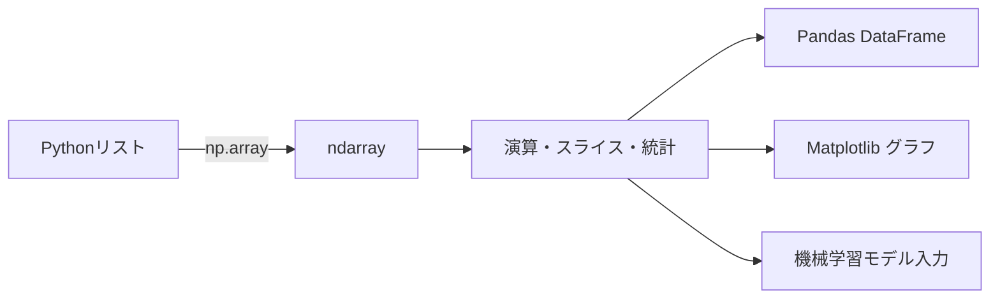

## 概要
NumPyはPythonで数値計算を高速に行う基盤ライブラリです。中心となる `ndarray`（N次元配列）はC言語で実装されており、Pythonのリストと比べて**10〜100倍以上の速度**で数値処理を行えます。PandasもMatplotlibも、内部ではNumPyを使っています。

## なぜ必要か
Pythonのリストで100万件のデータをループ処理すると数秒かかりますが、NumPy配列なら数ミリ秒です。「ブロードキャスト」という仕組みにより、forループなしで配列全体に演算を適用できます。データサイエンス・機械学習の全工程でNumPyは土台になります。

## 配列の作成

```python
import numpy as np

# リストから生成
a = np.array([1, 2, 3, 4, 5])
print(a.dtype)   # int64
print(a.shape)   # (5,)
print(a.ndim)    # 1（1次元）

# 2次元配列（行列）
matrix = np.array([[1, 2, 3],
                   [4, 5, 6]])
print(matrix.shape)  # (2, 3) → 2行3列

# 便利な生成関数
np.zeros((3, 4))          # 3行4列のゼロ行列
np.ones(5)                # [1. 1. 1. 1. 1.]
np.eye(3)                 # 3×3 単位行列
np.arange(0, 10, 2)       # [0 2 4 6 8]（stepあり）
np.linspace(0, 1, 5)      # [0.   0.25 0.5  0.75 1.  ]（等間隔）
np.random.seed(42)
np.random.randn(3, 3)     # 標準正規分布の3×3行列
```

## ブロードキャスト — forループ不要の一括演算

```python
temps = np.array([36.5, 37.2, 38.1, 36.8, 37.5])  # 5人の体温

# リスト全体にまとめて演算（ループ不要）
print(temps - 37.0)       # 平均との差：[-0.5  0.2  1.1 -0.2  0.5]
print(temps * 9/5 + 32)   # 摂氏→華氏：[97.7 98.96 100.58 98.24 99.5]

# 2つの配列を要素ごとに演算
before = np.array([80, 75, 90, 60])
after  = np.array([85, 78, 88, 70])
diff   = after - before                # [-5  3  2  10] → 差分
print(diff.mean(), diff.std())         # 平均・標準偏差
```

## インデックス・スライス・条件フィルタ

```python
data = np.array([10, 20, 30, 40, 50, 60, 70])

# 基本スライス
print(data[2])        # 30
print(data[1:5])      # [20 30 40 50]
print(data[::-1])     # [70 60 50 40 30 20 10]（逆順）

# 2次元配列のスライス
mat = np.arange(12).reshape(3, 4)
# [[ 0  1  2  3]
#  [ 4  5  6  7]
#  [ 8  9 10 11]]
print(mat[1, :])      # [4 5 6 7]（2行目全列）
print(mat[:, 2])      # [2 6 10]（全行3列目）
print(mat[0:2, 1:3])  # [[1 2],[5 6]]（部分行列）

# ブールインデックス（条件フィルタ）
scores = np.array([55, 88, 72, 95, 40, 67])
mask   = scores >= 70
print(scores[mask])        # [88 72 95 67]
print(scores[scores < 60]) # [55 40]
```

## 統計・集計

```python
data = np.array([4, 7, 13, 2, 8, 11, 5, 9, 3, 6])

print(f"件数  : {len(data)}")
print(f"合計  : {np.sum(data)}")
print(f"平均  : {np.mean(data):.2f}")
print(f"中央値: {np.median(data)}")
print(f"標準偏差: {np.std(data):.2f}")
print(f"分散  : {np.var(data):.2f}")
print(f"最小  : {np.min(data)}  最大: {np.max(data)}")
print(f"25%ile: {np.percentile(data, 25)}")
print(f"75%ile: {np.percentile(data, 75)}")

# 2次元配列の軸指定集計
mat = np.array([[1, 2, 3],
                [4, 5, 6]])
print(mat.sum(axis=0))  # 列ごとの合計: [5 7 9]
print(mat.sum(axis=1))  # 行ごとの合計: [6 15]
```

## 形状変換

```python
a = np.arange(12)          # [0 1 2 ... 11]
b = a.reshape(3, 4)        # 3行4列に変換
c = b.flatten()            # 1次元に戻す
d = b.T                    # 転置（4行3列）

# 結合
x = np.array([1, 2, 3])
y = np.array([4, 5, 6])
print(np.concatenate([x, y]))          # [1 2 3 4 5 6]
print(np.vstack([x, y]))               # 縦に結合 → (2,3)
print(np.column_stack([x, y]))         # 横に結合 → (3,2)
```

## 行列演算

```python
A = np.array([[1, 2], [3, 4]])
B = np.array([[5, 6], [7, 8]])

print(A @ B)                    # 行列積
# [[19 22]
#  [43 50]]

print(np.linalg.det(A))         # 行列式: -2.0
print(np.linalg.inv(A))         # 逆行列
vals, vecs = np.linalg.eig(A)   # 固有値・固有ベクトル
```

## NumPy vs Pythonリストの速度比較

```python
import time

n = 1_000_000

# Pythonリスト
lst = list(range(n))
t0  = time.time()
result = [x * 2 for x in lst]
print(f"list: {time.time() - t0:.3f}s")   # 約 0.08s

# NumPy
arr = np.arange(n)
t0  = time.time()
result = arr * 2
print(f"numpy: {time.time() - t0:.4f}s")  # 約 0.002s → 約40倍速い
```

## 処理の流れ



## 次に学ぶべき内容
NumPy配列の上に表形式のデータ操作機能を持つ [[pandas]] を学びましょう。
