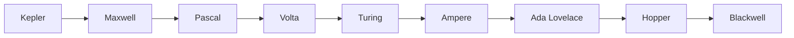
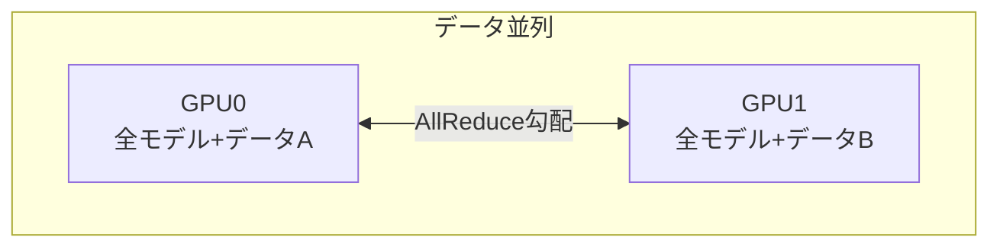

## 概要
NVIDIAはゲーミング用GeForce・プロフェッショナル用RTX/Quadro・データセンター用A100/H100/B200と、用途別に複数の製品ラインを展開しています。「どのGPUを選べばいいか」を性能・VRAM・価格・用途で整理します。AI開発・研究・車載ADASなど目的に応じた選択指針をまとめました。

## NVIDIA GPUアーキテクチャの世代

GPUは数年ごとに新しいアーキテクチャ世代へ更新され、世代が新しいほどTensorコアや低精度演算（FP8など）が強化されます。

| 世代 (発表年) | Compute Capability | 代表製品 |
|---|---|---|
| Kepler (2012) | 3.x | GTX 680・Tesla K80 |
| Maxwell (2014) | 5.x | GTX 980・Tesla M40 |
| Pascal (2016) | 6.x | GTX 1080・P100（初HBM2） |
| Volta (2017) | 7.0 | V100（初Tensorコア） |
| Turing (2018) | 7.5 | RTX 2080（初RTコア）・T4 |
| Ampere (2020) | 8.x | RTX 3090・A100・A30 |
| Ada Lovelace (2022) | 8.9 | RTX 4090・RTX 6000 Ada |
| Hopper (2022) | 9.0 | H100・H200 |
| Blackwell (2024) | 10.x | B100・B200・RTX 5090・GB200 |

## 可視化

## コンシューマー向け：GeForce RTX シリーズ

ゲーミング・個人のAI開発向け。コストパフォーマンスに優れますが、ECCメモリ非対応・データセンター利用にライセンス制約があります。

| モデル | VRAM | CUDAコア | TDP | 価格(USD) | 世代 |
|---|---|---|---|---|---|
| RTX 5090 | 32GB | 21,760 | 575W | $1,999 | Blackwell |
| RTX 5080 | 16GB | 10,752 | 360W | $999 | Blackwell |
| RTX 5070 Ti | 16GB | 8,960 | 300W | $749 | Blackwell |
| RTX 4090 | 24GB | 16,384 | 450W | $1,599 | Ada |
| RTX 4080 Super | 16GB | 10,240 | 320W | $999 | Ada |
| RTX 4070 Super | 12GB | 7,168 | 220W | $599 | Ada |
| RTX 4060 Ti | 16GB | 4,352 | 165W | $499 | Ada |
| RTX 4060 | 8GB | 3,072 | 115W | $299 | Ada |

> 💡 AI用途では **VRAM容量** が最重要。学習するモデルがVRAMに乗らなければ性能を発揮できません。

## プロフェッショナル向け：RTX / Quadro シリーズ

ワークステーション向け。**ECC（Error Correcting Code）メモリ**でビット反転エラーを自動訂正するため、科学計算・医療・自動運転など信頼性が必要な用途に使われます。

| モデル | VRAM | ECC | 主な用途 |
|---|---|---|---|
| RTX Pro 6000 | 96GB | ✅ | ハイエンドWS・3D/DL |
| RTX 6000 Ada | 48GB | ✅ | 大規模モデル推論・CAD |
| RTX 5000 Ada | 32GB | ✅ | 中規模ワークステーション |
| RTX 4500 Ada | 24GB | ✅ | 設計・シミュレーション |
| RTX 4000 Ada | 20GB | ✅ | コンパクト・省電力 |

## データセンター・AI向け：A/H/B シリーズ

LLM学習・大規模推論の主力。SXM形状はNVLinkで複数GPUを高速接続でき、PCIe形状は標準サーバーに搭載できます。

| モデル | VRAM | FP16 | FP8 | TDP | 形状 | 備考 |
|---|---|---|---|---|---|---|
| B200 SXM | 192GB HBM3e | 2,250 TF | 4,500 TF | 1000W | SXM | 最新フラッグシップ |
| B100 SXM | 192GB HBM3e | 1,750 TF | 3,500 TF | 700W | SXM | B200の省電力版 |
| H200 SXM | 141GB HBM3e | 989 TF | 1,979 TF | 700W | SXM | H100+大容量HBM3e |
| H100 SXM | 80GB HBM2e | 989 TF | 1,979 TF | 700W | SXM | LLM学習の現標準 |
| H100 PCIe | 80GB HBM2e | 756 TF | 1,513 TF | 350W | PCIe | 標準サーバー搭載 |
| A100 SXM | 80GB HBM2e | 312 TF | — | 400W | SXM | GPT-3時代の標準 |
| L40S | 48GB GDDR6 | 362 TF | 733 TF | 350W | PCIe | 推論・マルチメディア |
| A10 | 24GB GDDR6 | 125 TF | — | 150W | PCIe | 推論・入門DC |

## 用途別 GPU 選択ガイド

| 用途 | 推奨GPU | VRAM | 価格感 |
|---|---|---|---|
| 個人ホビー・入門ML | RTX 4070 / 5070 | 12〜16GB | 5〜10万円 |
| 研究・本格モデル開発 | RTX 4090 / 5090 | 24〜32GB | 20〜30万円 |
| スタートアップ・中規模学習 | A100 / H100 PCIe | 80GB | クラウド $2〜4/時 |
| 大規模LLM学習 | H100 SXM × 数百〜数千台 | 80GB×N | クラスタ $10M〜 |
| 推論サービング | L40S / H100 PCIe / A10 | 24〜80GB | クラウド $0.8〜3/時 |
| 車載ADAS・エッジ | Jetson Orin / DRIVE Thor | 16〜64GB共有 | Jetson $500〜 |

**必要VRAMの目安**：モデルのパラメータ数を $P$、1パラメータあたりのバイト数を $b$（FP16なら2、FP32なら4）とすると、推論時の最低VRAMは

$$\text{VRAM}_{\text{推論}} \approx P \times b$$

学習時はパラメータ・勾配・オプティマイザ状態（Adamは2倍）が必要で、おおよそ推論の **4〜6倍** を見込みます。

## NVLink と GPU 並列学習

NVLinkはGPU間を直結する高速インターコネクトで、PCIeより桁違いに速くテンソル並列に必須です。

| 世代 | 帯域幅（双方向） |
|---|---|
| NVLink 2.0 (Volta) | 300 GB/s |
| NVLink 3.0 (Ampere) | 600 GB/s |
| NVLink 4.0 (Hopper) | 900 GB/s |
| NVLink 5.0 (Blackwell) | 1,800 GB/s |
| PCIe 5.0 x16（参考） | 128 GB/s |

複数GPUでの学習には主に4つの戦略があります。

| 戦略 | 分割するもの | 代表実装 |
|---|---|---|
| データ並列 (DDP) | データ（モデルは複製） | PyTorch DistributedDataParallel |
| テンソル並列 | 重み行列を分割 | Megatron-LM（NVLink必須） |
| パイプライン並列 | 層をGPUに順番に配置 | GPipe / PipeDream |
| ZeRO | パラメータ・勾配・状態を分散 | DeepSpeed ZeRO-3 |

## 自動車向け GPU：NVIDIA DRIVE / Jetson

車載向けは低消費電力・機能安全（ISO 26262）が重視され、性能はTOPS（1秒あたり兆回演算）で表されます。

| モデル | AI性能 | TDP | 用途 |
|---|---|---|---|
| Jetson Orin Nano | 40 TOPS | 10W | スマートカメラ・ドローン |
| Jetson AGX Orin | 275 TOPS | 60W | 自律ロボット・産業AGV |
| DRIVE Orin | 254 TOPS | 45W | L2+自動運転（ASIL-D） |
| DRIVE Thor | 2,000 TOPS | 150W | L4自動運転・中央コンピュータ |

- **DRIVE Orin 採用車種**：Mercedes-Benz EQS, Volvo EX90, Li Auto L9 など
- **DRIVE Thor**：次世代電動車（2025年〜量産予定）

## クラウド GPU サービス比較

自前でGPUを買わずに時間単位で借りられます（料金は2024年末時点・変動あり）。

| サービス | GPU構成 | VRAM | $/時 |
|---|---|---|---|
| AWS p5.48xlarge | H100 × 8 | 640GB | $98.32 |
| GCP a3-highgpu-8g | H100 × 8 | 640GB | $32.77 |
| Azure NC H100 v5 | H100 × 8 | 640GB | $36.00 |
| Lambda Cloud | H100 × 8 | 640GB | $21.44 |
| RunPod (Secure) | H100 SXM × 8 | 640GB | $29.92 |
| Vast.ai (中断あり) | H100 × 1 | 80GB | $2.49 |

**コスト試算**：時間単価 $r$、利用時間 $t$ なら総額は $\text{Cost} = r \times t$。例えば A100×8（$32.77/時）を10時間使うと約 $328（約5万円）です。短期実験はスポット/中断ありインスタンスが圧倒的に安価です。
