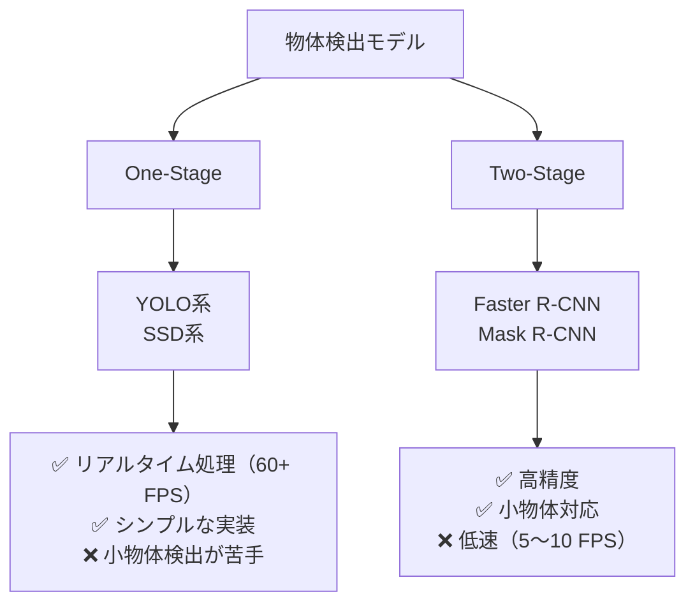

## 概要
物体検出は画像中の物体の位置（バウンディングボックス）とクラスを同時に予測するタスクです。ADAS（先進運転支援）での歩行者・車両検出、工場の外観検査、カメラ映像からの異常検知など、車載・産業分野で広く使われます。

## 物体検出の基礎概念

```python
import numpy as np
import matplotlib.pyplot as plt
import matplotlib.patches as patches

# バウンディングボックスの表現形式
# XYXY形式: [x1, y1, x2, y2]（左上・右下の座標）
# XYWH形式: [cx, cy, w, h]（中心座標・幅・高さ）

def xyxy_to_xywh(box):
    x1, y1, x2, y2 = box
    return [(x1+x2)/2, (y1+y2)/2, x2-x1, y2-y1]

def xywh_to_xyxy(box):
    cx, cy, w, h = box
    return [cx-w/2, cy-h/2, cx+w/2, cy+h/2]

# IoU（Intersection over Union）- 検出精度の指標
def compute_iou(box1, box2):
    """box: [x1, y1, x2, y2]"""
    xi1 = max(box1[0], box2[0])
    yi1 = max(box1[1], box2[1])
    xi2 = min(box1[2], box2[2])
    yi2 = min(box1[3], box2[3])

    inter = max(0, xi2-xi1) * max(0, yi2-yi1)
    area1 = (box1[2]-box1[0]) * (box1[3]-box1[1])
    area2 = (box2[2]-box2[0]) * (box2[3]-box2[1])
    union = area1 + area2 - inter
    return inter / union if union > 0 else 0

gt  = [50, 50, 200, 200]
pred = [60, 60, 210, 190]
print(f"IoU: {compute_iou(gt, pred):.3f}")  # 0.7以上が一般的な閾値
```

## Non-Maximum Suppression（NMS）

```python
def nms(boxes, scores, iou_threshold=0.5):
    """複数の重複ボックスから最良のものを選ぶ"""
    idxs = np.argsort(scores)[::-1]
    keep = []
    while len(idxs) > 0:
        best = idxs[0]
        keep.append(best)
        ious = np.array([compute_iou(boxes[best], boxes[i]) for i in idxs[1:]])
        idxs = idxs[1:][ious < iou_threshold]
    return keep

# 使用例
boxes  = [[50,50,200,200], [55,55,205,205], [300,100,500,300], [310,110,510,310]]
scores = [0.9, 0.75, 0.85, 0.6]
kept   = nms(boxes, scores, iou_threshold=0.5)
print(f"NMS後の検出: {kept} → スコア {[scores[i] for i in kept]}")
```

## YOLOv8の使い方

```python
# pip install ultralytics
from ultralytics import YOLO
import cv2

# 事前学習済みモデルのロード
model = YOLO("yolov8n.pt")   # nanoモデル（最小・最速）

# 推論
results = model("image.jpg", conf=0.5, iou=0.45)

for result in results:
    boxes   = result.boxes.xyxy.numpy()    # バウンディングボックス
    classes = result.boxes.cls.numpy()     # クラスID
    confs   = result.boxes.conf.numpy()    # 信頼度スコア
    for box, cls, conf in zip(boxes, classes, confs):
        print(f"Class: {result.names[int(cls)]}, Conf: {conf:.2f}, Box: {box.astype(int)}")

# 画像への描画
annotated = results[0].plot()   # バウンディングボックス描画済み画像
cv2.imwrite("output.jpg", annotated)

# 動画処理
results_stream = model("video.mp4", stream=True)
for frame_result in results_stream:
    frame = frame_result.plot()
    cv2.imshow("Detection", frame)
    if cv2.waitKey(1) == ord("q"):
        break
```

## カスタムデータでファインチューニング

```python
# データセット構成（YOLO形式）
# dataset/
#   images/train/*.jpg
#   images/val/*.jpg
#   labels/train/*.txt  # 各行: class cx cy w h（0〜1正規化）
#   dataset.yaml

import yaml
dataset_config = {
    "path":  "/path/to/dataset",
    "train": "images/train",
    "val":   "images/val",
    "nc":    3,                             # クラス数
    "names": ["car", "pedestrian", "sign"], # クラス名
}
with open("dataset.yaml", "w") as f:
    yaml.dump(dataset_config, f)

# ファインチューニング
model = YOLO("yolov8n.pt")
results = model.train(
    data    = "dataset.yaml",
    epochs  = 100,
    imgsz   = 640,
    batch   = 16,
    lr0     = 0.01,
    device  = "cuda" if __import__("torch").cuda.is_available() else "cpu",
    project = "runs/detect",
    name    = "my_model",
)
print(f"最良mAP50: {results.results_dict['metrics/mAP50(B)']:.3f}")
```

## 評価指標（mAP）

```python
# mAP（mean Average Precision）の計算概念
def average_precision(recalls, precisions):
    """AUC of Precision-Recall curve（11点補間）"""
    ap = 0
    for t in np.linspace(0, 1, 11):
        prec_at_t = precisions[recalls >= t]
        ap += (prec_at_t.max() if len(prec_at_t) > 0 else 0)
    return ap / 11

# mAP@50: IoU=0.5での各クラスAPの平均
# mAP@50-95: IoU=0.5〜0.95の平均（COCO標準）
```

## 主要モデルの比較



| モデル | mAP (COCO) | FPS (GPU) | 用途 |
|---|---|---|---|
| YOLOv8n | 37.3% | 480+ | エッジ・リアルタイム |
| YOLOv8x | 53.9% | 60 | 精度重視 |
| Faster R-CNN | 42.0% | 15 | 高精度検出 |
| DETR | 42.0% | 28 | 研究・複雑シーン |
