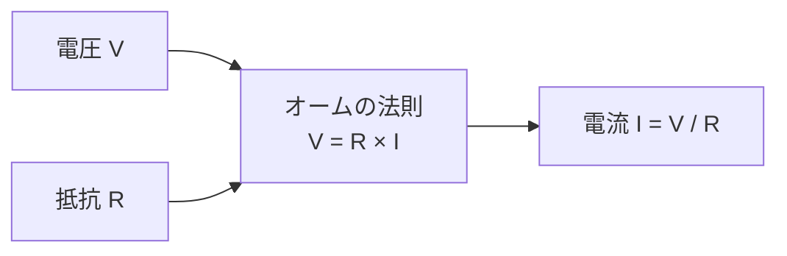

## 概要
オームの法則は電気の最も基本的な法則です。「電圧・電流・抵抗の関係」を一つの式で表します。1827年にゲオルク・オームが発見し、回路設計・故障診断・車載ECU開発のすべての場面で使われます。



## オームの法則

$$V = R \times I$$

- **V**：電圧 [V（ボルト）]
- **R**：抵抗 [Ω（オーム）]
- **I**：電流 [A（アンペア）]

```
覚え方（オームの三角形）:

        [ V ]
       -------
       [ R×I ]

  V = R × I    → 電圧を求める
  I = V ÷ R    → 電流を求める
  R = V ÷ I    → 抵抗を求める
```

## 計算例

```python
# オームの法則の計算
def ohms_law(V=None, R=None, I=None):
    """V, R, I のうち2つを与えると残り1つを返す"""
    if V is None: return R * I,  "V = R × I"
    if R is None: return V / I,  "R = V / I"
    if I is None: return V / R,  "I = V / R"

# 例1: 12V の電源に 4Ω の抵抗をつなぐと電流は？
I, formula = ohms_law(V=12, R=4)
print(f"電流 I = {I} A  ({formula})")   # → 3.0 A

# 例2: 5V の電源で 0.02A 流したい。抵抗は？
R, formula = ohms_law(V=5, I=0.02)
print(f"抵抗 R = {R} Ω  ({formula})")   # → 250.0 Ω

# 例3: 100Ω に 2A 流れている。電圧は？
V, formula = ohms_law(R=100, I=2)
print(f"電圧 V = {V} V  ({formula})")   # → 200.0 V
```

**数式で表すと**

$$
V = R I \quad\Longleftrightarrow\quad I = \frac{V}{R} \quad\Longleftrightarrow\quad R = \frac{V}{I}
$$

電圧 \( V \) [V]、抵抗 \( R \) [Ω]、電流 \( I \) [A] の関係。2つが分かれば残り1つが求まります。

## グラフで見るオームの法則

```python
import numpy as np
import matplotlib.pyplot as plt

fig, axes = plt.subplots(1, 2, figsize=(12, 5))

# 同じ抵抗でも電圧が大きいほど電流が大きい
V_range = np.linspace(0, 10, 100)
for R in [1, 2, 5, 10]:
    I = V_range / R
    axes[0].plot(V_range, I, label=f"R = {R} Ω")
axes[0].set_xlabel("電圧 V [V]")
axes[0].set_ylabel("電流 I [A]")
axes[0].set_title("電圧−電流特性")
axes[0].legend()
axes[0].grid(True)

# 同じ電圧でも抵抗が大きいほど電流は小さい
R_range = np.linspace(1, 50, 100)
for V in [5, 10, 20]:
    I = V / R_range
    axes[1].plot(R_range, I, label=f"V = {V} V")
axes[1].set_xlabel("抵抗 R [Ω]")
axes[1].set_ylabel("電流 I [A]")
axes[1].set_title("抵抗−電流特性")
axes[1].legend()
axes[1].grid(True)

plt.tight_layout()
plt.show()
```

## 実際の回路での使い方

### LED に流す電流の制限抵抗

```python
# LEDを点灯させるときの抵抗計算
V_supply = 5.0    # 電源電圧 [V]
V_led    = 2.0    # LEDの順方向電圧降下 [V]
I_led    = 0.020  # LEDに流したい電流 [A] = 20mA

# LEDと抵抗で分担する電圧
V_resistor = V_supply - V_led   # = 3.0 V

# 必要な抵抗値
R = V_resistor / I_led
print(f"必要な抵抗: {R} Ω")     # → 150 Ω
print(f"最も近い規格値: 150Ω または 180Ω を使う")
```

**数式で表すと**

$$
R = \frac{V_{supply} - V_{LED}}{I_{LED}}
$$

制限抵抗が受け持つ電圧 \( V_{supply}-V_{LED} \) [V] を目標電流 \( I_{LED} \) [A] で割った値。オームの法則そのものです。

### 車載システム（12V）の例

```python
# 自動車のヘッドライト（55W, 12V）の電流
V = 12    # バッテリー電圧
P = 55    # 電力 [W]

I = P / V
print(f"ヘッドライトの電流: {I:.2f} A")   # → 4.58 A

R = V / I
print(f"等価抵抗: {R:.2f} Ω")             # → 2.62 Ω

# ECUの制御回路（3.3V, 10mA）
V_ecu = 3.3
I_ecu = 0.010   # 10mA
R_ecu = V_ecu / I_ecu
print(f"ECU制御回路の抵抗: {R_ecu} Ω")   # → 330 Ω
```

**数式で表すと**

$$
I = \frac{P}{V}, \qquad R = \frac{V}{I} = \frac{V^2}{P}
$$

電力 \( P \) [W] と電圧 \( V \) [V] から電流 \( I \) [A] を求め、さらにオームの法則で等価抵抗 \( R \) [Ω] を導きます。

## 抵抗のカラーコード

市販の抵抗器には色のバンドで抵抗値が書かれています。

```
4バンド抵抗の読み方:

  [第1色][第2色][乗数色][許容差色]

  黒=0, 茶=1, 赤=2, 橙=3, 黄=4
  緑=5, 青=6, 紫=7, 灰=8, 白=9
  乗数: 金=×0.1, 銀=×0.01
  許容差: 金=±5%, 銀=±10%

例: 茶・黒・赤・金 = 1, 0, ×100, ±5%
                    = 1000 Ω = 1 kΩ ±5%
```

```python
COLOR_CODE = {
    "黒": 0, "茶": 1, "赤": 2, "橙": 3, "黄": 4,
    "緑": 5, "青": 6, "紫": 7, "灰": 8, "白": 9,
}
MULTIPLIER = {"黒": 1, "茶": 10, "赤": 100, "橙": 1e3, "黄": 1e4,
              "緑": 1e5, "青": 1e6, "金": 0.1, "銀": 0.01}
TOLERANCE  = {"金": "±5%", "銀": "±10%", "茶": "±1%", "赤": "±2%"}

def read_resistor(b1, b2, mult, tol):
    r = (COLOR_CODE[b1] * 10 + COLOR_CODE[b2]) * MULTIPLIER[mult]
    if r >= 1e6: label = f"{r/1e6:.1f} MΩ"
    elif r >= 1e3: label = f"{r/1e3:.1f} kΩ"
    else: label = f"{r:.0f} Ω"
    return f"{label} {TOLERANCE[tol]}"

print(read_resistor("茶", "黒", "赤", "金"))    # → 1.0 kΩ ±5%
print(read_resistor("黄", "紫", "橙", "金"))    # → 47.0 kΩ ±5%
```

オームの法則を使った回路計算は [[circuit-series-parallel]] で詳しく学びましょう。
