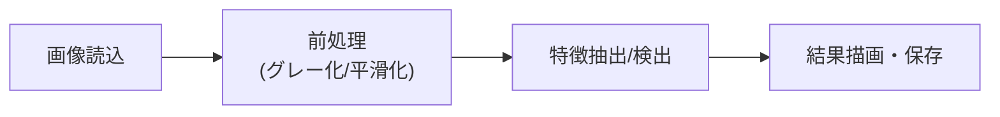

## 概要
OpenCV（Open Source Computer Vision Library）はC++/Python対応の高速な画像処理ライブラリです。画像の読み込み・変換・フィルタリング・エッジ検出・物体検出まで、コンピュータビジョンに必要な操作がほぼすべて揃っています。



## なぜ使うか
カメラ画像の前処理・特徴抽出・リアルタイム処理にはOpenCVが最速です。딥러닝での推論前の前処理（リサイズ・正規化）にも使い、自動運転の開発現場でも定番のライブラリです。

## 基本操作

```python
import cv2
import numpy as np
import matplotlib.pyplot as plt

# 画像の読み込み（OpenCVはBGR形式で読む）
img_bgr = cv2.imread("photo.jpg")
img_rgb = cv2.cvtColor(img_bgr, cv2.COLOR_BGR2RGB)   # matplotlib表示用

print(f"形状: {img_bgr.shape}")   # (H, W, C) = (height, width, 3)
print(f"dtype: {img_bgr.dtype}")  # uint8

# グレースケール変換
gray = cv2.cvtColor(img_bgr, cv2.COLOR_BGR2GRAY)

# 表示
fig, axes = plt.subplots(1, 2, figsize=(10, 4))
axes[0].imshow(img_rgb)
axes[0].set_title("カラー（RGB）")
axes[1].imshow(gray, cmap="gray")
axes[1].set_title("グレースケール")
plt.tight_layout()
plt.show()

# 保存
cv2.imwrite("output.jpg", img_bgr)
```

## リサイズ・クロップ・回転

```python
h, w = img_bgr.shape[:2]

# リサイズ
resized = cv2.resize(img_bgr, (256, 256))
# アスペクト比を維持してリサイズ
scale   = 256 / max(h, w)
resized_ar = cv2.resize(img_bgr, None, fx=scale, fy=scale)

# クロップ（スライスで切り出す）
y1, y2, x1, x2 = 100, 300, 50, 250
cropped = img_bgr[y1:y2, x1:x2]

# 回転
center  = (w // 2, h // 2)
M       = cv2.getRotationMatrix2D(center, angle=30, scale=1.0)
rotated = cv2.warpAffine(img_bgr, M, (w, h))

# 水平・垂直反転
flip_h = cv2.flip(img_bgr, 1)   # 水平
flip_v = cv2.flip(img_bgr, 0)   # 垂直
```

## 色空間と閾値処理

```python
# HSV空間での色抽出（例: 赤色を検出）
img_hsv = cv2.cvtColor(img_bgr, cv2.COLOR_BGR2HSV)

# 赤色の範囲（HSV）
lower_red1 = np.array([0,   120, 70])
upper_red1 = np.array([10,  255, 255])
lower_red2 = np.array([170, 120, 70])
upper_red2 = np.array([180, 255, 255])

mask1 = cv2.inRange(img_hsv, lower_red1, upper_red1)
mask2 = cv2.inRange(img_hsv, lower_red2, upper_red2)
mask  = cv2.bitwise_or(mask1, mask2)

red_region = cv2.bitwise_and(img_bgr, img_bgr, mask=mask)

# 2値化（グレースケール画像に適用）
_, binary_fixed  = cv2.threshold(gray, 127, 255, cv2.THRESH_BINARY)
binary_otsu      = cv2.threshold(gray, 0, 255, cv2.THRESH_BINARY + cv2.THRESH_OTSU)[1]
adaptive_binary  = cv2.adaptiveThreshold(gray, 255,
                                          cv2.ADAPTIVE_THRESH_GAUSSIAN_C,
                                          cv2.THRESH_BINARY, 11, 2)
```

## フィルタリング（ノイズ除去・ぼかし）

```python
# ガウシアンブラー（ノイズ除去）
blur_gauss = cv2.GaussianBlur(img_bgr, (7, 7), sigmaX=0)

# メディアンフィルタ（胡椒ノイズに強い）
blur_median = cv2.medianBlur(img_bgr, 5)

# バイラテラルフィルタ（エッジを保ちつつノイズ除去）
blur_bilateral = cv2.bilateralFilter(img_bgr, d=9, sigmaColor=75, sigmaSpace=75)

# シャープニング（アンシャープマスク）
blurred = cv2.GaussianBlur(img_bgr, (5, 5), 0)
sharpened = cv2.addWeighted(img_bgr, 1.5, blurred, -0.5, 0)
```

## エッジ検出

```python
# Canny エッジ検出（最もよく使われる）
edges_canny = cv2.Canny(gray, threshold1=50, threshold2=150)

# Sobel（x/y方向の勾配）
sobel_x = cv2.Sobel(gray, cv2.CV_64F, 1, 0, ksize=3)
sobel_y = cv2.Sobel(gray, cv2.CV_64F, 0, 1, ksize=3)
sobel   = cv2.magnitude(sobel_x, sobel_y)

# Laplacian
laplacian = cv2.Laplacian(gray, cv2.CV_64F)

fig, axes = plt.subplots(1, 3, figsize=(14, 4))
for ax, img, title in zip(axes,
    [edges_canny, np.uint8(np.abs(sobel)), np.uint8(np.abs(laplacian))],
    ["Canny", "Sobel", "Laplacian"]):
    ax.imshow(img, cmap="gray")
    ax.set_title(title)
plt.tight_layout()
plt.show()
```

## 輪郭検出と物体検出

```python
# 2値化 → 輪郭を検出
contours, hierarchy = cv2.findContours(binary_otsu,
                                        cv2.RETR_EXTERNAL,
                                        cv2.CHAIN_APPROX_SIMPLE)

# 面積で小さい輪郭を除去
large_contours = [c for c in contours if cv2.contourArea(c) > 500]
print(f"検出輪郭数: {len(large_contours)}")

# 輪郭を描画
canvas = img_rgb.copy()
cv2.drawContours(canvas, large_contours, -1, (0, 255, 0), 2)

# バウンディングボックスを描画
for c in large_contours:
    x, y, w, h = cv2.boundingRect(c)
    cv2.rectangle(canvas, (x, y), (x+w, y+h), (255, 0, 0), 2)

plt.imshow(canvas)
plt.title("輪郭 + バウンディングボックス")
plt.show()
```

## カメラキャプチャとリアルタイム処理

```python
cap = cv2.VideoCapture(0)   # 0: デフォルトカメラ

while cap.isOpened():
    ret, frame = cap.read()
    if not ret:
        break

    gray   = cv2.cvtColor(frame, cv2.COLOR_BGR2GRAY)
    edges  = cv2.Canny(gray, 50, 150)
    output = cv2.cvtColor(edges, cv2.COLOR_GRAY2BGR)

    # FPS表示
    cv2.putText(output, "Edge Detection",
                (10, 30), cv2.FONT_HERSHEY_SIMPLEX, 0.8, (0, 255, 0), 2)

    cv2.imshow("Edge Detection", output)
    if cv2.waitKey(1) & 0xFF == ord("q"):
        break

cap.release()
cv2.destroyAllWindows()
```

## 次に学ぶべき内容
深層学習と組み合わせた高度な [[image-processing]] を学びましょう。
