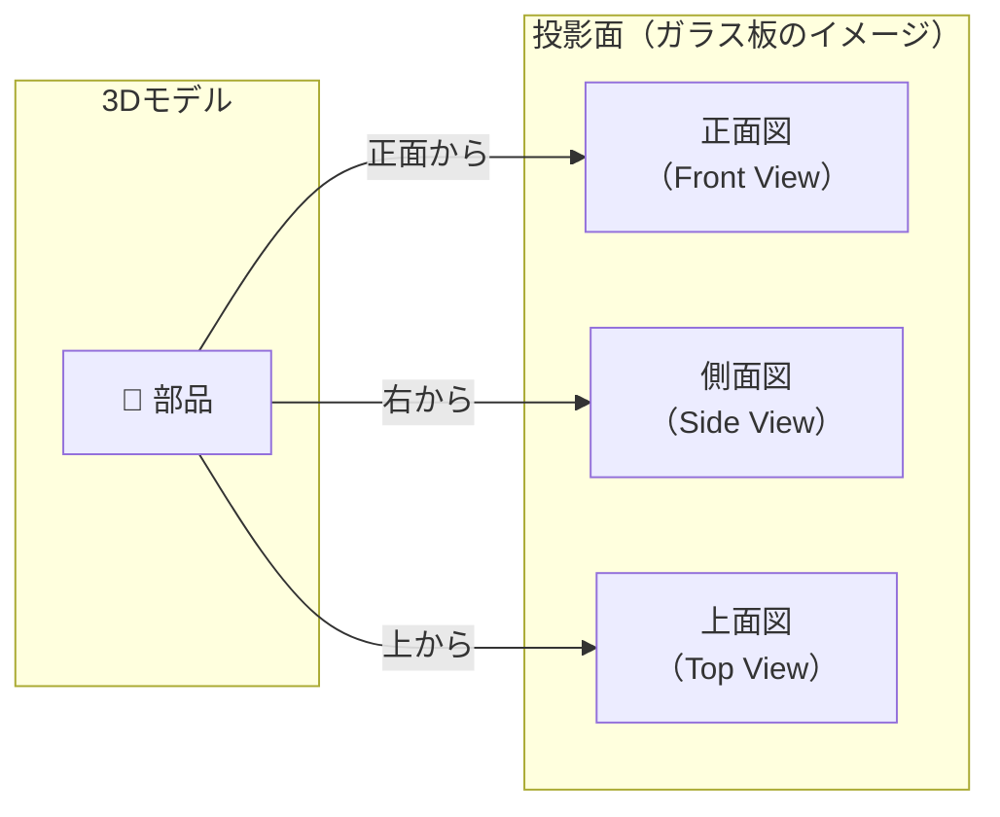
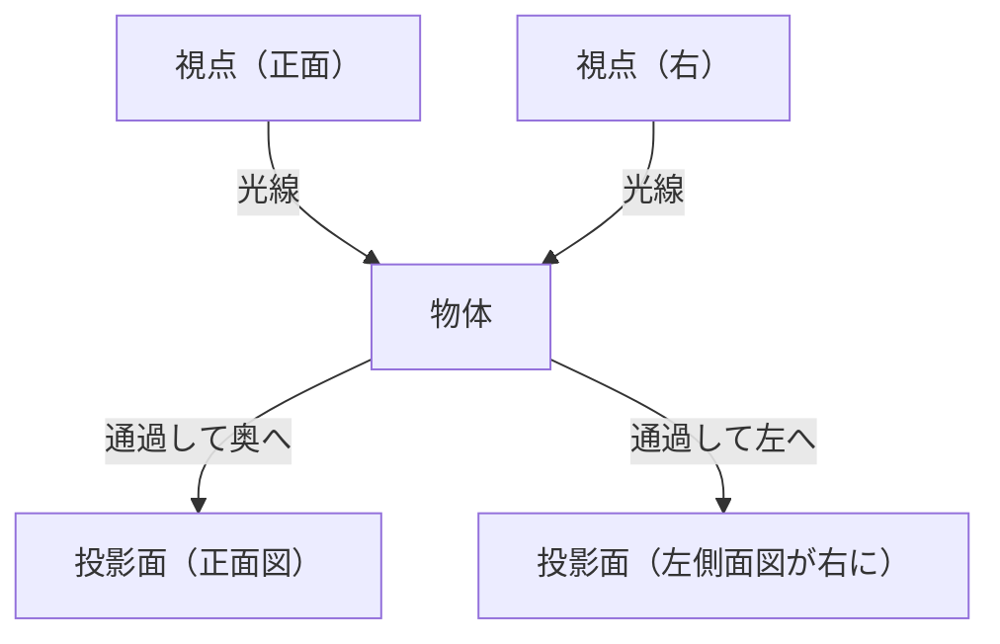
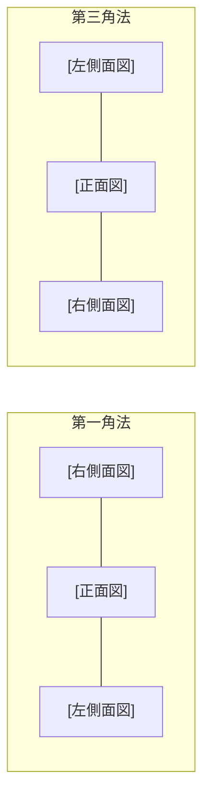

## 正投影図とは

立体（3Dモデル）を**平面の図面（2D）に落とし込む**方法が「投影」です。正投影（直投影）は、光線が投影面に対して**垂直・平行**に当たるとして描く手法で、寸法が正確に表れるため製造図面の基本です。



## 三面図の構成

多くの部品は**3方向からの投影（三面図）** で形状が完全に決まります：

| 図 | 別名 | 見る方向 |
|----|------|---------|
| 正面図（主投影図） | フロントビュー | 正面（部品の主要な形状面） |
| 平面図 | トップビュー・上面図 | 真上から |
| 側面図 | サイドビュー | 右または左から |

## 第一角法（ヨーロッパ式）

**JIS（日本工業規格）・ISO** が採用。ヨーロッパ・日本で標準。

「物体を**投影面の手前**に置く」イメージ。視点から見た光線が**物体を通過して奥の面に投影**されます。

```
        上
        ↑
左  ←  [物体]  →  右
        ↓
        下

配置ルール（第一角法）:
  ┌──────────────────┐
  │   [上面図]       │
  ├──────┬───────────┤
  │[左面]│[正面図]  [右面]
  ├──────┴───────────┤
  │   [下面図]       │
  └──────────────────┘
  ※ 正面図の「右」に左側面図が来る（視線方向と反対側）
```



### 第一角法の記号

図面の表題欄近くに記入される**投影法記号**：

```
第一角法マーク: 円錐の尖った側が「見る方向」を向く
  ◁—● （左が細くなった円錐と丸）
```

## 第三角法（アメリカ式）

**ASME（アメリカ）・各国の製造業**で広く使用。アメリカ系の自動車・航空宇宙産業ではこちらが主流。

「物体を**投影面の奥**に置く」イメージ。光線が**透明なガラス面に当たって手前に映る**（窓ガラスに顔を映すイメージ）。

```
配置ルール（第三角法）:
  ┌──────────────────┐
  │   [上面図]       │
  ├──────┬───────────┤
  │[左面]│[正面図]  [右面]
  ├──────┴───────────┤
  │   [下面図]       │
  └──────────────────┘
  ※ 正面図の「右」に右側面図が来る（直感的）
```

> 注目：配置の**レイアウトは同じでも意味が逆**。第三角法では見た方向の側に図が来るので直感的。

### 第三角法の記号

```
第三角法マーク: 円錐の丸い側が「見る方向」を向く
  ●—▷ （丸と右が細くなった円錐）
```

## 第一角法 vs 第三角法 比較

| 項目 | 第一角法 | 第三角法 |
|------|---------|---------|
| 採用地域 | 日本・ヨーロッパ・中国 | アメリカ・カナダ |
| 規格 | JIS B 0001, ISO | ASME Y14.5 |
| 直感性 | やや分かりにくい | 直感的（見た方向に図が来る） |
| 右側面図の位置 | 正面図の**左**に配置 | 正面図の**右**に配置 |



## 断面図

隠れた内部形状を表すため、**切断面で切った断面**を描く方法。

```
断面の種類:
  全断面図（Full Section）   : 部品全体を切断
  半断面図（Half Section）   : 対称部品の半分を断面に
  部分断面図（Broken Section）: 一部だけ切り欠く
  回転断面図（Revolved Section）: 断面をその場に90°回転して描く
  展開断面図（Removed Section）: 断面を別の場所に描く
```

断面部分には**ハッチング**（斜線）を入れて、切断された実体を示します：

| 材料 | ハッチングパターン |
|------|-----------------|
| 鉄鋼 | 45°細斜線 |
| アルミ | 横線 |
| 銅・黄銅 | 斜線+点 |
| ゴム・シール | 黒塗り |

## 補助投影図（局部投影）

傾斜面は正面・側面・上面に正確に映らないため、傾斜面に**平行な補助投影面**を設けて描きます。

```
  ／──────────────────────────＼
 ／  傾斜面（正面図では歪む）   ＼
 ＼───────────────────────────／
         ↓ 補助投影
  ┌────────────────────┐
  │  傾斜面の実形が現れる │
  └────────────────────┘
```

## 線の種類と意味

JIS B 0001 で定められた線の使い方：

| 線の種類 | 太さ | 用途 |
|---------|------|------|
| 外形線（実線・太） | 0.5〜0.7mm | 見える輪郭 |
| 隠れ線（破線・細） | 0.25〜0.35mm | 見えない輪郭 |
| 中心線（一点鎖線・細） | 0.25mm | 円・対称の中心、回転軸 |
| 切断線（一点鎖線・太端部） | 両端太 | 断面の切断位置 |
| 寸法線・寸法補助線（細） | 0.25mm | 寸法記入 |
| 破断線（フリーハンドに近い） | 細 | 中断を示す |

## 寸法記入のルール

```
基本原則:
  ① 寸法は一箇所に一度だけ記入（重複禁止）
  ② 内形寸法・外形寸法を明確に
  ③ 機能上重要な寸法は直接記入
  ④ 計算で求められる寸法は不要
  ⑤ 寸法は加工・測定しやすい場所に

記号:
  Ø  直径（Φ、丸棒・穴）
  R  半径（フィレット・円弧）
  □  正方形断面
  ◇  板厚
  SR 球の半径
  SØ 球の直径
```

## 公差（Tolerance）

設計寸法どおりに製造することは不可能なので、許容できる誤差範囲（公差）を指定します。

```
記入例: 50 ±0.05
  → 49.95mm 〜 50.05mm の範囲なら合格

  最大材料条件: 50.05mm（穴なら最小径、軸なら最大径）
  最小材料条件: 49.95mm

はめあい（JIS B 0401）:
  Ø20 H7/f6 → 穴Ø20H7 と 軸Ø20f6 の組み合わせ
  H7 = 穴側の公差クラス（大文字）
  f6 = 軸側の公差クラス（小文字）
```

## 表面粗さ

```
記号:  √ Ra 1.6   （算術平均粗さ 1.6μm）

代表的な粗さと加工法:
  Ra 25   → 旋削（荒削り）
  Ra 6.3  → フライス削り（通常）
  Ra 1.6  → 旋削（仕上げ）
  Ra 0.4  → 研削
  Ra 0.1  → ラッピング・超仕上げ
```

## まとめ

```
図面を読むチェックリスト:
  □ 投影法マーク確認（第一角 or 第三角）
  □ 正面図がどれか特定する
  □ 各図の配置関係を把握する
  □ 隠れ線（破線）で内部構造を確認
  □ 断面図の切断位置を確認
  □ 寸法・公差・表面粗さを読む
  □ 材料・表題欄を確認
```

第一角法（日本・欧州）と第三角法（米国）は投影面の位置の考え方が逆なので、自動車・航空など国際的な仕事では両方を読めることが必須です。
