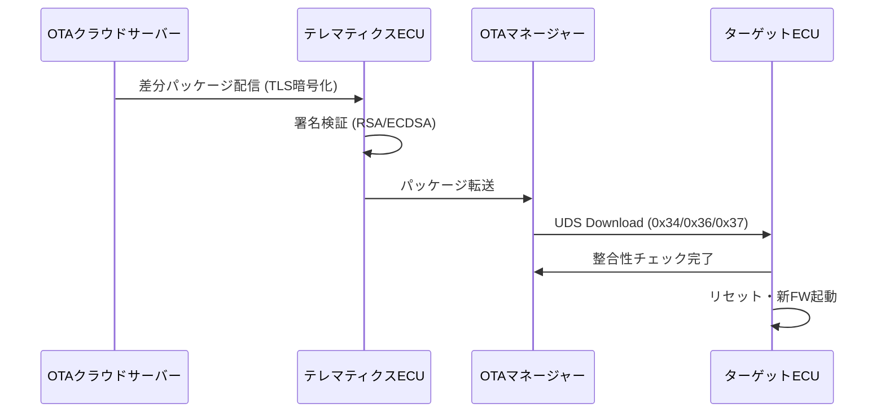

## 概要
OTA(Over-The-Air)更新は、無線通信を通じて車両のソフトウェア・ファームウェアをリモートで書き換える仕組みです。販売店に持ち込まずに最新機能の追加やバグ修正が可能となり、SDVの中核技術の一つです。

## なぜ必要か
現代の車両はソフトウェアが数億行に達し、リコール対応や機能改善のたびにディーラー来店を強いていては運用コストが膨大になります。OTAにより、クラウドからECUへ直接パッチを配布し、ユーザーへの負担なく常に最新状態を維持できます。

## OTAの流れ
1. **クラウドサーバー**が**差分更新**パッケージ(Delta)を生成
2. **Telematics Control Unit(TCU)** が4G/5G経由でパッケージを受信・検証(署名確認)
3. **OTA Manager** がパッケージを各ドメインコントローラへ転送
4. 各ECUが [[uds]] のDownloadサービスを使ってファームウェアを書き換え
5. **整合性チェック**後にECUをリセット・起動

## セキュリティ要件
改ざんされたファームウェアの書き込みを防ぐため、コード署名(RSA/ECDSA)と**TLS**暗号化が必須です。書き換え失敗時の**ロールバック**機能も安全設計の重要要素です。

## 自動運転での利用例
ADAS認識アルゴリズムのモデル更新、地図データの差分配信、法規制対応のパラメータ調整をOTAで実施します。Adaptive AUTOSARの [[adaptive-autosar]] はOTA更新を標準コンポーネントとして組み込んでいます。

## 関連用語
全体像は [[sdv]]、書き換え手順は [[uds]]、ソフトウェア基盤は [[adaptive-autosar]] を参照。

## 次に学ぶべき内容
OTAを支える [[sdv]] アーキテクチャ全体を理解しましょう。

## 図解

