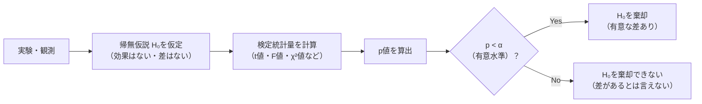

## p値は「偶然起きる確率」

**p値（p-value）** とは、「帰無仮説が正しいと仮定したとき、今回の観測結果と同じかそれ以上に極端な結果が偶然生じる確率」です。

一言で言えば：

> **p値 = 帰無仮説が正しいときに、このデータ（以上に極端なもの）が偶然出る確率**



## 具体例で理解する

**シナリオ**：新しい薬が血圧を下げるか調べる。

- **帰無仮説 H₀**：薬は効果なし（血圧変化の平均 = 0）
- **対立仮説 H₁**：薬は効果あり（血圧変化の平均 ≠ 0）
- 測定結果：p値 = 0.03

このとき「**もし薬に効果がなかったとしたら、今回のような結果（以上に極端な変化）が偶然起きる確率は 3%**」ということです。

有意水準 α = 0.05 なら p < α なので「帰無仮説を棄却 → 有意な効果あり」と判断します。

## p値の計算（Python）

```python
import numpy as np
from scipy import stats

# 薬を飲んだ患者の血圧変化（n=30人）
np.random.seed(42)
changes = np.random.normal(loc=-5, scale=10, size=30)   # 平均-5mmHg
print(f"サンプル平均: {changes.mean():.2f} mmHg")
print(f"サンプル標準偏差: {changes.std():.2f} mmHg")

# 1標本t検定：平均が0と異なるか
t_stat, p_value = stats.ttest_1samp(changes, popmean=0)
print(f"\nt統計量: {t_stat:.3f}")
print(f"p値:     {p_value:.4f}")

if p_value < 0.05:
    print("→ p < 0.05：帰無仮説を棄却（有意な血圧低下あり）")
else:
    print("→ p ≥ 0.05：帰無仮説を棄却できない")
```

**数式で表すと**

1標本 t 検定の統計量と、p 値（両側）の定義。

$$
t = \frac{\bar{x} - \mu_0}{s/\sqrt{n}}, \qquad p = P\bigl(|T_{n-1}| \ge |t| \bigm| H_0\bigr) = 2\bigl(1 - F_{n-1}(|t|)\bigr)
$$

\(F_{n-1}\) は自由度 \(n-1\) の t 分布の累積分布関数。p 値は「帰無仮説のもとで、観測した \(t\) 以上に極端な値が出る確率」を表す。

```
サンプル平均: -5.21 mmHg
サンプル標準偏差: 9.73 mmHg

t統計量: -2.933
p値:     0.0064
→ p < 0.05：帰無仮説を棄却（有意な血圧低下あり）
```

## 有意水準 α とは

**α（アルファ、有意水準）** は「偽陽性を許容する確率の上限」です。事前に決めます。

| α | 使われる場面 |
|---|------------|
| 0.05（5%） | 社会科学・医学の一般的な基準 |
| 0.01（1%） | より厳しい基準（大規模臨床試験など） |
| 0.001（0.1%） | 物理学・ゲノム研究など極めて厳しい場合 |

```python
# 有意水準ごとの判定
alpha_levels = [0.10, 0.05, 0.01, 0.001]
for alpha in alpha_levels:
    result = "棄却" if p_value < alpha else "棄却できない"
    print(f"α={alpha}: {result}  (p={p_value:.4f})")
```

```
α=0.1:   棄却  (p=0.0064)
α=0.05:  棄却  (p=0.0064)
α=0.01:  棄却  (p=0.0064)
α=0.001: 棄却できない  (p=0.0064)
```

## p値についてよくある誤解

### ❌ 誤解1：「p値 = 帰無仮説が正しい確率」

```
❌ 「p = 0.03 だから帰無仮説が正しい確率は 3%」
✅ 正しくは「帰無仮説が正しいとき、今回のデータが偶然起きる確率が 3%」
```

p値は「帰無仮説の確率」ではなく「データの極端さの確率」です。

### ❌ 誤解2：「p < 0.05 なら効果が大きい」

```python
# 大サンプルでは小さな効果でも p < 0.05 になる
np.random.seed(0)
for n in [30, 300, 3000, 30000]:
    x = np.random.normal(0.01, 1, n)   # 効果はほぼゼロ（0.01差）
    _, p = stats.ttest_1samp(x, 0)
    print(f"n={n:6d}: 平均={x.mean():.4f}, p={p:.4f}  {'← 有意！' if p<0.05 else ''}")
```

```
n=    30: 平均=0.0305, p=0.8622
n=   300: 平均=0.0520, p=0.3756
n=  3000: 平均=0.0177, p=0.2963
n= 30000: 平均=0.0112, p=0.0375  ← 有意！
```

n=30,000 で「有意」になったが、**効果量は 0.011 で実質ゼロ**。p値だけでは効果の大きさは分かりません。

### ❌ 誤解3：「p = 0.06 は失敗・p = 0.04 は成功」

0.05 という閾値は恣意的です。p = 0.049 と p = 0.051 に本質的な違いはありません。

### ❌ 誤解4：「p ≥ 0.05 なら効果はない」

```
p ≥ 0.05 → 「効果がないとは言えない」であって「効果がない」ではない
         → サンプルが小さすぎて検出できなかっただけかもしれない
```

## 効果量（Effect Size）を必ず一緒に報告する

p値だけでなく**効果量**（効果の実際の大きさ）を報告するのが現代の標準です。

```python
# Cohen's d: 標準化された効果量
def cohens_d(x, mu0=0):
    return (x.mean() - mu0) / x.std(ddof=1)

np.random.seed(42)
small_effect  = np.random.normal(0.2, 1, 100)   # d = 0.2（小）
medium_effect = np.random.normal(0.5, 1, 100)   # d = 0.5（中）
large_effect  = np.random.normal(0.8, 1, 100)   # d = 0.8（大）

for name, data in [("小", small_effect), ("中", medium_effect), ("大", large_effect)]:
    d = cohens_d(data)
    _, p = stats.ttest_1samp(data, 0)
    print(f"効果{name}: d={d:.2f}, p={p:.4f}")
```

**数式で表すと**

Cohen's d は平均差を標準偏差で割った、単位に依らない効果量。

$$
d = \frac{\bar{x} - \mu_0}{s}
$$

p 値と違ってサンプルサイズに依存しないため、「差の実質的な大きさ」を測れる。目安は 0.2（小）・0.5（中）・0.8（大）。

```
効果小: d=0.18, p=0.0692
効果中: d=0.50, p=0.0000
効果大: d=0.77, p=0.0000
```

| Cohen's d | 効果の大きさ |
|-----------|------------|
| d ≈ 0.2 | 小（Small） |
| d ≈ 0.5 | 中（Medium） |
| d ≈ 0.8 | 大（Large） |

## 信頼区間との組み合わせ

p値よりも**信頼区間（Confidence Interval）** の方が情報量が多いことがあります。

```python
# 信頼区間を計算
data = np.random.normal(-5, 10, 30)
n = len(data)
mean = data.mean()
se = stats.sem(data)                    # 標準誤差

ci_95 = stats.t.interval(0.95, df=n-1, loc=mean, scale=se)
ci_99 = stats.t.interval(0.99, df=n-1, loc=mean, scale=se)

print(f"標本平均: {mean:.2f}")
print(f"95%信頼区間: [{ci_95[0]:.2f}, {ci_95[1]:.2f}]")
print(f"99%信頼区間: [{ci_99[0]:.2f}, {ci_99[1]:.2f}]")
```

**数式で表すと**

母平均の \((1-\alpha)\) 信頼区間は、標本平均を中心に標準誤差の t 分位点倍を広げた区間。

$$
\bar{x} \pm t_{n-1,\,1-\alpha/2}\,\frac{s}{\sqrt{n}}
$$

\(t_{n-1,\,1-\alpha/2}\) は自由度 \(n-1\) の t 分布の分位点。区間がゼロを含まなければ有意水準 \(\alpha\) で有意と一致する。

> 「95% 信頼区間が [-8.2, -1.8] mmHg」は「p < 0.05」より情報が豊富。ゼロを含まない → 有意、かつ効果の推定範囲がわかる。

## 多重検定問題

複数の検定を繰り返すと偽陽性が増えます。

```python
import numpy as np
from scipy import stats

np.random.seed(0)
# 100個の検定を行う（真の効果はゼロ）
n_tests = 100
p_values = [stats.ttest_1samp(np.random.normal(0, 1, 30), 0)[1]
            for _ in range(n_tests)]

false_positives = sum(p < 0.05 for p in p_values)
print(f"偽陽性の数: {false_positives} / {n_tests}")
# → 約5個が「有意」になる（α=0.05の意味通り）

# Bonferroni補正: α を検定数で割る
alpha_bonferroni = 0.05 / n_tests
fp_corrected = sum(p < alpha_bonferroni for p in p_values)
print(f"Bonferroni補正後の偽陽性: {fp_corrected} / {n_tests}")
```

**数式で表すと**

\(m\) 回の独立検定を行うと、少なくとも1つ偽陽性が出る確率（family-wise error rate）は増大する。Bonferroni 補正はこれを抑えるため各検定の閾値を \(\alpha/m\) にする。

$$
\mathrm{FWER} = 1 - (1 - \alpha)^m, \qquad \text{補正後の閾値: } p_i < \frac{\alpha}{m}
$$

例えば \(\alpha=0.05,\; m=100\) なら FWER は約 99% にもなるため、補正が必要。

| 補正法 | 方法 | 特徴 |
|-------|------|------|
| **Bonferroni** | α / n_tests | 厳しすぎることも |
| **Holm** | ステップダウン法 | Bonferroniより検出力あり |
| **BH（FDR）** | 偽発見率を制御 | ゲノム研究などで標準 |

```python
from statsmodels.stats.multitest import multipletests

reject, p_corrected, _, _ = multipletests(p_values, alpha=0.05, method="fdr_bh")
print(f"BH法で有意: {sum(reject)} / {n_tests}")
```

## まとめ

```
p値を正しく使うチェックリスト:
  □ p値 = 「帰無仮説が正しいときにこのデータが偶然起きる確率」
  □ α（有意水準）は事前に決める（後出しNG）
  □ p < α だけでなく 効果量（Cohen's d など）を必ず報告
  □ 信頼区間も一緒に示すと情報量が増える
  □ 複数の検定を行うときは多重補正を適用する
  □ p ≥ 0.05 は「効果なし」ではなく「検出できなかった」
  □ サンプルサイズが大きいと小さな効果でも有意になる
```

p値は「あり・なし」の二値ではなく、**証拠の強さを示す連続値**として捉えましょう。
