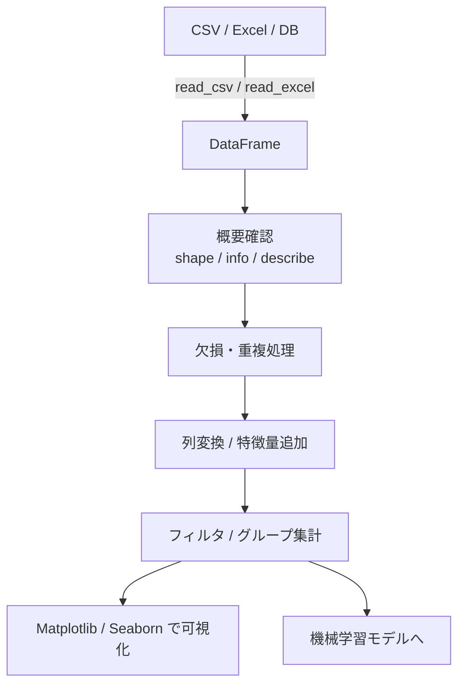

## 概要
実務データの9割はCSVやExcelで来ます。そこには欠損値・型の不一致・重複が必ずあります。Pandasは「表形式データを直感的に操作する」ライブラリで、`DataFrame`（2次元の表）と `Series`（1列）が中心です。`groupby`・`merge`・`resample` などのメソッドを覚えると、Excelで数時間かかる集計が数秒で終わります。実務のデータ分析作業の大半はPandasで完結します。

## 活用シーン
- **売上集計**: CSVを読み込んで部署・月別に `groupby` で集計してピボット表を作成
- **ログ結合**: 複数テーブルを `merge` で SQL的に結合して分析
- **時系列集計**: 日次データを `resample("W").mean()` で週次平均に集約

## DataFrameの作成

```python
import pandas as pd

# 辞書から作成
df = pd.DataFrame({
    "name":       ["Alice", "Bob", "Carol", "Dave", "Eve"],
    "department": ["開発", "営業", "開発", "マーケ", "営業"],
    "score":      [88, 72, 95, 60, 83],
    "age":        [25, 30, 22, 35, 28],
})

print(df)
#     name department  score  age
# 0  Alice         開発     88   25
# 1    Bob         営業     72   30
# 2  Carol         開発     95   22
# 3   Dave       マーケ     60   35
# 4    Eve         営業     83   28
```

## CSVの読み書き

```python
# 読み込み
df = pd.read_csv("sales.csv", encoding="utf-8")
df = pd.read_csv("sales.csv", parse_dates=["date"])  # 日付列を自動パース

# Excel
df = pd.read_excel("data.xlsx", sheet_name="Sheet1")

# 書き出し
df.to_csv("output.csv", index=False)
df.to_excel("output.xlsx", index=False)
```

## 基本確認

```python
df.shape          # (5, 4)  → (行数, 列数)
df.dtypes         # 各列の型
df.info()         # 型・欠損数・メモリ使用量
df.describe()     # 数値列の基本統計量（平均・標準偏差・四分位数）
df.head(3)        # 先頭3行
df.tail(3)        # 末尾3行
df.isnull().sum() # 各列の欠損数
```

## 列・行の選択

```python
# 1列選択（Series）
print(df["score"])

# 複数列選択（DataFrame）
print(df[["name", "score"]])

# 条件フィルタ
high_score   = df[df["score"] >= 80]
dev_high     = df[(df["department"] == "開発") & (df["score"] >= 80)]
specific_age = df[df["age"].between(25, 30)]

# loc（ラベル） / iloc（番号）
df.loc[0, "score"]          # 0行目 score列
df.iloc[0:3, 1:3]           # 0〜2行・1〜2列
```

## 列の追加・変換

```python
# 新しい列を計算して追加
df["score_scaled"] = df["score"] / 100
df["grade"]        = df["score"].apply(lambda x: "A" if x >= 90 else ("B" if x >= 70 else "C"))
df["name_upper"]   = df["name"].str.upper()

# 条件分岐列（np.where が便利）
import numpy as np
df["passed"] = np.where(df["score"] >= 70, True, False)
```

## データ可視化


## グループ集計

```python
# 部署ごとの平均スコア
print(df.groupby("department")["score"].mean())
# department
# マーケ    60.0
# 営業      77.5
# 開発      91.5

# 複数の集計関数を同時に適用
summary = df.groupby("department")["score"].agg(
    平均="mean", 最大="max", 件数="count"
)
print(summary)

# 複数列でグループ化
df.groupby(["department", "grade"])["score"].mean()

# pivot_table（Excelのピボットと同等）
pivot = df.pivot_table(
    values="score",
    index="department",
    columns="grade",
    aggfunc="count",
    fill_value=0,
)
```

## ソートと順位

```python
# 降順ソート
df_sorted = df.sort_values("score", ascending=False)

# 複数列ソート
df_sorted = df.sort_values(["department", "score"], ascending=[True, False])

# 順位列を追加
df["rank"] = df["score"].rank(ascending=False, method="min").astype(int)
```

## テーブルの結合

```python
dept_info = pd.DataFrame({
    "department": ["開発", "営業", "マーケ"],
    "budget":     [500, 300, 200],
})

# SQL的なJOIN
merged = df.merge(dept_info, on="department", how="left")

# 縦に積み重ね（UNION ALL）
combined = pd.concat([df_q1, df_q2], ignore_index=True)
```

## 時系列データ

```python
ts = pd.DataFrame({
    "date":  pd.date_range("2024-01-01", periods=90, freq="D"),
    "sales": np.random.randint(100, 500, 90),
})
ts = ts.set_index("date")

# リサンプリング（日次→週次平均）
weekly  = ts["sales"].resample("W").mean()
monthly = ts["sales"].resample("ME").sum()

# 移動平均
ts["ma7"]  = ts["sales"].rolling(7).mean()
ts["ma30"] = ts["sales"].rolling(30).mean()
```

## DataFrameの処理フロー



## よくある間違いと対処法

1. **SettingWithCopyWarning** → `df[df["col"] > 0]["other"] = 1` のようなチェーン代入は意図通り動かない。`df.loc[df["col"] > 0, "other"] = 1` と書く。
2. **`inplace=True` の落とし穴** → `inplace=True` は元のDataFrameを変更するが、メソッドチェーンができなくなり、メモリ節約効果もほぼない。`df = df.method()` と書く方が明瞭。
3. **日本語列名のエラー** → 日本語列名はそのまま使えるが、`df.列名` というドット記法は使えない。`df["列名"]` を使う。
4. **`groupby` 後の列選択を忘れる** → `df.groupby("dept").mean()` は全数値列の平均を返す。特定の列だけ必要なら `df.groupby("dept")["score"].mean()` と先に列を指定する。

## まとめ

- `df.info()` と `df.describe()` で最初にデータの形を把握する（欠損・型・分布を確認）
- 行フィルタは `df[条件]`、列選択は `df["列名"]`、両方は `df.loc[行条件, "列名"]`
- 集計は `groupby("key")["value"].agg(["mean", "count"])` が基本形
- テーブル結合は `df.merge(other, on="key", how="left")` で SQL の LEFT JOIN
- 時系列は `set_index("date")` して `resample("W").mean()` でリサンプリング

## 次に学ぶべき内容
DataFrameを [[matplotlib]] でグラフ化する方法を学びましょう。
