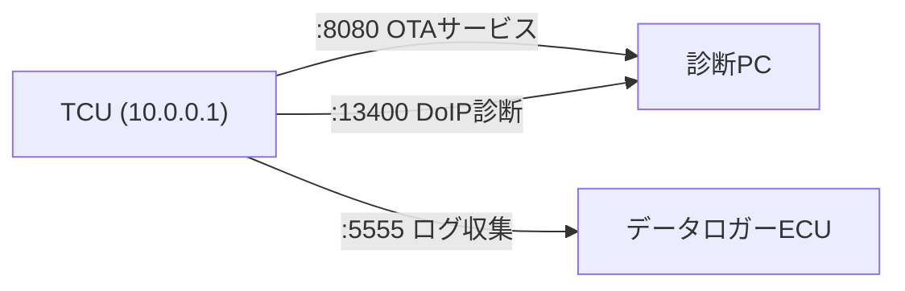

## 概要
ポート番号は、1台の機器内で動く複数の通信を区別するための16ビットの番号(0〜65535)です。IPアドレスが「建物の住所」なら、ポートは「部屋番号」に相当します。

## なぜ必要か
1つのECUが同時に複数の通信(診断・SOME/IP・映像など)を扱うとき、どのデータがどのアプリ宛かを区別する必要があります。ポート番号がその振り分けを可能にします。

## 自動運転での利用例
SOME/IPのサービスディスカバリは UDP 30490 番、DoIP診断は 13400 番、というように用途ごとにポートが決まっています。PCAP解析でポートを見れば、どの通信かを推測できます。

## 関連用語
IPアドレスとポートの組が [[socket]] です。ポートは [[tcp]] と [[udp]] の両方で使われます。

## 次に学ぶべき内容
IPとポートを組み合わせた通信の出入口、[[socket]] を学びましょう。

## 図解

