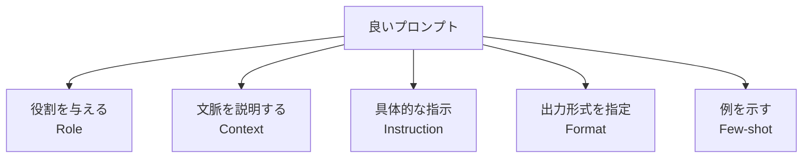

## 概要
プロンプトエンジニアリングはLLMに対して質の高い出力を得るための入力設計技術です。同じモデルでもプロンプトの書き方で出力の質が大きく変わります。コスト・速度・精度すべてに影響するため、LLMを使うすべての開発者に必須のスキルです。

## 基本原則



## 可視化


## 役割を与える（Role Prompting）

```python
import anthropic
client = anthropic.Anthropic()

# 悪い例
bad_response = client.messages.create(
    model="claude-opus-4-8",
    max_tokens=256,
    messages=[{"role": "user", "content": "TCP について教えて"}]
)

# 良い例: 役割＋対象読者＋制約を明示
good_response = client.messages.create(
    model="claude-opus-4-8",
    max_tokens=512,
    system="あなたは車載ネットワークの専門エンジニアです。組み込みエンジニア向けに、実践的で簡潔な技術説明をします。専門用語は使いますが、初回登場時に括弧で説明を付けてください。",
    messages=[{
        "role": "user",
        "content": "車載診断でTCPが使われる場面と、UDPと使い分ける理由を教えてください。"
    }]
)
print(good_response.content[0].text)
```

## Few-Shot プロンプティング

```python
# 例を示すことでフォーマットと品質を制御する
few_shot_prompt = """以下の形式でパケット情報を要約してください。

例1:
入力: src=192.168.1.1, dst=192.168.1.100, proto=TCP, dport=80, size=1460
要約: 192.168.1.1 → 192.168.1.100 へのHTTPリクエスト（1460B）

例2:
入力: src=10.0.0.1, dst=255.255.255.255, proto=UDP, dport=67, size=300
要約: 10.0.0.1 からのDHCP Discoverブロードキャスト（300B）

入力: src=172.16.0.5, dst=172.16.0.1, proto=TCP, dport=13400, size=64
要約:"""

response = client.messages.create(
    model="claude-opus-4-8",
    max_tokens=128,
    messages=[{"role": "user", "content": few_shot_prompt}]
)
print(response.content[0].text)
# → 172.16.0.5 → 172.16.0.1 へのDoIP接続リクエスト（64B）
```

## Chain-of-Thought（CoT）推論

```python
# 「ステップバイステップで考えて」と指示するだけで精度が上がる
cot_prompt = """以下のネットワーク障害を分析してください。

症状:
- 車両起動後30秒でCANバスがエラーフレームで埋まる
- 特定のECU（ID: 0x123）からのメッセージが増加
- バス負荷が95%超

段階的に原因を考えてください:
1. まず考えられる原因をすべて列挙
2. 各原因の可能性を評価
3. 最も可能性の高い原因と確認手順を提示"""

response = client.messages.create(
    model="claude-opus-4-8",
    max_tokens=1024,
    messages=[{"role": "user", "content": cot_prompt}]
)
```

## 構造化出力（JSON）

```python
import json

json_prompt = """以下のPCAPサマリーを解析し、JSON形式で返してください。

PCAPサマリー:
- キャプチャ時間: 30秒
- 総パケット: 15,234
- プロトコル: TCP 45%, UDP 35%, ARP 10%, ICMP 10%
- 最多通信ペア: 192.168.1.1 ↔ 192.168.1.100 (8,432パケット)
- 異常: TTL=1のパケットが23件

JSON形式:
{
  "duration_sec": <数値>,
  "total_packets": <数値>,
  "protocols": {"TCP": <割合>, ...},
  "top_pair": {"src": ..., "dst": ..., "count": ...},
  "anomalies": [{"type": ..., "count": ..., "severity": "low|medium|high"}]
}"""

response = client.messages.create(
    model="claude-opus-4-8",
    max_tokens=512,
    messages=[{"role": "user", "content": json_prompt}]
)
result = json.loads(response.content[0].text)
print(result)
```

## プロンプトテンプレート管理

```python
from string import Template

# テンプレート化して再利用しやすくする
ANALYSIS_TEMPLATE = Template("""
あなたは$role です。

## コンテキスト
$context

## タスク
$task

## 出力形式
$output_format

## 制約
- $constraint1
- $constraint2
""")

prompt = ANALYSIS_TEMPLATE.substitute(
    role      = "車載ネットワークの診断専門エンジニア",
    context   = "車両の定期診断レポートを作成しています",
    task      = "以下のDTCリストから重大度を評価し、優先順位をつけてください: P0300, U0100, B2477",
    output_format = "マークダウンの表形式（DTC | 内容 | 重大度 | 推奨対応）",
    constraint1 = "重大度は高・中・低の3段階",
    constraint2 = "推奨対応は1行以内",
)
```

## プロンプトのベストプラクティス

| 原則 | 悪い例 | 良い例 |
|---|---|---|
| 具体性 | 「説明して」 | 「200字以内で初心者向けに説明して」 |
| 役割 | （なし） | 「あなたは〇〇の専門家です」 |
| 形式 | 「まとめて」 | 「箇条書き・表・コードブロックで」 |
| 否定禁止 | 「専門用語を使わないで」 | 「中学生にも分かる言葉を使って」 |
| 例示 | （なし） | 「例：〇〇のような形式で」 |

## 次に学ぶべき内容
LLMに最新・専用知識を与える [[rag]] を学びましょう。
