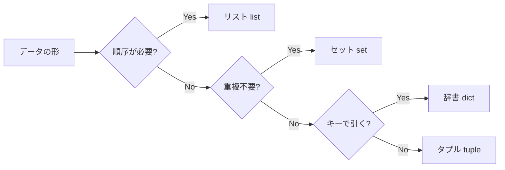

## 概要
Pythonはシンプルな文法と豊富なライブラリにより、データサイエンスの標準言語となっています。コードが英語に近い読みやすさを持ち、初心者でも数日で実用的なデータ処理が書けます。変数・リスト・辞書・制御構文を押さえておくと、NumPyやPandasへスムーズに移行できます。

## なぜ必要か
機械学習・統計分析・グラフ描画はすべてPythonコードで記述します。「変数に何が入っているか」「リストをどう操作するか」という基礎が曖昧だと、ライブラリのエラー原因が掴めません。土台を固めることで、複雑なデータ処理もスムーズに書けるようになります。

## 変数と型

```python
# 主要なデータ型
x     = 42          # int（整数）
y     = 3.14        # float（小数）
name  = "Alice"     # str（文字列）
flag  = True        # bool（真偽値）

print(type(x))      # <class 'int'>

# f文字列（Python 3.6+）で整形出力
print(f"{name} のスコアは {x} 点（{y:.1f} 換算）")
# → Alice のスコアは 42 点（3.1 換算）
```

## リスト — 順序付きコレクション

```python
scores = [90, 85, 72, 95, 60]

# インデックスとスライス
print(scores[0])        # 90（先頭）
print(scores[-1])       # 60（末尾）
print(scores[1:4])      # [85, 72, 95]

# 追加・削除
scores.append(88)       # 末尾に追加
scores.insert(0, 100)   # 先頭に挿入
scores.remove(60)       # 値を指定して削除

# リスト内包表記（Pythonらしい書き方）
passed  = [s for s in scores if s >= 80]   # 合格者のみ
doubled = [s * 2 for s in scores]          # 全スコア2倍

# 集計
print(f"最高: {max(scores)}, 最低: {min(scores)}, 合計: {sum(scores)}")
```

## 辞書 — キーと値のマッピング

```python
sensor = {
    "id":    "sensor_01",
    "type":  "temperature",
    "value": 36.5,
    "unit":  "celsius",
}

# 値の取得
print(sensor["value"])                    # 36.5
print(sensor.get("location", "unknown"))  # キーが無ければデフォルト値

# 追加・更新
sensor["timestamp"] = "2025-01-15T09:00:00"
sensor["value"]     = 37.1

# 全キー・値を走査
for key, val in sensor.items():
    print(f"  {key}: {val}")

# 辞書のリスト（テーブルデータの最も基本的な表現）
readings = [
    {"id": "s01", "value": 36.5},
    {"id": "s02", "value": 40.2},
    {"id": "s03", "value": 35.8},
]
high_temp = [r for r in readings if r["value"] > 38]
```

## 制御構文

```python
# if / elif / else
score = 75
if score >= 90:
    grade = "A"
elif score >= 70:
    grade = "B"
else:
    grade = "C"

# for ループ（enumerate で番号付き）
names = ["Alice", "Bob", "Carol"]
for i, name in enumerate(names, start=1):
    print(f"{i}. {name}")

# while ループ
n = 1
while n <= 5:
    print(n)
    n += 1
```

## 関数

```python
def calc_stats(data: list[float]) -> dict:
    """リストの基本統計量を返す"""
    n   = len(data)
    avg = sum(data) / n
    mn  = min(data)
    mx  = max(data)
    return {"count": n, "mean": avg, "min": mn, "max": mx}

result = calc_stats([88, 72, 95, 60, 83])
print(result)
# → {'count': 5, 'mean': 79.6, 'min': 60, 'max': 95}
```

## よく使う組み込み関数

| 関数 | 用途 | 例 |
|---|---|---|
| `len()` | 要素数 | `len([1,2,3])` → 3 |
| `range()` | 連番生成 | `list(range(5))` → [0,1,2,3,4] |
| `zip()` | 複数リストを組み合わせ | `zip(a, b)` |
| `enumerate()` | インデックス付きfor | `enumerate(lst)` |
| `sorted()` | ソート（元リスト変更なし） | `sorted(lst, reverse=True)` |
| `isinstance()` | 型チェック | `isinstance(x, int)` |

## データ構造の使い分け



## 次に学ぶべき内容
大量の数値データを高速処理する [[numpy]] へ進みましょう。
