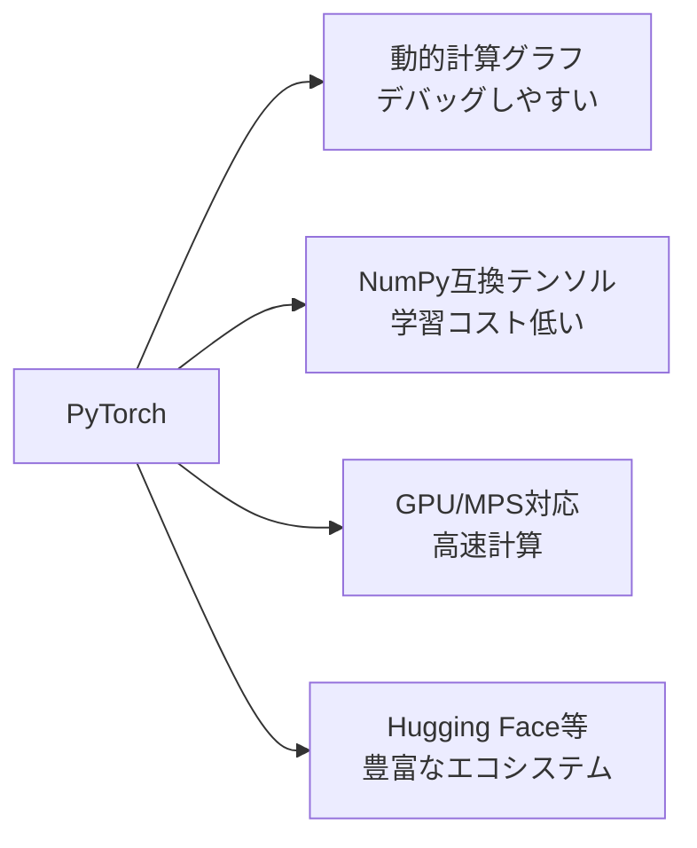

## 概要
PyTorchはFacebook（Meta）が開発した深層学習フレームワークです。NumPy的なテンソル演算＋自動微分（autograd）＋GPU対応を提供し、研究・実務の両方で最も広く使われています。「書いたコードがそのまま動く」動的計算グラフが特徴です。

## なぜ PyTorch か



## 可視化


## テンソルの基本

```python
import torch
import numpy as np

# テンソル作成
a = torch.tensor([1.0, 2.0, 3.0])
b = torch.zeros(3, 4)
c = torch.randn(2, 3)          # 標準正規分布

# NumPy との相互変換
arr = np.array([1.0, 2.0, 3.0])
t   = torch.from_numpy(arr)    # NumPy → Tensor
n   = t.numpy()                # Tensor → NumPy（CPU のみ）

# デバイス指定
device = "cuda" if torch.cuda.is_available() else "cpu"
t_gpu  = t.to(device)

# 形状操作
x = torch.randn(4, 6)
print(x.shape)              # torch.Size([4, 6])
print(x.reshape(2, 12))     # reshape
print(x.transpose(0, 1))    # 転置
print(x.unsqueeze(0).shape) # (1, 4, 6) → バッチ次元を追加
```

## 自動微分（autograd）

```python
# requires_grad=True で勾配計算を有効化
x = torch.tensor(3.0, requires_grad=True)
y = x ** 2 + 2 * x + 1    # y = x² + 2x + 1

y.backward()               # 逆伝播
print(x.grad)              # dy/dx = 2x + 2 = 8.0

# 複数変数
a = torch.tensor(2.0, requires_grad=True)
b = torch.tensor(3.0, requires_grad=True)
L = (a * b + b ** 2).sum()
L.backward()
print(a.grad, b.grad)      # ∂L/∂a=3.0, ∂L/∂b=8.0
```

## ニューラルネットワークの定義（nn.Module）

```python
import torch.nn as nn
import torch.nn.functional as F

class MLP(nn.Module):
    def __init__(self, in_features: int, hidden: int, n_classes: int):
        super().__init__()
        self.fc1 = nn.Linear(in_features, hidden)
        self.fc2 = nn.Linear(hidden, hidden // 2)
        self.fc3 = nn.Linear(hidden // 2, n_classes)
        self.dropout = nn.Dropout(0.3)
        self.bn1     = nn.BatchNorm1d(hidden)

    def forward(self, x):
        x = F.relu(self.bn1(self.fc1(x)))
        x = self.dropout(x)
        x = F.relu(self.fc2(x))
        x = self.fc3(x)       # 出力層はActivation不要（CrossEntropyLoss内で適用）
        return x

model = MLP(in_features=20, hidden=128, n_classes=3)
print(model)
print(f"パラメータ数: {sum(p.numel() for p in model.parameters()):,}")
```

## 訓練ループ

```python
from torch.utils.data import DataLoader, TensorDataset
import torch.optim as optim

# データ準備
X = torch.randn(1000, 20)
y = torch.randint(0, 3, (1000,))
dataset    = TensorDataset(X, y)
train_set, val_set = torch.utils.data.random_split(dataset, [800, 200])
train_loader = DataLoader(train_set, batch_size=64, shuffle=True)
val_loader   = DataLoader(val_set,   batch_size=64)

# モデル・損失・オプティマイザ
model     = MLP(20, 128, 3).to(device)
criterion = nn.CrossEntropyLoss()
optimizer = optim.AdamW(model.parameters(), lr=1e-3, weight_decay=1e-4)
scheduler = optim.lr_scheduler.CosineAnnealingLR(optimizer, T_max=30)

# 学習ループ
history = {"train_loss": [], "val_loss": [], "val_acc": []}

for epoch in range(30):
    # --- 訓練フェーズ ---
    model.train()
    train_loss = 0
    for Xb, yb in train_loader:
        Xb, yb = Xb.to(device), yb.to(device)
        optimizer.zero_grad()
        loss = criterion(model(Xb), yb)
        loss.backward()
        optimizer.step()
        train_loss += loss.item()

    # --- 検証フェーズ ---
    model.eval()
    val_loss, correct, total = 0, 0, 0
    with torch.no_grad():
        for Xb, yb in val_loader:
            Xb, yb = Xb.to(device), yb.to(device)
            out  = model(Xb)
            val_loss += criterion(out, yb).item()
            correct  += (out.argmax(1) == yb).sum().item()
            total    += len(yb)

    scheduler.step()
    history["train_loss"].append(train_loss / len(train_loader))
    history["val_loss"].append(val_loss   / len(val_loader))
    history["val_acc"].append(correct / total)

    if (epoch + 1) % 5 == 0:
        print(f"Epoch {epoch+1:3d} | loss={history['train_loss'][-1]:.4f} | val_acc={history['val_acc'][-1]:.3f}")
```

## 学習曲線の可視化

```python
import matplotlib.pyplot as plt

fig, (ax1, ax2) = plt.subplots(1, 2, figsize=(11, 4))

ax1.plot(history["train_loss"], label="Train Loss")
ax1.plot(history["val_loss"],   label="Val Loss")
ax1.set_title("Loss曲線")
ax1.set_xlabel("Epoch")
ax1.legend()

ax2.plot(history["val_acc"], color="green")
ax2.set_title("Validation Accuracy")
ax2.set_xlabel("Epoch")
ax2.set_ylim(0, 1)

plt.tight_layout()
plt.show()
```

## モデルの保存と読み込み

```python
# 重みのみ保存（推奨）
torch.save(model.state_dict(), "model.pth")

# 読み込み
model_loaded = MLP(20, 128, 3)
model_loaded.load_state_dict(torch.load("model.pth", map_location="cpu"))
model_loaded.eval()

# 推論
with torch.no_grad():
    x_new = torch.randn(1, 20)
    pred  = model_loaded(x_new).argmax(1).item()
    print(f"予測クラス: {pred}")
```

## 次に学ぶべき内容
画像を扱う [[cnn]] を学びましょう。
