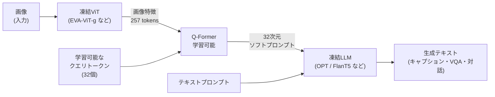
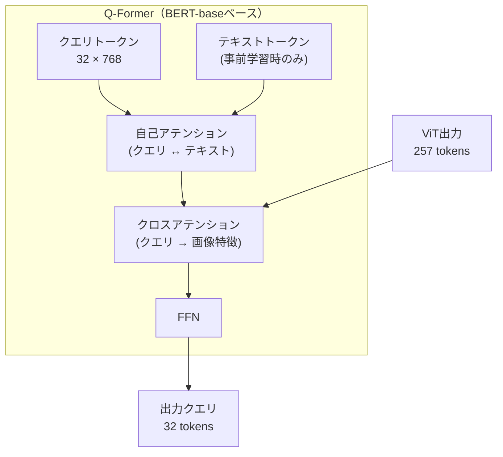
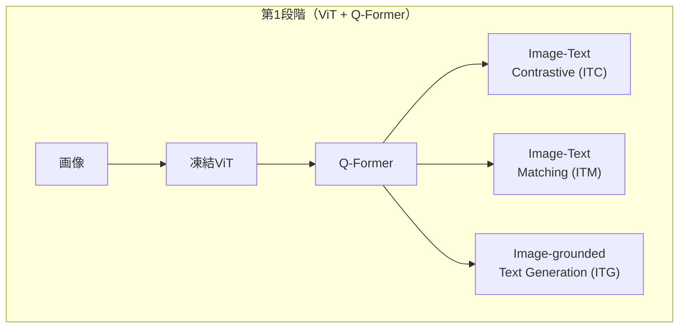
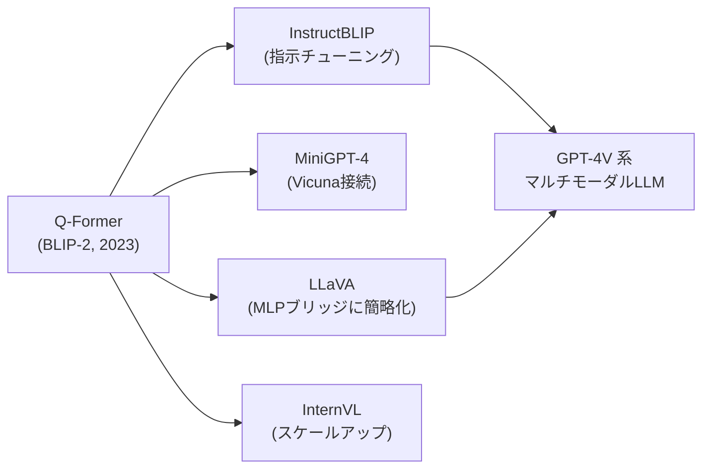

## 概要
Q-Former（Querying Transformer）は、**凍結された画像エンコーダ（ViT）と凍結された大規模言語モデル（LLM）を橋渡しする軽量モジュール**です。BLIP-2（2023年、Salesforce Research）で提案され、巨大なモデルを再学習せずにマルチモーダル能力を獲得できる点で画期的でした。



## アーキテクチャの全体像

| コンポーネント | パラメータ数 | 学習 | 役割 |
|---|---|---|---|
| ViT-g（画像エンコーダ） | 1.3B | **凍結** | 画像特徴を抽出 |
| Q-Former | **188M** | **学習** | 視覚と言語の橋渡し |
| OPT-6.7B / FlanT5-XXL | 6.7B / 11B | **凍結** | テキスト生成 |

全体の88%のパラメータが凍結されるため、**188Mだけを学習**してマルチモーダル能力を獲得できます。

## 主要な数式

**クロスアテンション**（クエリ \(Q\)、キー \(K\)、バリュー \(V\)）：

$$\mathrm{Attention}(Q, K, V) = \mathrm{softmax}\!\left(\frac{QK^\top}{\sqrt{d_k}}\right)V$$

- \(Q\)：学習可能なクエリトークン（\(32 \times d\)）
- \(K, V\)：ViTの出力画像特徴（\(257 \times d\)）から生成
- 32個のクエリが257個の画像トークンから必要な情報を選択的に取得

**クエリトークンの射影**（Q-Former → LLM入力）：

$$\mathbf{h}_{\text{LLM}} = W_{\text{proj}}\,\mathbf{q}_{\text{out}} \in \mathbb{R}^{32 \times d_{\text{LLM}}}$$

LLMのembedding次元 \(d_{\text{LLM}}\) に線形射影し、ソフトプロンプトとして前置。

## Q-Formerの内部構造



- **自己アテンション**：クエリトークン同士、およびクエリとテキストの相互作用
- **クロスアテンション**：クエリが画像特徴から情報を抽出（交互に配置）
- テキストアテンションマスクを切り替えることで複数タスクを同時学習

## 2段階事前学習

### 第1段階：視覚-言語表現学習



| 目的関数 | 略称 | 学習内容 |
|---|---|---|
| 画像-テキスト対照学習 | ITC | 対応する画像・テキストペアを近くに |
| 画像-テキストマッチング | ITM | 画像とテキストが対応するか二値分類 |
| 画像条件付きテキスト生成 | ITG | 画像を見てキャプションを生成 |

### 第2段階：LLMへのブートストラッピング

凍結LLMに対し、Q-Formerの出力（32トークン）をソフトプロンプトとして接続し、言語生成能力を転移します。

```python
import torch
import torch.nn as nn

class SimpleQFormer(nn.Module):
    """Q-Formerの最小実装（概念デモ）"""

    def __init__(self, num_queries=32, d_model=768, num_heads=12, num_layers=6):
        super().__init__()
        # 学習可能なクエリトークン
        self.query_tokens = nn.Parameter(torch.zeros(1, num_queries, d_model))
        nn.init.trunc_normal_(self.query_tokens, std=0.02)

        encoder_layer = nn.TransformerDecoderLayer(
            d_model=d_model, nhead=num_heads,
            dim_feedforward=d_model * 4, batch_first=True
        )
        self.transformer = nn.TransformerDecoder(encoder_layer, num_layers=num_layers)
        self.norm = nn.LayerNorm(d_model)

    def forward(self, image_features):
        """
        image_features: (B, 257, 768)  ← ViTの出力
        returns:        (B, 32,  768)  ← 圧縮された視覚表現
        """
        B = image_features.size(0)
        queries = self.query_tokens.expand(B, -1, -1)
        # クエリが画像特徴にクロスアテンション
        out = self.transformer(queries, image_features)
        return self.norm(out)   # (B, 32, 768)
```

**数式で表すと**

$$
\mathbf{q}_{\text{out}} = \mathrm{softmax}\!\left(\frac{Q K^\top}{\sqrt{d_k}}\right) V, \qquad K, V = f(\text{image\_features})
$$

32個のクエリ \(Q\) が257個の画像特徴（キー \(K\)・バリュー \(V\)）へクロスアテンションし、視覚情報を32トークンへ圧縮します。

## 可視化


## CLIPとの比較

| 観点 | CLIP | Q-Former (BLIP-2) |
|---|---|---|
| 画像-言語結合 | 対照学習（コサイン距離） | クロスアテンション（動的） |
| 圧縮方法 | グローバル1ベクトル | 32クエリトークン（局所情報保持） |
| LLM統合 | ×（生成なし） | ○（凍結LLMに接続可能） |
| 追加学習コスト | エンコーダ全体 | Q-Formerのみ（188M） |
| ゼロショット分類 | 得意 | △（CLIPの方が高精度） |
| 画像キャプション / VQA | △ | 得意 |

## なぜ32クエリで十分か

ViTは画像を \(16 \times 16\) パッチに分割し、257トークン（256パッチ + CLSトークン）を出力します。Q-Formerの32クエリは、この257トークンから**LLMが必要とする言語的に有意な情報のみを選択的に抽出**します。

$$\text{圧縮率} = \frac{257}{32} \approx 8\times$$

実験的に32クエリが精度とコストのバランス点であることが示されています（16では情報不足、64では過剰）。

## 主要性能指標（BLIP-2）

| タスク | データセット | BLIP-2 | 従来SOTA |
|---|---|---|---|
| ゼロショット VQA | VQAv2 | **65.2** | 61.0 |
| 画像キャプション | COCO | **145.8** CIDEr | 138.0 |
| 画像-テキスト検索 | Flickr30K R@1 | **96.9** | 94.0 |
| ゼロショット VQA | GQA | **44.7** | 41.6 |

## 後継と影響



Q-Formerの「凍結モデルの組み合わせ」というアイデアは、その後のマルチモーダルLLM研究の標準的な出発点となりました。LLaVAではQ-Formerをより単純なMLPプロジェクタに置き換えても同等性能が出ることが示され、アーキテクチャの議論が続いています。
