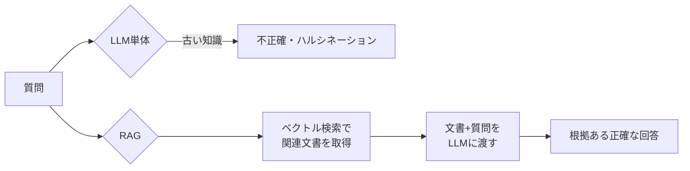

## 概要
RAG（Retrieval-Augmented Generation）は、外部の知識ベース（ドキュメント・DB）から関連情報を検索してLLMのプロンプトに追加する手法です。LLMの学習データにない最新情報・社内専用知識を扱えるようになります。

## なぜRAGが必要か



LLMは学習後の情報を知らず、社内文書も知りません。RAGはそれを補完します。

## RAGのパイプライン全体

```python
# ステップ1: ドキュメントを分割・埋め込み・保存（インデックス構築）
# ステップ2: クエリを埋め込み・類似文書を検索（Retrieval）
# ステップ3: 文書+クエリをLLMに渡して回答生成（Generation）
```

## ステップ1: ドキュメントの前処理とチャンク分割

```python
import re
from pathlib import Path

def load_and_chunk(filepath: str, chunk_size: int = 400,
                   overlap: int = 80) -> list[dict]:
    text = Path(filepath).read_text(encoding="utf-8")

    # マークダウンのコードブロックは分割しない
    # 段落で分割してから結合
    paragraphs = re.split(r"\n\n+", text)
    chunks = []
    buf    = ""

    for para in paragraphs:
        if len(buf) + len(para) < chunk_size:
            buf += para + "\n\n"
        else:
            if buf.strip():
                chunks.append({"text": buf.strip(), "source": filepath})
            # オーバーラップ: 前のチャンクの末尾を次に引き継ぐ
            buf = buf[-overlap:] + para + "\n\n"

    if buf.strip():
        chunks.append({"text": buf.strip(), "source": filepath})

    return chunks

chunks = load_and_chunk("docs/ethernet.md")
print(f"{len(chunks)} チャンク生成")
```

## ステップ2: 埋め込みとベクトルDBへの保存

```python
import numpy as np
from sentence_transformers import SentenceTransformer

# 埋め込みモデル（無料・ローカルで動く）
embed_model = SentenceTransformer("sentence-transformers/all-MiniLM-L6-v2")

def embed_texts(texts: list[str]) -> np.ndarray:
    return embed_model.encode(texts, normalize_embeddings=True,
                              batch_size=32, show_progress_bar=True)

# すべてのチャンクを埋め込み
texts     = [c["text"]   for c in chunks]
sources   = [c["source"] for c in chunks]
embeddings = embed_texts(texts)

print(f"埋め込み形状: {embeddings.shape}")  # (N, 384)

# --- FAISS を使ったベクトルインデックス ---
import faiss

dim   = embeddings.shape[1]
index = faiss.IndexFlatIP(dim)         # 内積=コサイン類似度（正規化済み）
index.add(embeddings.astype("float32"))
print(f"インデックス件数: {index.ntotal}")

# 保存
faiss.write_index(index, "knowledge.index")
import json
with open("knowledge_meta.json", "w") as f:
    json.dump({"texts": texts, "sources": sources}, f, ensure_ascii=False)
```

## ステップ3: 検索と回答生成

```python
import faiss
import json
import anthropic

# インデックスとメタデータを読み込み
index = faiss.read_index("knowledge.index")
with open("knowledge_meta.json") as f:
    meta = json.load(f)

client = anthropic.Anthropic()

def retrieve(query: str, k: int = 5) -> list[dict]:
    q_vec = embed_model.encode([query], normalize_embeddings=True).astype("float32")
    scores, indices = index.search(q_vec, k)
    results = []
    for score, idx in zip(scores[0], indices[0]):
        if idx >= 0:
            results.append({
                "text":   meta["texts"][idx],
                "source": meta["sources"][idx],
                "score":  float(score),
            })
    return results

def rag_query(question: str, k: int = 5) -> str:
    docs = retrieve(question, k)

    context = "\n\n---\n\n".join(
        f"[出典: {d['source']}]\n{d['text']}"
        for d in docs
    )

    prompt = f"""以下の参考文書を元に質問に答えてください。
文書にない情報は「文書には記載がありません」と答えてください。

## 参考文書
{context}

## 質問
{question}"""

    response = client.messages.create(
        model="claude-opus-4-8",
        max_tokens=1024,
        messages=[{"role": "user", "content": prompt}]
    )
    return response.content[0].text

answer = rag_query("車載EthernetでVLANを使う理由は？")
print(answer)
```

## 可視化


## 検索精度を上げる工夫

```python
# 1. ハイブリッド検索（ベクトル + キーワード）
from rank_bm25 import BM25Okapi

tokenized = [t.split() for t in texts]
bm25      = BM25Okapi(tokenized)

def hybrid_search(query: str, k: int = 5, alpha: float = 0.5) -> list[dict]:
    # ベクトル検索スコア
    q_vec       = embed_model.encode([query], normalize_embeddings=True).astype("float32")
    vec_scores, vec_idx = index.search(q_vec, k * 3)
    vec_map     = {int(i): float(s) for s, i in zip(vec_scores[0], vec_idx[0]) if i >= 0}

    # BM25スコア
    bm25_scores = bm25.get_scores(query.split())
    bm25_top    = np.argsort(bm25_scores)[::-1][:k * 3]
    bm25_norm   = bm25_scores / (bm25_scores.max() + 1e-9)

    # スコアを結合（RRF: Reciprocal Rank Fusion も有効）
    all_idx = set(list(vec_map.keys()) + list(bm25_top))
    combined = {}
    for i in all_idx:
        v = vec_map.get(i, 0.0)
        b = float(bm25_norm[i]) if i < len(bm25_norm) else 0.0
        combined[i] = alpha * v + (1 - alpha) * b

    top_k = sorted(combined, key=combined.get, reverse=True)[:k]
    return [{"text": texts[i], "source": sources[i], "score": combined[i]} for i in top_k]
```

## RAGの評価指標

| 指標 | 意味 | ツール |
|---|---|---|
| Faithfulness | 回答が文書に忠実か | RAGAS |
| Answer Relevancy | 質問への回答率 | RAGAS |
| Context Recall | 必要な文書を取得できているか | RAGAS |
| MRR | 正解が何番目に来るか | 手動評価 |
