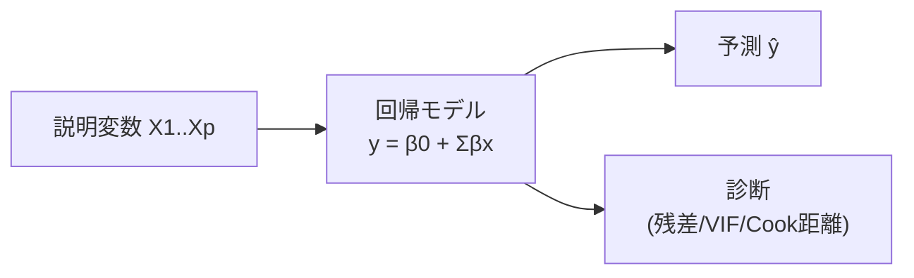

## 概要
「気温が1℃上がると、アイスの売上はいくら増えるか、その推定は信頼できるか」――機械学習の線形回帰との最大の違いは、回帰分析では**係数の統計的有意性・信頼区間・モデルの診断**まで行う点です。Statsmodelsの `OLS.summary()` が出力する t値・p値・VIF・残差診断を読めるようになると、モデルの品質を科学的に評価できます。実験計画・因果推論・経済分析など「説明」が目的の場面で特に威力を発揮します。

## 活用シーン
- **マーケティングMix分析**: 広告・価格・プロモーションの効果を係数で定量化
- **価格設定**: 住宅価格の説明変数ごとの係数とその信頼区間を算出
- **A/Bテスト分析**: 介入効果の有無と効果量を統計的に評価



## 主要な数式

**重回帰モデル**：

$$y_i = \beta_0 + \beta_1 x_{i1} + \beta_2 x_{i2} + \cdots + \beta_p x_{ip} + \varepsilon_i, \qquad \varepsilon_i \sim \mathcal{N}(0, \sigma^2)$$

**最小二乗法**は残差二乗和を最小化する：

$$\hat{\beta} = \arg\min_{\beta} \sum_{i=1}^{n}(y_i - \mathbf{x}_i^\top \beta)^2$$

行列形式の閉形式解（正規方程式）：

$$\hat{\beta} = (\mathbf{X}^\top \mathbf{X})^{-1}\mathbf{X}^\top \mathbf{y}$$

**決定係数 \(R^2\) と自由度調整済み \(R^2\)**：

$$R^2 = 1 - \frac{\sum_i (y_i - \hat{y}_i)^2}{\sum_i (y_i - \bar{y})^2}, \qquad R^2_{\text{adj}} = 1 - (1-R^2)\frac{n-1}{n-p-1}$$

**分散膨張係数（VIF）**（説明変数 \(j\)）：

$$\mathrm{VIF}_j = \frac{1}{1 - R_j^2}$$

ここで \(R_j^2\) は \(x_j\) を他の説明変数で回帰したときの決定係数。

## 単回帰分析

```python
import numpy as np
import pandas as pd
import matplotlib.pyplot as plt
import statsmodels.api as sm
from scipy import stats

rng = np.random.default_rng(42)

# データ生成: 気温とアイス販売数の関係
temperature = rng.uniform(15, 35, 60)
ice_cream   = 2.5 * temperature - 20 + rng.normal(0, 5, 60)

# statsmodels による回帰（OLS: 最小二乗法）
X = sm.add_constant(temperature)   # 切片項を追加
model = sm.OLS(ice_cream, X).fit()
print(model.summary())
# → coef, std err, t値, p値, 信頼区間などが出力される

# 回帰直線の可視化
x_range = np.linspace(15, 35, 100)
X_pred  = sm.add_constant(x_range)
pred    = model.get_prediction(X_pred)
mean_pred  = pred.predicted_mean
ci_lower, ci_upper = pred.conf_int().T

plt.figure(figsize=(8, 5))
plt.scatter(temperature, ice_cream, alpha=0.6, label="観測値")
plt.plot(x_range, mean_pred, "r-", label="回帰直線")
plt.fill_between(x_range, ci_lower, ci_upper, alpha=0.2, label="95% 信頼区間")
plt.xlabel("気温 (℃)")
plt.ylabel("販売数")
plt.legend()
plt.title(f"単回帰分析  R²={model.rsquared:.3f}")
plt.tight_layout()
plt.show()
```

## 重回帰分析

```python
# 複数の説明変数で目的変数を予測
# 例: 住宅価格 ~ 面積 + 築年数 + 駅距離

n = 200
area    = rng.uniform(30, 120, n)          # 面積 (m²)
age     = rng.uniform(0, 40, n)            # 築年数
station = rng.uniform(1, 30, n)            # 駅距離 (分)

price = (
    3.0 * area
    - 0.5 * age
    - 2.0 * station
    + 50
    + rng.normal(0, 10, n)
)

df = pd.DataFrame({
    "price":   price,
    "area":    area,
    "age":     age,
    "station": station,
})

X = sm.add_constant(df[["area", "age", "station"]])
model_multi = sm.OLS(df["price"], X).fit()
print(model_multi.summary())

# 標準化係数（β係数）: 説明変数の相対的な影響力
from sklearn.preprocessing import StandardScaler

scaler = StandardScaler()
X_scaled = scaler.fit_transform(df[["area", "age", "station"]])
y_scaled = (df["price"] - df["price"].mean()) / df["price"].std()

model_std = sm.OLS(y_scaled, sm.add_constant(X_scaled)).fit()
coef_names = ["const", "area", "age", "station"]
for name, coef in zip(coef_names[1:], model_std.params[1:]):
    print(f"β_{name:8s} = {coef:+.3f}")
```

## 多重共線性の検出と対処

```python
from statsmodels.stats.outliers_influence import variance_inflation_factor

# VIF（分散膨張係数）で多重共線性を診断
# VIF > 10 は問題あり、> 5 で注意

# 共線性を含む例: floor と area が強く相関
floor = area / 3 + rng.normal(0, 2, n)   # 階数 ≈ 面積/3

df_collinear = pd.DataFrame({
    "area":    area,
    "floor":   floor,       # area と強く相関
    "age":     age,
    "station": station,
})

X_c = sm.add_constant(df_collinear)

vif_data = pd.DataFrame({
    "feature": df_collinear.columns,
    "VIF":     [variance_inflation_factor(df_collinear.values, i)
                for i in range(df_collinear.shape[1])],
})
print(vif_data)
# area と floor の VIF が高くなる

# 対処法1: 相関の高い変数を一方削除
# 対処法2: PCA で次元削減
from sklearn.decomposition import PCA
pca = PCA(n_components=1)
area_pc = pca.fit_transform(df_collinear[["area", "floor"]])

# 対処法3: Ridge 回帰（L2 正則化）
from sklearn.linear_model import Ridge
ridge = Ridge(alpha=1.0)
ridge.fit(df_collinear, price)
print("Ridge 係数:", dict(zip(df_collinear.columns, ridge.coef_)))
```

## 回帰分析の可視化


## 残差診断

```python
# 回帰の4大仮定: ① 線形性 ② 等分散性 ③ 正規性 ④ 独立性

residuals = model_multi.resid
fitted    = model_multi.fittedvalues

fig, axes = plt.subplots(2, 2, figsize=(10, 8))

# 1. 残差 vs 当てはめ値（線形性・等分散性）
axes[0, 0].scatter(fitted, residuals, alpha=0.5)
axes[0, 0].axhline(0, color="red", linestyle="--")
axes[0, 0].set_xlabel("当てはめ値")
axes[0, 0].set_ylabel("残差")
axes[0, 0].set_title("残差 vs 当てはめ値")

# 2. Q-Q プロット（正規性）
stats.probplot(residuals, plot=axes[0, 1])
axes[0, 1].set_title("Normal Q-Q Plot")

# 3. スケール-ロケーション（等分散性）
sqrt_abs_resid = np.sqrt(np.abs(residuals))
axes[1, 0].scatter(fitted, sqrt_abs_resid, alpha=0.5)
axes[1, 0].set_xlabel("当てはめ値")
axes[1, 0].set_ylabel("√|標準化残差|")
axes[1, 0].set_title("Scale-Location")

# 4. 残差のヒストグラム
axes[1, 1].hist(residuals, bins=20, edgecolor="black")
axes[1, 1].set_xlabel("残差")
axes[1, 1].set_ylabel("頻度")
axes[1, 1].set_title("残差分布")

plt.tight_layout()
plt.show()

# Shapiro-Wilk 検定（正規性の検定）
w, p_shapiro = stats.shapiro(residuals[:50])   # n≤5000 推奨
print(f"Shapiro-Wilk: W={w:.4f}, p={p_shapiro:.4f}")
print("正規性:" , "○" if p_shapiro > 0.05 else "×（注意）")

# Durbin-Watson 統計量（独立性・自己相関）
from statsmodels.stats.stattools import durbin_watson
dw = durbin_watson(residuals)
print(f"Durbin-Watson: {dw:.3f}  (2に近いほど独立、<1 or >3 は自己相関あり)")
```

## 外れ値・影響値の検出

```python
# Cook の距離: 各観測値がモデル全体に与える影響力
influence = model_multi.get_influence()
cooks_d   = influence.cooks_distance[0]

# 閾値: 4/n を超えると影響値
threshold = 4 / len(price)
influential = np.where(cooks_d > threshold)[0]
print(f"影響値の観測点（Cook's D > {threshold:.3f}）: {len(influential)} 個")

plt.figure(figsize=(10, 4))
plt.stem(range(len(cooks_d)), cooks_d, markerfmt=",", linefmt="C0-")
plt.axhline(threshold, color="red", linestyle="--", label=f"閾値 4/n={threshold:.3f}")
plt.xlabel("観測点インデックス")
plt.ylabel("Cook's Distance")
plt.title("Cook の距離")
plt.legend()
plt.tight_layout()
plt.show()

# レバレッジ（説明変数空間での外れ値）
leverage = influence.hat_matrix_diag
high_leverage = leverage > 2 * X.shape[1] / n
print(f"高レバレッジ点: {high_leverage.sum()} 個")
```

## よくある間違いと対処法

1. **多重共線性を放置する** → VIF > 10 の説明変数が複数あると係数の推定が不安定になる。相関の高い変数を一方削除するか、Ridge回帰を使う。
2. **残差の正規性を確認しない** → Q-Qプロットが直線から大きく外れている場合、目的変数の対数変換や別のモデルが必要。Shapiro-Wilk検定（`n ≤ 5000`）で確認する。
3. **自由度調整済みR²を使わない** → 説明変数を増やすだけで通常のR²は上がる。変数選択の評価には `Adjusted R²` または `AIC/BIC` を使う。
4. **影響値（Cook's Distance）を無視する** → 外れ値1点がモデル全体の係数を変えてしまうことがある。`4/n` を超えるCook距離の点を確認し、除去または頑健回帰を検討する。

## 回帰診断まとめ

| チェック項目 | 指標 | 基準 |
|---|---|---|
| 多重共線性 | VIF | < 5（目安）、> 10 は問題 |
| 残差の正規性 | Shapiro-Wilk, Q-Q プロット | p > 0.05 で正規性あり |
| 等分散性 | Breusch-Pagan 検定, Scale-Location | 残差が水平バンド内 |
| 独立性 | Durbin-Watson | 1.5 〜 2.5 が目安 |
| 外れ値 | Cook's Distance | < 4/n |
| モデル適合度 | Adjusted R², AIC/BIC | 高 Adj.R²、低 AIC/BIC |

## まとめ

- `sm.OLS().fit().summary()` の出力を読む: coef（係数）・std err（標準誤差）・t値・p値・信頼区間
- VIF > 10 は多重共線性の赤信号。相関の高い変数を除去か Ridge 正則化を使う
- 残差4大診断: ①線形性（残差 vs 当てはめ値）②等分散性（Scale-Location）③正規性（Q-Q）④独立性（Durbin-Watson）
- Cook's Distance > 4/n の点は影響値として要確認
- 機械学習（予測精度重視）vs 統計回帰（係数の解釈・有意性重視）を目的で使い分ける
