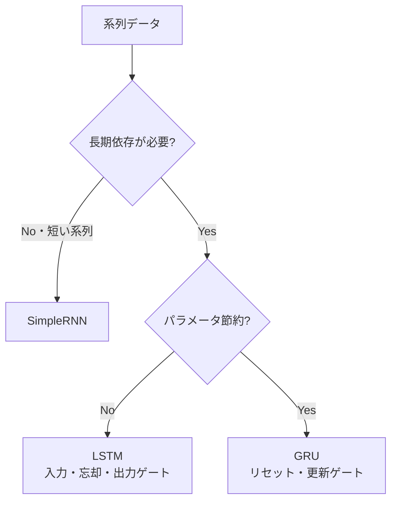

## 概要
RNN（Recurrent Neural Network）は系列データ（時系列・テキスト・音声）を扱うために設計されたニューラルネットワークです。前のタイムステップの出力を次のステップの入力として使うことで、「文脈」を保持します。LSTMはRNNの長期依存問題を解決した改良版です。

## 主要な数式

**RNN の隠れ状態更新**：

$$\mathbf{h}_t = \tanh\!\left(\mathbf{W}_{hh}\mathbf{h}_{t-1} + \mathbf{W}_{xh}\mathbf{x}_t + \mathbf{b}_h\right)$$

**LSTM のゲート**（忘却・入力・出力）：

$$\mathbf{f}_t = \sigma(\mathbf{W}_f[\mathbf{h}_{t-1}, \mathbf{x}_t] + \mathbf{b}_f), \quad \mathbf{i}_t = \sigma(\mathbf{W}_i[\cdot] + \mathbf{b}_i), \quad \mathbf{o}_t = \sigma(\mathbf{W}_o[\cdot] + \mathbf{b}_o)$$

**セル状態と隠れ状態の更新**：

$$\mathbf{c}_t = \mathbf{f}_t \odot \mathbf{c}_{t-1} + \mathbf{i}_t \odot \tilde{\mathbf{c}}_t, \qquad \mathbf{h}_t = \mathbf{o}_t \odot \tanh(\mathbf{c}_t)$$

忘却ゲート $\mathbf{f}_t$ が過去の情報をどれだけ残すかを制御し、勾配消失を緩和する。

## 可視化


## RNN vs LSTM vs GRU



## LSTM の仕組み（直感的理解）

LSTMは3つのゲートで「何を覚え・何を忘れ・何を出力するか」を制御します：

| ゲート | 役割 |
|---|---|
| 忘却ゲート | 過去の記憶をどれだけ捨てるか |
| 入力ゲート | 新しい情報をどれだけ追加するか |
| 出力ゲート | セル状態からどれだけ出力するか |

## PyTorchで時系列予測

```python
import torch
import torch.nn as nn
import numpy as np
import matplotlib.pyplot as plt

# サインカーブにノイズを加えた時系列データ
t     = np.linspace(0, 8 * np.pi, 1000)
data  = np.sin(t) + 0.1 * np.random.randn(len(t))

# スライディングウィンドウでサンプル作成
def make_sequences(data, seq_len=50):
    X, y = [], []
    for i in range(len(data) - seq_len):
        X.append(data[i : i + seq_len])
        y.append(data[i + seq_len])
    return (torch.tensor(np.array(X), dtype=torch.float32).unsqueeze(-1),
            torch.tensor(np.array(y), dtype=torch.float32))

X, y  = make_sequences(data)
split = int(len(X) * 0.8)
X_train, X_test = X[:split], X[split:]
y_train, y_test = y[:split], y[split:]

class LSTMForecaster(nn.Module):
    def __init__(self, input_size=1, hidden_size=64, num_layers=2, dropout=0.2):
        super().__init__()
        self.lstm = nn.LSTM(
            input_size, hidden_size, num_layers,
            batch_first=True, dropout=dropout
        )
        self.fc = nn.Linear(hidden_size, 1)

    def forward(self, x):
        out, _ = self.lstm(x)
        return self.fc(out[:, -1, :]).squeeze(-1)  # 最終タイムステップだけ使う

model     = LSTMForecaster()
criterion = nn.MSELoss()
optimizer = torch.optim.Adam(model.parameters(), lr=1e-3)

from torch.utils.data import TensorDataset, DataLoader
loader = DataLoader(TensorDataset(X_train, y_train), batch_size=64, shuffle=True)

for epoch in range(50):
    model.train()
    for Xb, yb in loader:
        optimizer.zero_grad()
        loss = criterion(model(Xb), yb)
        loss.backward()
        optimizer.step()
    if (epoch + 1) % 10 == 0:
        model.eval()
        with torch.no_grad():
            val_loss = criterion(model(X_test), y_test).item()
        print(f"Epoch {epoch+1}: val_loss={val_loss:.4f}")
```

## テキスト分類への応用

```python
import torch.nn as nn

class TextClassifier(nn.Module):
    def __init__(self, vocab_size, embed_dim, hidden_size, n_classes):
        super().__init__()
        self.embed = nn.Embedding(vocab_size, embed_dim, padding_idx=0)
        self.lstm  = nn.LSTM(embed_dim, hidden_size, batch_first=True,
                             bidirectional=True, num_layers=2, dropout=0.3)
        self.fc    = nn.Linear(hidden_size * 2, n_classes)  # bidirectional×2
        self.drop  = nn.Dropout(0.4)

    def forward(self, x):
        emb  = self.drop(self.embed(x))           # (B, T, embed_dim)
        out, (hn, _) = self.lstm(emb)
        # 順方向と逆方向の最終隠れ状態を結合
        hn   = torch.cat([hn[-2], hn[-1]], dim=-1)  # (B, hidden*2)
        return self.fc(self.drop(hn))

model = TextClassifier(vocab_size=10000, embed_dim=128,
                       hidden_size=256, n_classes=2)
x = torch.randint(0, 10000, (32, 100))   # バッチ32・長さ100
print(model(x).shape)                    # (32, 2)
```

## 予測結果の可視化

```python
model.eval()
with torch.no_grad():
    preds = model(X_test).numpy()

actual = y_test.numpy()
time   = np.arange(len(actual))

plt.figure(figsize=(12, 4))
plt.plot(time, actual, label="実測値", alpha=0.8)
plt.plot(time, preds,  label="予測値", alpha=0.8, linestyle="--")
plt.title("LSTMによる時系列予測")
plt.legend()
plt.tight_layout()
plt.show()
```

## 次に学ぶべき内容
系列モデルの現在の主流となった [[transformer]] を学びましょう。
