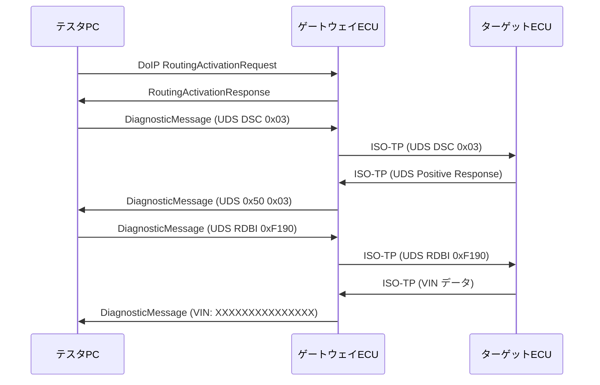

## 概要
ScapyはEthernetだけでなく、**車載通信プロトコル（CAN・ISO-TP・UDS・DoIP・SOME/IP）**もサポートします。`scapy.contrib.automotive` モジュールを使うと、車載診断や通信テストをPythonで自動化できます。

## なぜ使うか
車載ECUの診断・テストは従来ベンダーツールに依存していましたが、Scapyを使えばオープンソースで自動化できます。CANトレースの解析・UDSコマンドの送受信・DoIPセッションの確立などを、テストスクリプトに組み込めます。

## セットアップ

```python
# 車載モジュールのインポート
from scapy.contrib.automotive.can import CAN
from scapy.contrib.automotive.isotp import ISOTP
from scapy.contrib.automotive.uds import UDS, UDS_RDBI, UDS_SA
from scapy.contrib.automotive.doip import DoIP
from scapy.layers.inet import IP, TCP, UDP
from scapy.all import *

# SocketCAN インターフェース（Linux vcan0 など）
# sudo modprobe vcan
# sudo ip link add dev vcan0 type vcan
# sudo ip link set up vcan0
```

## CAN フレームの作成と解析

```python
from scapy.contrib.automotive.can import CAN

# 標準CAN フレーム（11bit ID）
can_frame = CAN(
    identifier = 0x123,    # CAN ID
    length     = 8,
    data       = b"\x02\x10\x03\x00\x00\x00\x00\x00"
)
can_frame.show()
# ###[ CAN ]###
#   flags    = 0
#   identifier= 0x123
#   length   = 8
#   data     = b'\x02\x10\x03\x00\x00\x00\x00\x00'

# 拡張CAN フレーム（29bit ID）
can_ext = CAN(
    flags      = 4,        # Extended ID フラグ
    identifier = 0x18DAF101,
    length     = 3,
    data       = b"\x01\x3E\x00"
)
```

## CANトレースファイルの解析

```python
from scapy.all import rdpcap
from scapy.contrib.automotive.can import CAN
from collections import Counter
import pandas as pd

pkts = rdpcap("can_trace.pcap")

# CAN IDとデータの分布
records = []
for pkt in pkts:
    if pkt.haslayer(CAN):
        c = pkt[CAN]
        records.append({
            "time":  float(pkt.time),
            "id":    hex(c.identifier),
            "len":   c.length,
            "data":  c.data.hex(),
        })

df = pd.DataFrame(records)
print(f"総フレーム数: {len(df)}")
print(f"\nCAN ID分布:")
print(df["id"].value_counts().head(10))

# バス負荷の時系列
df["time_bin"] = (df["time"] - df["time"].min()).astype(int)
bus_load = df.groupby("time_bin").size()
bus_load.plot(figsize=(10, 3), title="CAN バス負荷（フレーム数/秒）")
import matplotlib.pyplot as plt
plt.show()
```

## ISO-TP（CAN上の多バイトメッセージ）

```python
from scapy.contrib.automotive.isotp import ISOTPSocket, ISOTP

# ISO-TP ソケット（vcan0 上）
sock = ISOTPSocket("vcan0", tx_id=0x7E0, rx_id=0x7E8)

# UDS メッセージを ISO-TP で送信
uds_request = bytes.fromhex("1003")  # DiagnosticSessionControl: ExtendedSession
sock.send(ISOTP(data=uds_request))

response = sock.recv(timeout=1)
if response:
    print(f"応答: {response[ISOTP].data.hex()}")
sock.close()
```

## UDS（統合診断サービス）の操作

```python
from scapy.contrib.automotive.uds import (
    UDS, UDS_DSC, UDS_RDBI, UDS_SA, UDS_WDBI
)

# DiagnosticSessionControl — 拡張診断セッションへ移行
dsc = UDS() / UDS_DSC(diagnosticSessionType=0x03)
print(dsc.show2())

# ReadDataByIdentifier — ECU情報を読む
rdbi = UDS() / UDS_RDBI(identifiers=[0xF190])  # VIN番号
print(rdbi.show2())

# SecurityAccess — セキュリティ解除
sa_req  = UDS() / UDS_SA(securityAccessType=0x01)  # requestSeed
sa_send = UDS() / UDS_SA(securityAccessType=0x02,   # sendKey
                          securityKey=b"\xAB\xCD\xEF\x00")

# UDS レスポンスの解析
def parse_uds_response(data: bytes) -> dict:
    if not data:
        return {}
    sid  = data[0]
    body = data[1:]
    if sid == 0x50:   # Positive response to DSC
        return {"service": "DSC_Positive", "session": body[0]}
    elif sid == 0x7F: # Negative response
        return {"service": "NRC", "requested_sid": body[0], "nrc": hex(body[1])}
    elif sid == 0x62: # Positive response to RDBI
        return {"service": "RDBI_Positive", "did": body[:2].hex(), "data": body[2:].hex()}
    return {"raw": data.hex()}
```

## DoIP（Diagnostics over IP）セッション

```python
from scapy.contrib.automotive.doip import DoIP
from scapy.layers.inet import IP, TCP

# DoIP はTCPポート 13400 を使用
# VehicleIdentificationRequest
vehicle_id_req = (
    IP(dst="192.168.1.100") /
    TCP(dport=13400) /
    DoIP(payload_type=0x0001)  # VehicleIdentificationRequest
)

# RoutingActivationRequest → UDS 通信路を開く
routing_act = (
    IP(dst="192.168.1.100") /
    TCP(dport=13400) /
    DoIP(
        payload_type    = 0x0005,  # RoutingActivationRequest
        source_address  = 0x0E00,  # テスタ論理アドレス
        activation_type = 0x00,
    )
)

# DoIP 上で UDS を送る（DiagnosticMessage）
uds_over_doip = (
    IP(dst="192.168.1.100") /
    TCP(dport=13400) /
    DoIP(
        payload_type   = 0x8001,   # DiagnosticMessage
        source_address = 0x0E00,
        target_address = 0x1001,   # ECUの論理アドレス
    ) /
    UDS() / UDS_DSC(diagnosticSessionType=0x03)
)
doip_pkt = IP(dst="192.168.1.100")/TCP(dport=13400)/routing_act
```

## DoIP PCAPからのダイアログ再構成

```python
from scapy.all import rdpcap
from scapy.contrib.automotive.doip import DoIP

def analyze_doip_trace(pcap_file: str) -> pd.DataFrame:
    pkts = rdpcap(pcap_file)
    dialogs = []

    for pkt in pkts:
        if not pkt.haslayer(DoIP):
            continue
        d = pkt[DoIP]
        payload_type = d.payload_type
        entry = {
            "time":         float(pkt.time),
            "src":          pkt[IP].src if pkt.haslayer(IP) else "",
            "dst":          pkt[IP].dst if pkt.haslayer(IP) else "",
            "payload_type": hex(payload_type),
            "description":  {
                0x0001: "VehicleIDRequest",
                0x0004: "VehicleIDResponse",
                0x0005: "RoutingActivationReq",
                0x0006: "RoutingActivationRes",
                0x8001: "DiagnosticMessage",
                0x8002: "DiagMsgPositiveAck",
                0x8003: "DiagMsgNegativeAck",
            }.get(payload_type, f"Unknown(0x{payload_type:04X})"),
        }
        dialogs.append(entry)

    return pd.DataFrame(dialogs)
```

## CAN解析のフロー


