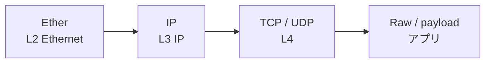

## 概要
Scapyは**Pythonでパケットを作成・送信・受信・解析できる**ネットワーク操作ライブラリです。Wiresharkが「見るだけ」のツールとすれば、Scapyは「作って送れる」双方向のツールです。ネットワーク診断・セキュリティテスト・プロトコル検証・PCAP解析に使います。

## なぜ使うか
Wiresharkはキャプチャ・表示に特化していますが、「特定パケットを生成して応答を確認したい」「PCAPからプロトコル別に統計を出したい」という場合はScapyが適しています。PythonのロジックとネットワークI/Oを自然に組み合わせられます。

## インストールと起動

```bash
pip install scapy
# Linuxではroot権限が必要なことが多い
sudo python3 -c "from scapy.all import *; print('OK')"
```

## レイヤー構造



Scapy のパケットはこのレイヤーを `/` で重ねて組み立てます。

## パケットを作る

```python
from scapy.all import *

# Ethernet フレーム
eth = Ether(dst="ff:ff:ff:ff:ff:ff", src="00:11:22:33:44:55")

# IP パケット
ip  = IP(src="192.168.1.1", dst="192.168.1.100", ttl=64)

# UDP セグメント
udp = UDP(sport=12345, dport=53)

# ペイロード
payload = Raw(b"Hello, Network!")

# レイヤーを重ねる
pkt = eth / ip / udp / payload

# パケット構造を確認
pkt.show()
# ###[ Ethernet ]###
#   dst = ff:ff:ff:ff:ff:ff
#   src = 00:11:22:33:44:55
# ###[ IP ]###
#      src = 192.168.1.1
#      dst = 192.168.1.100
# ###[ UDP ]###
#         sport= 12345
#         dport= domain
# ###[ Raw ]###
#             load = 'Hello, Network!'

# 16進数でダンプ
hexdump(pkt)
print(f"パケットサイズ: {len(pkt)} バイト")
```

## 各フィールドの参照

```python
pkt = IP(src="10.0.0.1", dst="10.0.0.2") / TCP(dport=80, flags="S")

# フィールドにアクセス
print(pkt[IP].src)      # 10.0.0.1
print(pkt[TCP].dport)   # 80
print(pkt[TCP].flags)   # S (SYN)

# レイヤーの確認
print(pkt.haslayer(TCP))  # True
print(pkt.haslayer(UDP))  # False

# TTLを書き換え
pkt[IP].ttl = 128
```

## パケットを送信する

```python
# L3 で送信（IPルーティングを使う）
send(IP(dst="8.8.8.8") / ICMP())

# L2 で送信（インターフェース指定）
sendp(Ether() / IP(dst="192.168.1.1") / ICMP(), iface="eth0")

# 送信して応答を受信（L3）
response = sr1(IP(dst="8.8.8.8") / ICMP(), timeout=2)
if response:
    response.show()

# 複数パケット送信・複数応答受信
answered, unanswered = sr(
    [IP(dst="8.8.8.8") / ICMP() for _ in range(3)],
    timeout=2
)
```

## ICMPパケットで疎通確認（ping）

```python
def ping(host: str, count: int = 3) -> dict:
    results = {"sent": 0, "received": 0, "rtts": []}
    for i in range(count):
        pkt = IP(dst=host) / ICMP(seq=i)
        t_start = time.time()
        reply   = sr1(pkt, timeout=1, verbose=False)
        results["sent"] += 1
        if reply and reply.haslayer(ICMP) and reply[ICMP].type == 0:
            rtt = (time.time() - t_start) * 1000
            results["received"] += 1
            results["rtts"].append(rtt)
    results["loss_rate"] = 1 - results["received"] / results["sent"]
    if results["rtts"]:
        results["avg_rtt"] = sum(results["rtts"]) / len(results["rtts"])
    return results

import time
result = ping("8.8.8.8")
print(f"損失率: {result['loss_rate']*100:.0f}%")
print(f"平均RTT: {result.get('avg_rtt', 'N/A'):.1f} ms")
```

## TCPハンドシェイクを手動で行う

```python
# SYN 送信
ip  = IP(dst="example.com")
syn = TCP(sport=RandShort(), dport=80, flags="S", seq=1000)

syn_ack = sr1(ip / syn, timeout=3, verbose=False)
if syn_ack and syn_ack.haslayer(TCP):
    print(f"SYN-ACK 受信: seq={syn_ack[TCP].seq}, ack={syn_ack[TCP].ack}")

    # ACK 送信（ハンドシェイク完了）
    ack = TCP(sport=syn.sport, dport=80,
              flags="A",
              seq=syn_ack[TCP].ack,
              ack=syn_ack[TCP].seq + 1)
    send(ip / ack, verbose=False)
    print("TCP ハンドシェイク完了")
```

## パケットのキャプチャ

```python
# 10パケットをキャプチャ
pkts = sniff(iface="eth0", count=10)

# フィルタ付きキャプチャ（BPFフィルタ構文）
http_pkts = sniff(iface="eth0", filter="tcp port 80", count=20)

# コールバック処理（リアルタイム処理）
def process_pkt(pkt):
    if pkt.haslayer(IP):
        print(f"{pkt[IP].src} → {pkt[IP].dst}")

sniff(iface="eth0", prn=process_pkt, count=50)

# PCAPファイルに保存
wrpcap("capture.pcap", pkts)
```

## 次に学ぶべき内容
PCAPファイルの解析を [[scapy-pcap]] で詳しく学びましょう。
