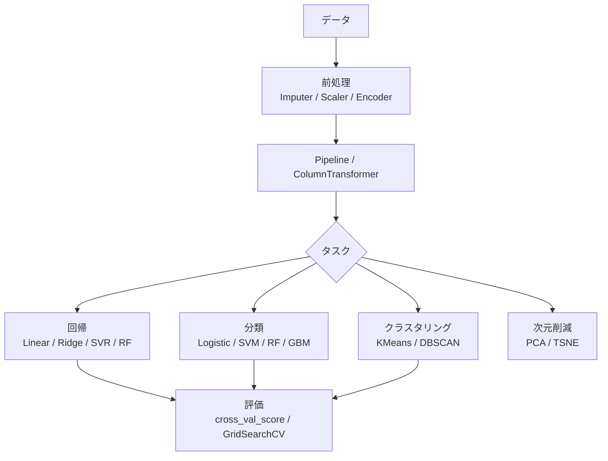

## 概要
scikit-learn（sklearn）はPythonで最も広く使われる機械学習ライブラリです。回帰・分類・クラスタリング・次元削減・前処理・モデル評価まで、一貫したAPIで扱えます。`fit()` で学習、`predict()` で予測という統一インターフェースが特徴です。

## なぜ使うか
PyTorch/TensorFlowはニューラルネットワーク向けですが、scikit-learnは**表形式データ（テーブルデータ）に強い**ライブラリです。決定木・SVM・ランダムフォレストなど古典的な手法を数行で試せ、特徴量エンジニアリング・交差検証・パイプラインも完備しています。

## 可視化


## 共通のAPI設計

```python
# すべてのモデルが同じインターフェース
model.fit(X_train, y_train)     # 学習
model.predict(X_test)           # 予測
model.score(X_test, y_test)     # スコア評価
model.predict_proba(X_test)     # 確率（分類のみ）
```

## データの前処理

```python
import numpy as np
import pandas as pd
from sklearn.preprocessing import (
    StandardScaler, MinMaxScaler, LabelEncoder, OneHotEncoder
)
from sklearn.impute import SimpleImputer

# 欠損値補完
imp = SimpleImputer(strategy="median")
X_filled = imp.fit_transform(X)

# 標準化（平均0・分散1）→ SVM・ロジスティック回帰・ニューラルネットに必須
scaler = StandardScaler()
X_scaled = scaler.fit_transform(X_train)
X_test_scaled = scaler.transform(X_test)   # testはfit不要！

# 正規化（0〜1に収める）
minmax = MinMaxScaler()
X_norm = minmax.fit_transform(X_train)

# カテゴリ変数をワンホットエンコード
enc = OneHotEncoder(sparse_output=False, drop="first")
X_cat = enc.fit_transform(df[["city", "type"]])
```

**数式で表すと**

$$
z = \frac{x - \mu}{\sigma}, \qquad x_{\text{norm}} = \frac{x - x_{\min}}{x_{\max} - x_{\min}}
$$

`StandardScaler` は平均 \(\mu\)・標準偏差 \(\sigma\) で標準化（平均0・分散1）し、`MinMaxScaler` は最小0・最大1の範囲へ線形変換します。統計量は訓練データで `fit` し、テストには `transform` のみ適用します。

## 訓練/テスト分割と交差検証

```python
from sklearn.model_selection import (
    train_test_split, cross_val_score, KFold, StratifiedKFold
)

# 単純な分割
X_train, X_test, y_train, y_test = train_test_split(
    X, y, test_size=0.2, random_state=42, stratify=y  # stratify: クラス比率を維持
)

# k-fold 交差検証（過学習の検出に有効）
from sklearn.ensemble import RandomForestClassifier
model = RandomForestClassifier(n_estimators=100, random_state=42)

cv = StratifiedKFold(n_splits=5, shuffle=True, random_state=42)
scores = cross_val_score(model, X, y, cv=cv, scoring="f1_macro")
print(f"CV F1: {scores.mean():.3f} ± {scores.std():.3f}")
```

**数式で表すと**

$$
\mathrm{CV} = \frac{1}{k}\sum_{i=1}^{k} \mathrm{score}\!\left(\mathcal{D}_{\text{test}}^{(i)}\right)
$$

\(k\)-fold 交差検証はデータを \(k\) 分割し、各 fold をテストに使ったスコアの平均で汎化性能を推定します。標準偏差が大きいほど分割による評価のばらつきが大きいことを示します。

## Pipeline — 前処理とモデルを一体化

```python
from sklearn.pipeline import Pipeline
from sklearn.preprocessing import StandardScaler
from sklearn.linear_model import LogisticRegression

# パイプラインにまとめると test の変換漏れ・データリークを防げる
pipe = Pipeline([
    ("imputer", SimpleImputer(strategy="median")),
    ("scaler",  StandardScaler()),
    ("model",   LogisticRegression(max_iter=1000)),
])

pipe.fit(X_train, y_train)
y_pred = pipe.predict(X_test)
```

## ColumnTransformer — 列ごとに異なる前処理

```python
from sklearn.compose import ColumnTransformer
from sklearn.preprocessing import StandardScaler, OneHotEncoder
from sklearn.pipeline import Pipeline
from sklearn.ensemble import GradientBoostingClassifier

num_cols = ["age", "income", "score"]
cat_cols = ["city", "occupation"]

preprocessor = ColumnTransformer([
    ("num", StandardScaler(),                    num_cols),
    ("cat", OneHotEncoder(drop="first"),         cat_cols),
])

pipe = Pipeline([
    ("prep",  preprocessor),
    ("model", GradientBoostingClassifier()),
])

pipe.fit(X_train, y_train)
print(pipe.score(X_test, y_test))
```

## ハイパーパラメータチューニング

```python
from sklearn.model_selection import GridSearchCV, RandomizedSearchCV
from sklearn.ensemble import RandomForestClassifier

param_grid = {
    "model__n_estimators":  [100, 200, 300],
    "model__max_depth":     [None, 5, 10],
    "model__min_samples_split": [2, 5],
}

gs = GridSearchCV(pipe, param_grid, cv=5, scoring="f1_macro", n_jobs=-1)
gs.fit(X_train, y_train)
print(f"最良パラメータ: {gs.best_params_}")
print(f"最良スコア:     {gs.best_score_:.3f}")
```

## モデル評価の全体像

```python
from sklearn.metrics import (
    classification_report, confusion_matrix,
    roc_auc_score, ConfusionMatrixDisplay
)
import matplotlib.pyplot as plt

y_pred  = pipe.predict(X_test)
y_proba = pipe.predict_proba(X_test)[:, 1]

# 詳細レポート
print(classification_report(y_test, y_pred, target_names=["Neg", "Pos"]))

# 混同行列
fig, ax = plt.subplots(figsize=(4, 3))
ConfusionMatrixDisplay.from_predictions(y_test, y_pred, ax=ax)
plt.tight_layout()
plt.show()

# AUC-ROC
print(f"AUC: {roc_auc_score(y_test, y_proba):.3f}")
```

## scikit-learn の全体マップ



## 次に学ぶべき内容
回帰の基礎となる [[linear-regression]] を学びましょう。
