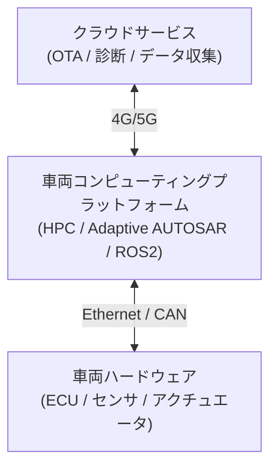

## 概要
SDV(Software Defined Vehicle)は、車両の機能をソフトウェアで定義・更新できるようにする設計思想です。ハード固定の機能群から、**OTA**で継続的に進化するソフト中心の車へ——スマートフォンのような体験を車にもたらします。

## なぜ必要か
自動運転やコネクテッド機能は、出荷後も改善・追加が必要です。多数のECUに分散した固定機能では限界があるため、高性能な集中型コンピュータと高帯域ネットワークで、ソフト更新を前提とした設計へ移行しています。

## 自動運転での利用例
SDVでは**ゾーンアーキテクチャ**+車載 [[ethernet]] バックボーン上に、[[autosar]] Adaptive や [[ros2-dds]] ベースのアプリが載り、**OTA**で自動運転機能が更新されます。通信の中心は [[adas-comm]] で扱うサービス指向通信です。

## 関連用語
基盤の通信が [[ethernet]]、ソフト標準が [[autosar]]、ADAS固有の通信設計が [[adas-comm]] です。

## 次に学ぶべき内容
最後に、ADAS特有の通信要件をまとめた [[adas-comm]] を学びましょう。

## 図解

