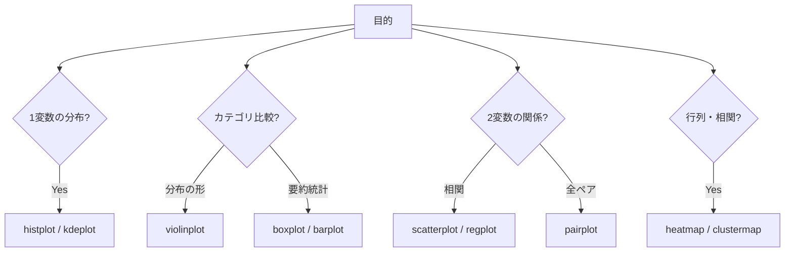

## 概要
SeabornはMatplotlibをベースにした統計可視化ライブラリです。Pandasの `DataFrame` を直接受け取り、複雑な統計グラフを少ないコードで美しく描けます。箱ひげ図・バイオリンプロット・ペアプロット・ヒートマップなど、データの分布や相関を直感的に把握する場面で力を発揮します。

## なぜ必要か
Matplotlibでは散布図に色分け・回帰直線・信頼区間を追加しようとすると数十行になりますが、Seabornなら `sns.lmplot()` の1行で済みます。「データを素早く多角的に見る」EDA（探索的分析）フェーズでは、Seabornのほうが圧倒的に高速です。

## 基本セットアップ

```python
import seaborn as sns
import matplotlib.pyplot as plt
import pandas as pd
import numpy as np

# テーマ設定
sns.set_theme(style="whitegrid", palette="muted", font_scale=1.1)

# 組み込みデータセットを使って動作確認
tips = sns.load_dataset("tips")    # レストランのチップデータ
iris = sns.load_dataset("iris")    # アヤメの計測データ
print(tips.head(3))
```

## 分布を見る — histplot / kdeplot / rugplot

```python
fig, axes = plt.subplots(1, 3, figsize=(14, 4))

# ヒストグラム + KDE（密度曲線）
sns.histplot(data=tips, x="total_bill", kde=True,
             bins=20, color="steelblue", ax=axes[0])
axes[0].set_title("ヒストグラム + KDE")

# KDE のみ（グループ別）
sns.kdeplot(data=tips, x="tip", hue="sex",
            fill=True, alpha=0.4, ax=axes[1])
axes[1].set_title("KDE（性別比較）")

# rug plot（実データの分布）
sns.histplot(data=tips, x="total_bill", kde=True, ax=axes[2])
sns.rugplot(data=tips, x="total_bill", ax=axes[2], color="red", height=0.05)
axes[2].set_title("ヒストグラム + rug")

plt.tight_layout()
plt.show()
```

## カテゴリ比較 — boxplot / violinplot / barplot

```python
fig, axes = plt.subplots(1, 3, figsize=(15, 5))

# 箱ひげ図（中央値・四分位・外れ値）
sns.boxplot(data=tips, x="day", y="total_bill",
            hue="sex", palette="pastel", ax=axes[0])
axes[0].set_title("箱ひげ図")

# バイオリンプロット（分布の形状も見える）
sns.violinplot(data=tips, x="day", y="tip",
               inner="quartile", palette="muted", ax=axes[1])
axes[1].set_title("バイオリンプロット")

# 棒グラフ（平均 + 95%CI）
sns.barplot(data=tips, x="day", y="total_bill",
            hue="sex", palette="Set2", ax=axes[2])
axes[2].set_title("平均 + 信頼区間")

plt.tight_layout()
plt.show()
```

## 散布図と回帰 — scatterplot / lmplot / regplot

```python
# 基本の散布図（hue で色分け、size で点の大きさを変える）
fig, axes = plt.subplots(1, 2, figsize=(12, 5))

sns.scatterplot(data=tips, x="total_bill", y="tip",
                hue="sex", size="size", sizes=(40, 200),
                alpha=0.7, ax=axes[0])
axes[0].set_title("散布図（性別・人数）")

# 回帰直線 + 信頼区間を自動で描画
sns.regplot(data=tips, x="total_bill", y="tip",
            scatter_kws={"alpha": 0.4}, ax=axes[1])
axes[1].set_title("散布図 + 回帰直線")

plt.tight_layout()
plt.show()
```

## 相関行列 — heatmap

```python
# 数値列の相関係数を計算
corr = tips[["total_bill", "tip", "size"]].corr()

fig, ax = plt.subplots(figsize=(6, 5))
sns.heatmap(
    corr,
    annot=True,           # 数値を表示
    fmt=".2f",
    cmap="RdBu_r",        # 赤（正）→白→青（負）
    vmin=-1, vmax=1,
    square=True,
    linewidths=0.5,
    ax=ax,
)
ax.set_title("相関係数マトリクス")
plt.tight_layout()
plt.show()
```

## ペアプロット — pairplot

```python
# 全数値列の組み合わせを一気に可視化（EDAで最初に使う）
g = sns.pairplot(
    iris,
    hue="species",          # 種ごとに色分け
    diag_kind="kde",        # 対角線はKDE（"hist"でも可）
    plot_kws={"alpha": 0.6},
)
g.figure.suptitle("Iris データのペアプロット", y=1.02)
plt.show()
```

## クラスタリングの可視化 — clustermap

```python
# 行と列をクラスタリングして並べ替えるヒートマップ
pivot = tips.pivot_table(
    index="day", columns="time", values="total_bill", aggfunc="mean"
)
sns.clustermap(pivot, annot=True, fmt=".1f",
               cmap="YlOrRd", figsize=(6, 5))
plt.show()
```

## よく使う関数の整理



## 次に学ぶべき内容
可視化スキルを活かして、データ全体を体系的に調べる [[data-analysis]] へ進みましょう。
