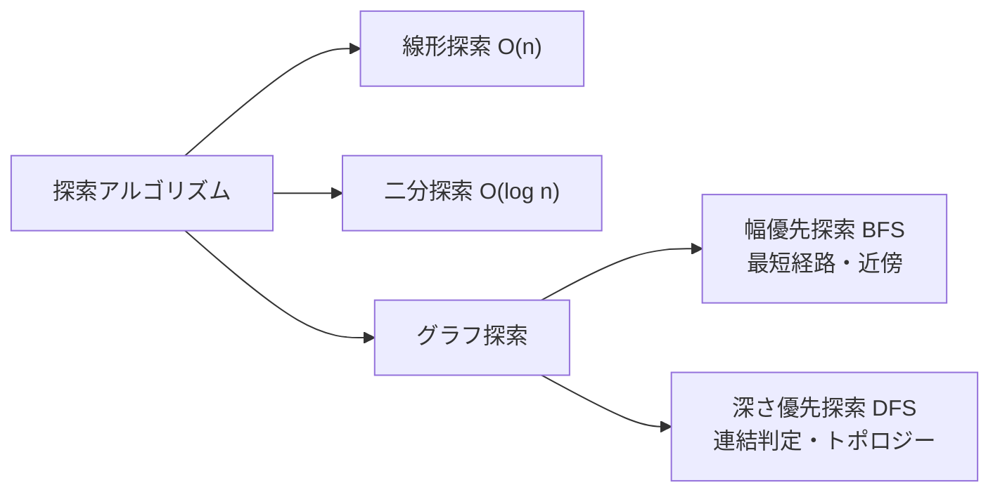
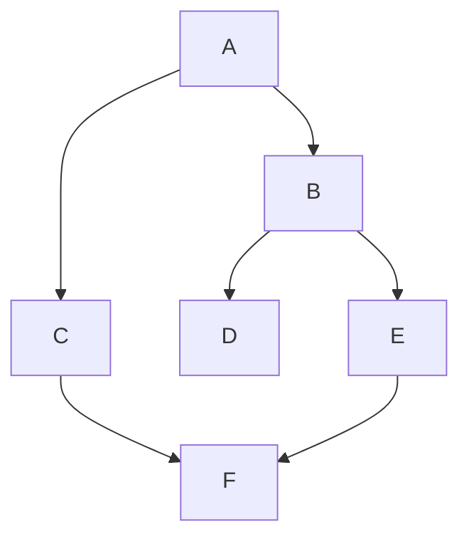

## 探索の基本

データの中から「欲しいもの」を見つける操作は、あらゆるプログラムの中核です。探し方によって計算量が劇的に違います。



## 線形探索

先頭から順番に調べる。ソート不要だが O(n)。

```python
def linear_search(arr, target):
    for i, x in enumerate(arr):
        if x == target:
            return i
    return -1

data = [42, 17, 5, 99, 31, 8]
print(linear_search(data, 99))   # 3
print(linear_search(data, 50))   # -1
```

**計算量・数式で表すと**

$$
T_{\text{worst}}(n) = O(n), \quad T_{\text{avg}}(n) = O(n/2) = O(n)
$$

先頭から順に比較するため、最悪・平均ともに \(n\) に比例します。

## 二分探索（Binary Search）

**ソート済み配列**を前提に、毎回「半分」に絞り込む。100万件でも約20回で見つかります。

```python
def binary_search(arr, target):
    lo, hi = 0, len(arr) - 1
    while lo <= hi:
        mid = lo + (hi - lo) // 2   # オーバーフロー防止
        if arr[mid] == target:
            return mid
        elif arr[mid] < target:
            lo = mid + 1
        else:
            hi = mid - 1
    return -1   # 見つからない

arr = [1, 3, 5, 7, 9, 11, 13, 15, 17, 19]
print(binary_search(arr, 13))   # 6
print(binary_search(arr, 4))    # -1
```

**計算量・数式で表すと**

$$
T(n) = T(n/2) + O(1) = O(\log n)
$$

毎回探索範囲が半分になるため、最悪でも \(\lceil \log_2 n \rceil\) 回の比較で済みます。

**動作の様子**（13を探す, n=10）：
```
arr: [1, 3, 5, 7, 9, 11, 13, 15, 17, 19]
       lo=0              mid=4  hi=9
arr[4]=9 < 13 → lo=5
              lo=5  mid=7  hi=9
arr[7]=15 > 13 → hi=6
              lo=5 mid=5 hi=6
arr[5]=11 < 13 → lo=6
              lo=6 mid=6 hi=6
arr[6]=13 == 13 → return 6  ✅ (4ステップで完了)
```

### 応用: 条件を満たす最初の位置

```python
import bisect

arr = [1, 3, 3, 5, 5, 5, 7, 9]

# 値 5 が最初に現れる位置
print(bisect.bisect_left(arr, 5))    # 3

# 値 5 の次の挿入位置（最後の 5 の右）
print(bisect.bisect_right(arr, 5))   # 6

# ソート済みリストへの挿入
bisect.insort(arr, 4)
print(arr)   # [1, 3, 3, 4, 5, 5, 5, 7, 9]
```

### 二分探索の応用パターン

```python
# 「ある条件を満たす最小値」を求める（最適化問題に多用）
# 例: n人の荷物を m台の車に積める最小積載量は?

def can_ship(weights, capacity, days):
    """capacity で全荷物を days 日で運べるか?"""
    current = 0
    required_days = 1
    for w in weights:
        if current + w > capacity:
            required_days += 1
            current = 0
        current += w
    return required_days <= days

def min_ship_capacity(weights, days):
    lo = max(weights)      # 最低でも最重荷物分
    hi = sum(weights)      # 最大でも全部1日
    while lo < hi:
        mid = (lo + hi) // 2
        if can_ship(weights, mid, days):
            hi = mid
        else:
            lo = mid + 1
    return lo

weights = [1, 2, 3, 4, 5, 6, 7, 8, 9, 10]
print(min_ship_capacity(weights, 5))   # 15
```

**計算量・数式で表すと**

$$
T(n) = O\!\left(n \log \sum_i w_i\right)
$$

答えの範囲を二分探索（\(O(\log \sum w_i)\) 回）し、各回で判定 `can_ship` を \(O(n)\) で行います。

## グラフ探索

グラフは「ノード（頂点）」と「エッジ（辺）」の集合。SNSの友達関係・地図・タスク依存関係などを表現します。

```python
# 隣接リスト表現（最も一般的）
graph = {
    "A": ["B", "C"],
    "B": ["D", "E"],
    "C": ["F"],
    "D": [],
    "E": ["F"],
    "F": [],
}
```



## 幅優先探索（BFS: Breadth-First Search）

近いノードから順に探索。**最短経路の発見**に使います。

```python
from collections import deque

def bfs(graph, start, goal=None):
    visited = {start}
    queue   = deque([(start, [start])])   # (現在ノード, これまでのパス)
    order   = []

    while queue:
        node, path = queue.popleft()
        order.append(node)

        if node == goal:
            return path   # 最短経路を返す

        for neighbor in graph.get(node, []):
            if neighbor not in visited:
                visited.add(neighbor)
                queue.append((neighbor, path + [neighbor]))

    return order   # goalなし → 訪問順を返す

# 探索順
print(bfs(graph, "A"))          # ['A', 'B', 'C', 'D', 'E', 'F']

# 最短経路
print(bfs(graph, "A", goal="F"))  # ['A', 'C', 'F']  ← 2ステップ
```

**計算量・数式で表すと**

$$
T = O(V + E)
$$

各頂点 \(V\) と各辺 \(E\) を1回ずつ処理します。重みなしグラフの最短経路（辺数最小）を保証します。

### BFS で最短距離を求める

```python
def shortest_distance(graph, start):
    """start から各ノードへの最短ステップ数"""
    dist = {start: 0}
    queue = deque([start])
    while queue:
        node = queue.popleft()
        for neighbor in graph.get(node, []):
            if neighbor not in dist:
                dist[neighbor] = dist[node] + 1
                queue.append(neighbor)
    return dist

print(shortest_distance(graph, "A"))
# {'A': 0, 'B': 1, 'C': 1, 'D': 2, 'E': 2, 'F': 2}
```

**計算量・数式で表すと**

$$
T = O(V + E)
$$

BFS と同じく全頂点・全辺を1回走査し、各ノードへの最短ステップ数 \(\text{dist}[v]\) を確定します。

## 深さ優先探索（DFS: Depth-First Search）

一方向に深く掘り下げてから戻る。**連結判定・サイクル検出・トポロジカルソート**に使います。

```python
# 再帰版
def dfs_recursive(graph, node, visited=None):
    if visited is None:
        visited = set()
    visited.add(node)
    order = [node]
    for neighbor in graph.get(node, []):
        if neighbor not in visited:
            order += dfs_recursive(graph, neighbor, visited)
    return order

# スタック版（大規模グラフで再帰深度制限を避ける）
def dfs_stack(graph, start):
    visited = set()
    stack   = [start]
    order   = []
    while stack:
        node = stack.pop()
        if node in visited:
            continue
        visited.add(node)
        order.append(node)
        for neighbor in reversed(graph.get(node, [])):
            if neighbor not in visited:
                stack.append(neighbor)
    return order

print(dfs_recursive(graph, "A"))  # ['A', 'B', 'D', 'E', 'F', 'C']
print(dfs_stack(graph, "A"))      # ['A', 'B', 'D', 'E', 'F', 'C']
```

**計算量・数式で表すと**

$$
T = O(V + E)
$$

各頂点と各辺を1回ずつ訪問します。再帰版は深さ分の \(O(V)\)、スタック版も同オーダーの補助メモリを使います。

### 連結成分の数を数える

```python
def count_components(n, edges):
    """n ノード、edges のグラフの連結成分数"""
    graph = {i: [] for i in range(n)}
    for u, v in edges:
        graph[u].append(v)
        graph[v].append(u)

    visited = set()
    count   = 0
    for node in range(n):
        if node not in visited:
            dfs_stack(graph, node)  # ここでは visited を更新したい
            count += 1
    return count

# Union-Find を使う方が効率的（後述）
```

## ダイクストラ法（重み付き最短経路）

エッジに重み（コスト）がある場合の最短経路。BFS の「ステップ数」が「コストの和」になります。

```python
import heapq

def dijkstra(graph, start):
    """
    graph: {node: [(neighbor, weight), ...]}
    戻り値: start から各ノードへの最小コスト
    """
    dist  = {start: 0}
    heap  = [(0, start)]   # (コスト, ノード)

    while heap:
        cost, node = heapq.heappop(heap)
        if cost > dist.get(node, float('inf')):
            continue    # すでに良いルートが見つかっている
        for neighbor, weight in graph.get(node, []):
            new_cost = cost + weight
            if new_cost < dist.get(neighbor, float('inf')):
                dist[neighbor] = new_cost
                heapq.heappush(heap, (new_cost, neighbor))
    return dist

# 例: 都市間の移動コスト
road = {
    "東京": [("名古屋", 90), ("仙台", 100)],
    "名古屋": [("大阪", 70), ("東京", 90)],
    "大阪": [("名古屋", 70)],
    "仙台": [("東京", 100)],
}
print(dijkstra(road, "東京"))
# {'東京': 0, '名古屋': 90, '仙台': 100, '大阪': 160}
```

**計算量・数式で表すと**

$$
T = O\!\left((V + E) \log V\right)
$$

各辺の緩和ごとにヒープへ push/pop（\(O(\log V)\)）します。負の重みがない場合に最小コストを保証します。

## Union-Find（素集合データ構造）

グループ（集合）の合体と「同じグループか？」の判定を高速に行います。

```python
class UnionFind:
    def __init__(self, n):
        self.parent = list(range(n))
        self.rank   = [0] * n

    def find(self, x):       # O(α(n))≈O(1): ルートを探す（経路圧縮）
        if self.parent[x] != x:
            self.parent[x] = self.find(self.parent[x])
        return self.parent[x]

    def union(self, x, y):   # O(α(n))≈O(1): 2つの集合を合体
        rx, ry = self.find(x), self.find(y)
        if rx == ry: return
        if self.rank[rx] < self.rank[ry]:
            rx, ry = ry, rx
        self.parent[ry] = rx
        if self.rank[rx] == self.rank[ry]:
            self.rank[rx] += 1

    def connected(self, x, y):
        return self.find(x) == self.find(y)

# 例: ネットワークの連結判定
uf = UnionFind(6)   # ノード 0〜5
uf.union(0, 1)
uf.union(1, 2)
uf.union(3, 4)

print(uf.connected(0, 2))   # True（0-1-2 でつながっている）
print(uf.connected(0, 3))   # False（別グループ）
print(uf.connected(3, 4))   # True
```

**計算量・数式で表すと**

$$
T_{\text{find}} = T_{\text{union}} = O(\alpha(n)) \approx O(1)
$$

経路圧縮とランクによる合併を併用すると、1操作あたりほぼ定数時間（\(\alpha\) はアッカーマン関数の逆関数）になります。

## BFS vs DFS の使い分け

| 問題 | BFS | DFS |
|------|-----|-----|
| 最短経路（重みなし） | ✅ | ❌ |
| 全ノードの訪問 | ✅ | ✅ |
| サイクル検出 | ✅ | ✅ |
| トポロジカルソート | ❌ | ✅ |
| 連結成分の検出 | ✅ | ✅ |
| 迷路の解法 | ✅（最短） | ✅（解を見つけるだけ） |
| メモリ使用 | O(幅) | O(深さ) |

## まとめ

```
探索アルゴリズムの選び方:
  ├─ 配列が未ソート             → 線形探索 O(n)
  ├─ 配列がソート済み           → 二分探索 O(log n)
  ├─ グラフの最短経路（重みなし）→ BFS
  ├─ グラフの最短経路（重みあり）→ ダイクストラ法
  ├─ グラフの全探索・連結判定   → DFS or BFS
  ├─ 集合の合体・連結判定       → Union-Find
  └─ ソート済み配列への挿入位置 → bisect（二分探索）
```

探索アルゴリズムはグラフ・木のあらゆる問題の基礎。競技プログラミングでも実務でも、BFS/DFS とダイクストラは必須スキルです。
