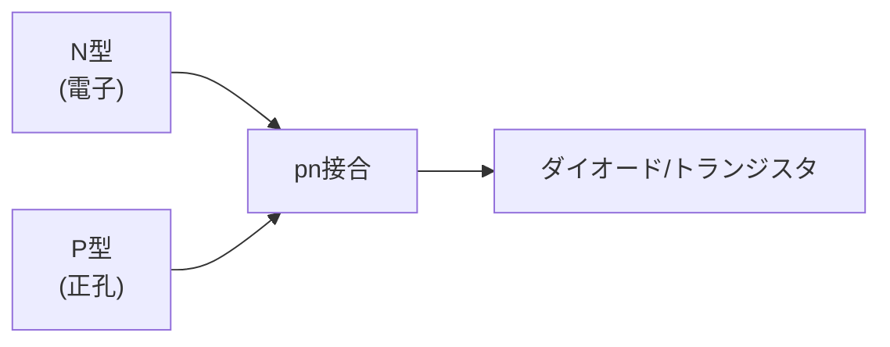

## 概要
半導体はスマートフォン・PC・車載ECUのすべてに使われている現代文明の基盤素材です。「どうして電流を制御できるのか」を理解することは、電子回路設計・組み込み開発の出発点です。



## 主要な数式

**ダイオードの電流–電圧特性**（ショックレーの式、熱電圧 $V_T \approx 26\,\text{mV}$）：

$$I = I_S\left(e^{V/(nV_T)} - 1\right)$$

**熱電圧**（ボルツマン定数 $k$、電荷 $q$、絶対温度 $T$）：

$$V_T = \frac{kT}{q}$$

**MOSFET の飽和領域ドレイン電流**：

$$I_D = \frac{1}{2}\mu C_{ox}\frac{W}{L}\,(V_{GS} - V_{th})^2$$

ゲート電圧 $V_{GS}$ がしきい値 $V_{th}$ を超えると電流が流れ、スイッチとして動作する。

**キャリア密度と真性半導体**：

$$n\,p = n_i^2$$

## 半導体とは

```
導電性の比較:

  金属（銅）     ← 自由電子が多い、電気をよく通す
  ────────────────────────────
  半導体（Si）   ← 条件によって通したり遮断したりできる ← これが重要！
  ────────────────────────────
  絶縁体（ガラス） ← 自由電子がほぼない、電気を通さない
```

シリコン（Si）は原子価4（4個の共有結合）で、単体では自由電子がほとんどありません。しかし**不純物を微量添加（ドーピング）**することで導電性を制御できます。

## N型・P型半導体

```python
import numpy as np
import matplotlib.pyplot as plt

# N型半導体: 5価の不純物（リン・砒素）を添加
# → 電子（−）が余る → 電子が多数キャリア
print("N型半導体:")
print("  シリコン（4価）+ リン（5価）")
print("  → 共有結合に使われない電子が1個余る")
print("  → 自由電子が増える（電子が多数キャリア）")

# P型半導体: 3価の不純物（ボロン）を添加
# → 正孔（ホール）が生まれる
print("\nP型半導体:")
print("  シリコン（4価）+ ボロン（3価）")
print("  → 共有結合が1つ不足 → 正孔（ホール）が生まれる")
print("  → ホールが多数キャリア（正電荷の動き）")
```

## PN接合ダイオード

P型とN型を接触させると**空乏層**が生まれます。

```python
def diode_current(V, I_s=1e-12, n=1, T=300):
    """
    ダイオードの電流-電圧特性（理想ダイオード方程式）
    I_s: 逆方向飽和電流, n: 理想係数, T: 温度[K]
    """
    k = 1.381e-23   # ボルツマン定数
    q = 1.602e-19   # 電気素量
    Vt = k * T / q  # 熱電圧 ≈ 26mV at 25°C
    return I_s * (np.exp(V / (n * Vt)) - 1)

V_range = np.linspace(-1, 0.8, 1000)
I = diode_current(V_range) * 1e3   # mA に変換
I_clipped = np.clip(I, -0.1, 100)   # 表示用にクリップ

plt.figure(figsize=(8, 5))
plt.plot(V_range, I_clipped, "b-", lw=2)
plt.axhline(0, color="black", lw=0.8)
plt.axvline(0, color="black", lw=0.8)
plt.axvline(0.7, color="red", linestyle="--", alpha=0.7, label="順方向電圧降下 ≈ 0.7V (Si)")
plt.xlabel("電圧 [V]")
plt.ylabel("電流 [mA]")
plt.title("ダイオードのI-V特性（整流作用）")
plt.legend()
plt.ylim(-0.5, 20)
plt.grid(True)
plt.show()

# 実用上の電圧降下
print("代表的なダイオードの順方向電圧降下:")
print("  シリコンダイオード: 約 0.6〜0.7 V")
print("  ゲルマニウム:       約 0.2〜0.3 V")
print("  LED（赤）:           約 1.8〜2.2 V")
print("  LED（青/白）:         約 3.0〜3.5 V")
print("  ショットキー:        約 0.2〜0.4 V（高速・低損失）")
```

## バイポーラトランジスタ（BJT）

トランジスタは「小さな電流で大きな電流を制御するスイッチ・増幅器」です。

```
NPN型トランジスタ:

       コレクタ（C）
           ↑  Ic
    Ib →  [BJT]
           ↓
       エミッタ（E）

  Ic = hFE × Ib   (hFE: 電流増幅率 = 100〜500)
```

```python
# BJTのスイッチング動作
def bjt_switch(V_cc, R_c, h_FE, I_b):
    """
    NPN BJT スイッチ回路
    V_cc: 電源電圧, R_c: コレクタ抵抗
    h_FE: 電流増幅率, I_b: ベース電流
    """
    I_c_sat = V_cc / R_c      # 飽和コレクタ電流
    I_c     = h_FE * I_b      # 増幅されたコレクタ電流

    if I_c >= I_c_sat:
        return "ON（飽和）", I_c_sat, 0.2    # Vce_sat ≈ 0.2V
    else:
        return "線形動作", I_c, V_cc - I_c * R_c

# 例: 12V 系のリレー駆動回路
V_cc = 12
R_c  = 120    # Ω（リレーコイル抵抗）
h_FE = 200

for I_b_uA in [0, 10, 50, 200]:
    I_b = I_b_uA * 1e-6
    state, Ic, Vce = bjt_switch(V_cc, R_c, h_FE, I_b)
    print(f"Ib={I_b_uA:3d} μA: {state}, Ic={Ic*1e3:.1f} mA, Vce={Vce:.1f} V")
```

## MOSFET

現代の電子機器のほとんどはMOSFETで作られています。

```python
# Nチャンネル MOSFET の動作
def nmos_current(Vgs, Vds, Vth=2.0, k=0.01):
    """
    NMOSのドレイン電流（簡易モデル）
    Vth: 閾値電圧, k: プロセス依存の定数
    """
    if Vgs < Vth:
        return 0    # カットオフ（OFF）

    Vgs_eff = Vgs - Vth

    if Vds < Vgs_eff:
        # 線形（トライオード）領域
        Id = k * (Vgs_eff * Vds - Vds**2 / 2)
    else:
        # 飽和領域
        Id = k / 2 * Vgs_eff**2

    return Id

# ドレイン特性曲線
Vds_range = np.linspace(0, 10, 200)
plt.figure(figsize=(9, 5))
for Vgs in [1, 2, 3, 4, 5]:
    Id = [nmos_current(Vgs, Vds) * 1000 for Vds in Vds_range]   # mA
    plt.plot(Vds_range, Id, label=f"Vgs = {Vgs} V")
plt.xlabel("Vds [V]")
plt.ylabel("Id [mA]")
plt.title("NMOSFET ドレイン特性（Vth=2V）")
plt.legend()
plt.grid(True)
plt.show()

# MOSFET vs BJT の違い
print("\nMOSFET vs BJT:")
print("           MOSFET              BJT")
print("  制御:    電圧制御（Vgs）      電流制御（Ib）")
print("  入力抵抗: 非常に高い          低〜中程度")
print("  速度:    高速                  低速（比較）")
print("  用途:    デジタル回路・CMOS   アナログ増幅・高電流")
```

## 集積回路（IC）の基礎

```
CMOSインバーター（NOT回路）:

  VDD
   ↓
  [PMOS]  ← Vgs がLowのとき ON
   ↓ Vout
  [NMOS]  ← Vgs がHighのとき ON
   ↓
  GND

  入力=High(1) → NMOS ON, PMOS OFF → 出力=Low(0)
  入力=Low(0)  → NMOS OFF, PMOS ON → 出力=High(1)
  → インバーター（NOT）の動作！
```

```python
# CMOS の消費電力（動的電力）
def cmos_dynamic_power(C_load, V_dd, f_clock):
    """
    CMOS論理回路の動的消費電力
    スイッチングのたびにコンデンサを充放電
    """
    return C_load * V_dd**2 * f_clock

# Intel Core i9 の概算
C_load_total = 20e-9     # ゲート容量の合計（概算）20nF
V_dd         = 1.2       # V（最近のCPUは低電圧化）
f_clock      = 5e9       # 5 GHz

P_dynamic = cmos_dynamic_power(C_load_total, V_dd, f_clock)
print(f"CPUの動的消費電力（概算）: {P_dynamic:.0f} W")
print("（実際のTDP: 125〜250W程度 — 漏れ電流・静的電力も加わる）")
```
