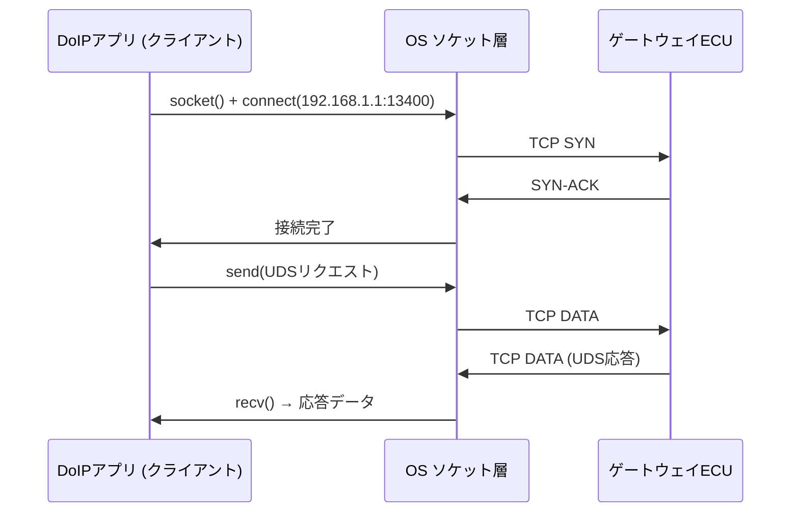

## 概要
**ソケット**は、IPアドレスとポート番号の組で表される「通信のエンドポイント(出入口)」であり、プログラムがネットワーク通信を行うためのAPIでもあります。アプリはソケットを開いてデータを読み書きします。

## なぜ必要か
OSやネットワークの複雑さを隠し、アプリ開発者が「ファイルの読み書き」に近い感覚で通信を扱えるようにするのが**ソケット**です。TCP/UDP通信を実装する際の基本単位です。

## 自動運転での利用例
ECU上のアプリはUDP/TCP**ソケット**を開いて他ECUと通信します。SOME/IPミドルウェアも内部ではソケットを使ってメッセージを送受信しています。

## 関連用語
**ソケット**は [[port]] と IP の組で表され、[[tcp]] / [[udp]] のどちらでも使えます。通信の中身を観測するには [[wireshark]] を使います。

## 次に学ぶべき内容
通信を実際に「見る」ためのツール、[[wireshark]] へ進みましょう。

## 図解

