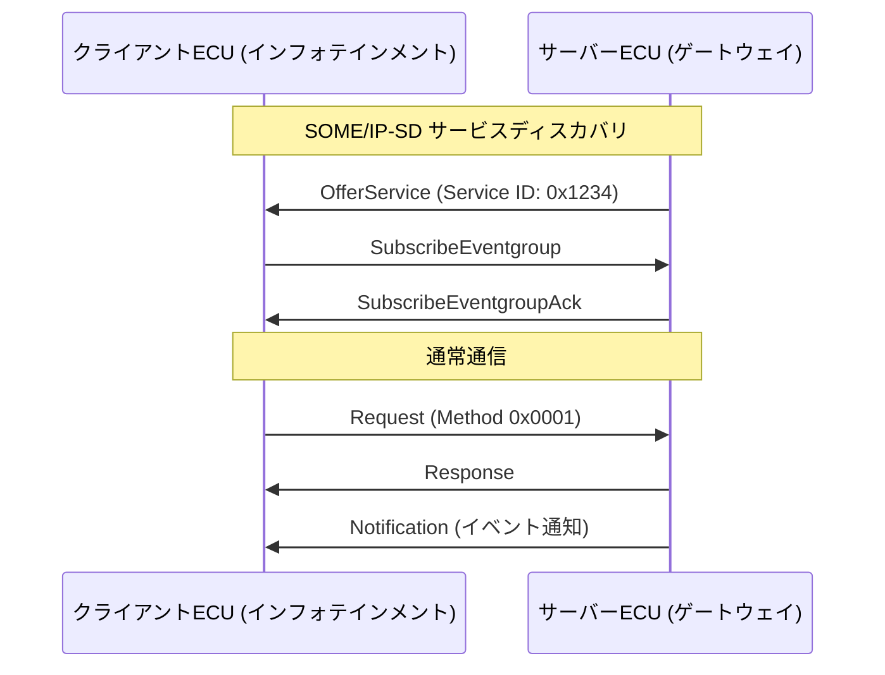

## 概要
SOME/IP(Scalable service-Oriented MiddlewarE over IP)は、車載ECU同士が「サービス」をやり取りするためのIP上のミドルウェアです。メソッド呼び出し(RPC)、イベント通知(Pub/Sub)、サービスディスカバリ(SOME/IP-SD)を提供します。

## なぜ必要か
ゾーン/ドメイン型アーキテクチャでは、ECUが提供する機能を他のECUが柔軟に利用したくなります。SOME/IPは「どのECUがどのサービスを提供するか」を動的に発見し、IP上で疎結合な通信を実現します。

## 自動運転での利用例
カメラECUが提供する物体検出サービスを、複数の制御ECUが購読(subscribe)して受け取る、といった使い方をします。低遅延通知は [[udp]]、大きなデータや確実性が必要な通信は [[tcp]] 上で行われます。SOME/IP-SDは UDP 30490 番を使います。

## 関連用語
土台のトランスポートが [[udp]] / [[tcp]]、上位の標準フレームワークが [[autosar]] です。

## 次に学ぶべき内容
これらを統合する車載ソフト標準、[[autosar]] を学びましょう。

## 図解

