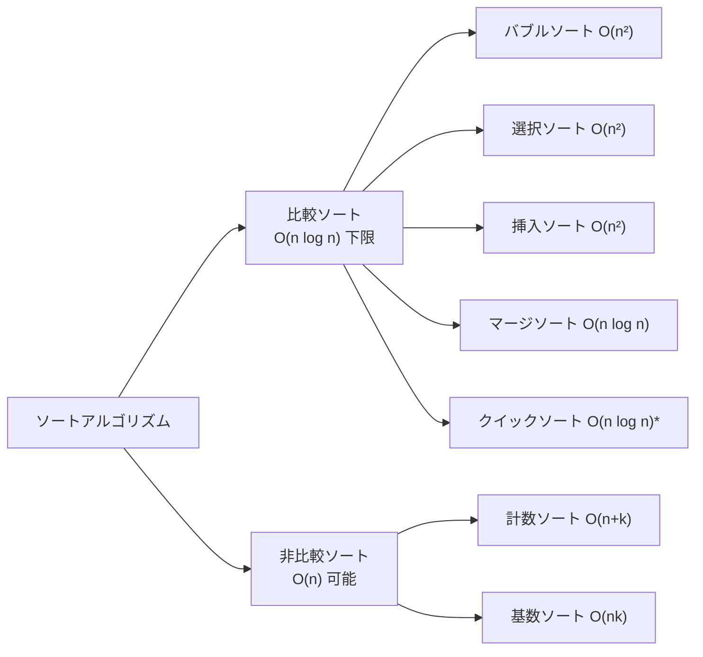

## ソートはなぜ重要か

ソートは単体でも使いますが、**「二分探索を使うための前処理」「重複の検出」「順位付け」** など、他のアルゴリズムの前提としても登場します。面接でもよく問われる基礎中の基礎です。



## 各アルゴリズムの比較

| アルゴリズム | 平均 | 最悪 | 空間 | 安定 | 特徴 |
|------------|------|------|------|------|------|
| バブルソート | O(n²) | O(n²) | O(1) | ✅ | 実装簡単・実用的でない |
| 選択ソート | O(n²) | O(n²) | O(1) | ❌ | スワップ回数が少ない |
| 挿入ソート | O(n²) | O(n²) | O(1) | ✅ | 小・ほぼソート済みに強い |
| マージソート | O(n log n) | O(n log n) | O(n) | ✅ | 安定・連結リストに最適 |
| クイックソート | O(n log n) | O(n²) | O(log n) | ❌ | 実際は最速・キャッシュ効率◎ |
| ヒープソート | O(n log n) | O(n log n) | O(1) | ❌ | 最悪保証あり・実際はやや遅い |
| 計数ソート | O(n+k) | O(n+k) | O(k) | ✅ | 整数限定・範囲 k が小さい場合 |
| Python `sorted` | O(n log n) | O(n log n) | O(n) | ✅ | Timsort（挿入+マージ） |

## バブルソート

隣り合う要素を比較・交換して大きい値を「泡のように」末尾へ浮かせる。

```python
def bubble_sort(arr):
    n = len(arr)
    for i in range(n):
        swapped = False
        for j in range(n - i - 1):
            if arr[j] > arr[j + 1]:
                arr[j], arr[j + 1] = arr[j + 1], arr[j]
                swapped = True
        if not swapped:   # 交換なし = すでにソート済み → O(n) で終了
            break
    return arr

print(bubble_sort([64, 34, 25, 12, 22, 11, 90]))
# [11, 12, 22, 25, 34, 64, 90]
```

**視覚的な動作**：
```
初期: [5, 3, 8, 1, 9]
Pass1: [3, 5, 1, 8, 9]  ← 9が末尾へ
Pass2: [3, 1, 5, 8, 9]  ← 8が確定
Pass3: [1, 3, 5, 8, 9]  ← 完了
```

## 挿入ソート

「手札のトランプ」を整える感覚。左から順に適切な位置へ差し込む。

```python
def insertion_sort(arr):
    for i in range(1, len(arr)):
        key = arr[i]
        j = i - 1
        while j >= 0 and arr[j] > key:
            arr[j + 1] = arr[j]
            j -= 1
        arr[j + 1] = key
    return arr

# ほぼソート済みの配列に強い（O(n) に近い）
nearly_sorted = [1, 2, 4, 3, 5, 6, 8, 7]
print(insertion_sort(nearly_sorted))   # [1, 2, 3, 4, 5, 6, 7, 8]
```

```
初期: [5, 3, 8, 1]
i=1: key=3, [5→], [3, 5, 8, 1]
i=2: key=8, そのまま [3, 5, 8, 1]
i=3: key=1, [8→][5→][3→], [1, 3, 5, 8]
```

## マージソート

「分割して統治」の典型例。半分ずつ再帰的にソートし、マージする。

```python
def merge_sort(arr):
    if len(arr) <= 1:
        return arr
    mid   = len(arr) // 2
    left  = merge_sort(arr[:mid])
    right = merge_sort(arr[mid:])
    return _merge(left, right)

def _merge(left, right):
    result = []
    i = j = 0
    while i < len(left) and j < len(right):
        if left[i] <= right[j]:   # <= で安定ソートを保証
            result.append(left[i]); i += 1
        else:
            result.append(right[j]); j += 1
    return result + left[i:] + right[j:]

arr = [38, 27, 43, 3, 9, 82, 10]
print(merge_sort(arr))   # [3, 9, 10, 27, 38, 43, 82]
```

```
[38, 27, 43, 3, 9, 82, 10]
    分割
[38, 27, 43]    [3, 9, 82, 10]
  分割              分割
[38] [27,43]  [3,9]  [82,10]
      ↓マージ    ↓マージ   ↓マージ
    [27,38,43] [3,9]  [10,82]
         ↓マージ        ↓マージ
       [27,38,43]    [3,9,10,82]
                ↓マージ
         [3,9,10,27,38,43,82]
```

## クイックソート

実際のソートで最もよく使われる。ピボットで分割し、再帰的にソート。

```python
def quicksort(arr, lo=0, hi=None):
    if hi is None:
        hi = len(arr) - 1
    if lo >= hi:
        return arr
    pivot_idx = _partition(arr, lo, hi)
    quicksort(arr, lo, pivot_idx - 1)
    quicksort(arr, pivot_idx + 1, hi)
    return arr

def _partition(arr, lo, hi):
    # 三数中間法でピボット選択（最悪ケースを避ける）
    mid = (lo + hi) // 2
    candidates = [(arr[lo], lo), (arr[mid], mid), (arr[hi], hi)]
    candidates.sort()
    pivot_idx = candidates[1][1]
    arr[pivot_idx], arr[hi] = arr[hi], arr[pivot_idx]

    pivot = arr[hi]
    i = lo - 1
    for j in range(lo, hi):
        if arr[j] <= pivot:
            i += 1
            arr[i], arr[j] = arr[j], arr[i]
    arr[i + 1], arr[hi] = arr[hi], arr[i + 1]
    return i + 1

arr = [10, 80, 30, 90, 40, 50, 70]
print(quicksort(arr))   # [10, 30, 40, 50, 70, 80, 90]
```

**なぜ速いか**：
- キャッシュ局所性が高い（配列をインプレースで操作）
- 平均 O(n log n) で定数係数が小さい
- ピボットの選び方で最悪 O(n²) を回避できる

## 計数ソート（整数限定）

値の範囲が決まっているとき、O(n) でソートできます。

```python
def counting_sort(arr, max_val=None):
    if not arr:
        return arr
    if max_val is None:
        max_val = max(arr)
    count = [0] * (max_val + 1)
    for x in arr:
        count[x] += 1
    result = []
    for val, cnt in enumerate(count):
        result.extend([val] * cnt)
    return result

# 0〜9 の数字のみで構成されたデータ
grades = [3, 1, 4, 1, 5, 9, 2, 6, 5, 3, 5]
print(counting_sort(grades, max_val=9))
# [1, 1, 2, 3, 3, 4, 5, 5, 5, 6, 9]
```

## Python 組み込みのソート（Timsort）

実務では `sorted()` か `list.sort()` を使えばOK。

```python
data = [3, 1, 4, 1, 5, 9, 2, 6]

# 昇順
print(sorted(data))           # [1, 1, 2, 3, 4, 5, 6, 9]

# 降順
print(sorted(data, reverse=True))

# キーを指定
words = ["banana", "apple", "cherry", "date"]
print(sorted(words, key=len))          # 長さでソート: ['date', 'apple', 'banana', 'cherry']
print(sorted(words, key=lambda w: w[-1]))  # 末尾文字でソート

# 複数キー
students = [("Alice", 90), ("Bob", 85), ("Carol", 90), ("Dave", 85)]
# スコア降順 → 名前昇順
print(sorted(students, key=lambda s: (-s[1], s[0])))
# [('Alice', 90), ('Carol', 90), ('Bob', 85), ('Dave', 85)]

# オブジェクトのソート
from dataclasses import dataclass, field

@dataclass
class Student:
    name: str
    score: int

students = [Student("Alice", 90), Student("Bob", 85), Student("Carol", 92)]
print(sorted(students, key=lambda s: s.score, reverse=True))
```

## 安定ソートとは

**安定ソート**: 等しい要素の相対順序が保たれるソート。

```python
data = [("Alice", 90), ("Bob", 85), ("Carol", 85), ("Dave", 90)]
# Bob と Carol は同スコア → 元の順序を保ちたい

# Python の sorted は安定ソート（Timsort）
by_score = sorted(data, key=lambda x: x[1])
print(by_score)
# [('Bob', 85), ('Carol', 85), ('Alice', 90), ('Dave', 90)]
# Bob が Carol より前 ← 元の順序が保たれている ✅
```

## ソートアルゴリズムの選び方

```
データの特徴で選ぶ:
  ├─ 整数で値の範囲が小さい    → 計数ソート O(n)
  ├─ ほぼソート済み            → 挿入ソート（実質 O(n)）
  ├─ 安定ソートが必要          → マージソート or Python sorted
  ├─ メモリを節約したい        → クイックソート or ヒープソート
  ├─ 連結リストのソート        → マージソート
  └─ それ以外（実務）          → Python の sorted() を使う ← これが一番
```

## まとめ

- **実務では `sorted()` または `.sort()` を使う**（Timsort は O(n log n) で安定）
- バブル・選択・挿入ソートは O(n²) → 学習目的か小規模データ用
- マージソートは安定・最悪 O(n log n) 保証・追加メモリ O(n)
- クイックソートは平均最速・最悪 O(n²) だがピボット選択で回避可能
- 整数かつ値域が小さければ計数ソートで O(n)
