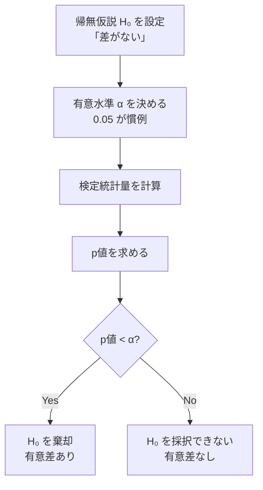

## 概要
「この薬は本当に効いているのか？」「A/Bテストで施策Bが良かったのは偶然？」――データから**意味のある結論を引き出す**ための道具が統計学です。機械学習の精度評価・A/Bテスト・センサーデータ分析など、データを扱うすべての場面の基盤となります。「p値が0.05未満なら正しい」という誤解が多い分野でもあるため、各指標の意味を正確に理解することが重要です。PythonではSciPyとStatsmodelsが主要ライブラリです。

## 活用シーン
- **A/Bテスト**: UIの変更が売上に本当に効果があったかをt検定で判断
- **センサー監視**: 工場センサーの測定値が正常範囲かをz-スコアで検知
- **品質管理**: 製品のばらつきが許容範囲内かを信頼区間で評価

## 主要な数式

**標本平均**と**不偏分散**：

$$\bar{x} = \frac{1}{n}\sum_{i=1}^{n} x_i, \qquad s^2 = \frac{1}{n-1}\sum_{i=1}^{n}(x_i - \bar{x})^2$$

**正規分布**の確率密度関数：

$$f(x) = \frac{1}{\sqrt{2\pi\sigma^2}} \exp\left(-\frac{(x-\mu)^2}{2\sigma^2}\right)$$

**標準化（z スコア）**：観測値が平均から標準偏差何個分離れているか。

$$z = \frac{x - \mu}{\sigma}$$

**標準誤差**と**95% 信頼区間**（母分散未知、正規近似）：

$$\mathrm{SE} = \frac{s}{\sqrt{n}}, \qquad \bar{x} \pm 1.96\,\frac{s}{\sqrt{n}}$$

**共分散**と**相関係数**（ピアソン）：

$$\mathrm{Cov}(X,Y) = \frac{1}{n}\sum_{i=1}^{n}(x_i-\bar{x})(y_i-\bar{y}), \qquad r = \frac{\mathrm{Cov}(X,Y)}{s_X \, s_Y}$$

**ベイズの定理**：

$$P(A \mid B) = \frac{P(B \mid A)\,P(A)}{P(B)}$$

## 基本統計量

> 💡 **実務ポイント:** `np.std(data)` はデフォルトで母標準偏差。標本データには `ddof=1` を指定して不偏標準偏差を使うこと。

```python
import numpy as np
import scipy.stats as stats
import matplotlib.pyplot as plt
import seaborn as sns

np.random.seed(42)
data = np.random.normal(loc=170, scale=8, size=300)   # 身長データ（cm）

print(f"平均:     {np.mean(data):.2f}")
print(f"中央値:   {np.median(data):.2f}")
print(f"標準偏差: {np.std(data, ddof=1):.2f}")   # 不偏標準偏差
print(f"分散:     {np.var(data, ddof=1):.2f}")
print(f"歪度:     {stats.skew(data):.4f}")         # 0 = 対称
print(f"尖度:     {stats.kurtosis(data):.4f}")     # 0 = 正規分布
print(f"95%信頼区間: {stats.t.interval(0.95, len(data)-1, np.mean(data), stats.sem(data))}")
```

## 主要な確率分布

```python
fig, axes = plt.subplots(2, 3, figsize=(14, 8))

x = np.linspace(-4, 4, 300)

# 正規分布（連続）
axes[0,0].plot(x, stats.norm.pdf(x), color="steelblue", lw=2)
axes[0,0].set_title("正規分布 N(0,1)")

# t分布（小標本）
for df in [1, 5, 30]:
    axes[0,1].plot(x, stats.t.pdf(x, df), label=f"df={df}", lw=2)
axes[0,1].plot(x, stats.norm.pdf(x), "k--", label="Normal", lw=1.5)
axes[0,1].set_title("t分布")
axes[0,1].legend(fontsize=8)

# カイ二乗分布
x_chi = np.linspace(0, 20, 300)
for df in [2, 4, 8]:
    axes[0,2].plot(x_chi, stats.chi2.pdf(x_chi, df), label=f"k={df}", lw=2)
axes[0,2].set_title("カイ二乗分布")
axes[0,2].legend(fontsize=8)

# ポアソン分布（離散）
k = np.arange(0, 20)
for lam in [1, 4, 8]:
    axes[1,0].bar(k + lam*0.1, stats.poisson.pmf(k, lam), width=0.3, alpha=0.6, label=f"λ={lam}")
axes[1,0].set_title("ポアソン分布")
axes[1,0].legend(fontsize=8)

# 二項分布
k = np.arange(0, 21)
for p in [0.3, 0.5, 0.7]:
    axes[1,1].plot(k, stats.binom.pmf(k, 20, p), "o-", label=f"p={p}", lw=2)
axes[1,1].set_title("二項分布 n=20")
axes[1,1].legend(fontsize=8)

# 一様分布
axes[1,2].fill_between([0, 1], [1, 1], color="steelblue", alpha=0.5)
axes[1,2].set_ylim(0, 1.5)
axes[1,2].set_title("一様分布 U(0,1)")

plt.tight_layout()
plt.show()
```

## 正規分布の可視化


## 仮説検定の流れ



## t検定（平均の比較）

> 💡 **実務ポイント:** 独立2標本t検定は `equal_var=False`（Welchのt検定）を使うのが安全。分散が等しいという仮定を置かなくてよい。

```python
group_a = np.random.normal(75, 10, 50)   # A群のスコア
group_b = np.random.normal(80, 12, 50)   # B群のスコア

# 独立2標本t検定
t_stat, p_val = stats.ttest_ind(group_a, group_b, equal_var=False)  # Welchのt検定
print(f"t統計量: {t_stat:.3f}  p値: {p_val:.4f}")
print("有意差あり" if p_val < 0.05 else "有意差なし")

# 対応のあるt検定（ビフォー/アフター）
before = np.random.normal(70, 8, 30)
after  = before + np.random.normal(5, 3, 30)   # 介入後に平均+5
t2, p2 = stats.ttest_rel(before, after)
print(f"\n対応t検定: t={t2:.3f}, p={p2:.4f}")

# 効果量（Cohen's d）
pooled_std = np.sqrt((group_a.std()**2 + group_b.std()**2) / 2)
cohens_d   = (group_b.mean() - group_a.mean()) / pooled_std
print(f"効果量 Cohen's d: {cohens_d:.3f}")   # 0.2=小 0.5=中 0.8=大
```

## 分散分析（ANOVA）

```python
# 3グループ以上の平均差を一度に検定
group_c = np.random.normal(85, 10, 50)

f_stat, p_anova = stats.f_oneway(group_a, group_b, group_c)
print(f"一元配置ANOVA: F={f_stat:.3f}, p={p_anova:.4f}")

# 多重比較（Tukey HSD）
from statsmodels.stats.multicomp import pairwise_tukeyhsd
import pandas as pd

data_all    = np.concatenate([group_a, group_b, group_c])
labels_all  = ["A"]*50 + ["B"]*50 + ["C"]*50
tukey = pairwise_tukeyhsd(data_all, labels_all, alpha=0.05)
print(tukey.summary())
```

## 相関と回帰の統計的検定

```python
x = np.random.randn(100)
y = 0.6 * x + np.random.randn(100) * 0.8

# ピアソン相関係数（線形）
r, p = stats.pearsonr(x, y)
print(f"ピアソンr: {r:.3f}  p値: {p:.4f}")

# スピアマン相関（ノンパラ）
rho, p_s = stats.spearmanr(x, y)
print(f"スピアマンρ: {rho:.3f}  p値: {p_s:.4f}")

# 正規性の検定
_, p_norm = stats.shapiro(x[:50])   # Shapiro-Wilk（n<=50）
print(f"Shapiro-Wilk p値: {p_norm:.4f} ({'正規' if p_norm > 0.05 else '非正規'})")
```

## よくある間違いと対処法

1. **p値の誤解** → `p < 0.05` は「差がある確率95%」ではない。「帰無仮説が正しい場合にこれ以上極端なデータが出る確率が5%未満」という意味。効果量（Cohen's d）も合わせて確認する。
2. **相関≠因果** → ピアソン相関が高くても因果関係は証明できない。「アイスの売上と溺死者数が相関する」は気温という交絡変数のせい。
3. **多重検定の問題** → 20個の仮説を同時に検定するとランダムに有意差が出る。Bonferroni補正や FDR制御（`statsmodels.stats.multitest`）を使う。
4. **正規性の確認なしにt検定** → `stats.shapiro()` で正規性を確認し、非正規ならWilcoxon順位和検定などノンパラメトリック手法を使う。

## まとめ

- 平均・標準偏差・信頼区間はどんなデータ分析でも最初に確認する基本統計量
- t検定は「2グループの平均差が偶然かどうか」を判断するツール（p値と効果量を両方見る）
- 相関係数（ピアソン: 線形、スピアマン: 順位）は因果関係を証明しない
- 多重比較には Tukey HSD または Bonferroni 補正を使う
- 正規性が疑われるときはノンパラメトリック検定（Wilcoxon等）に切り替える

## 次に学ぶべき内容
時系列データの統計的分析は [[time-series-analysis]] で学びましょう。
