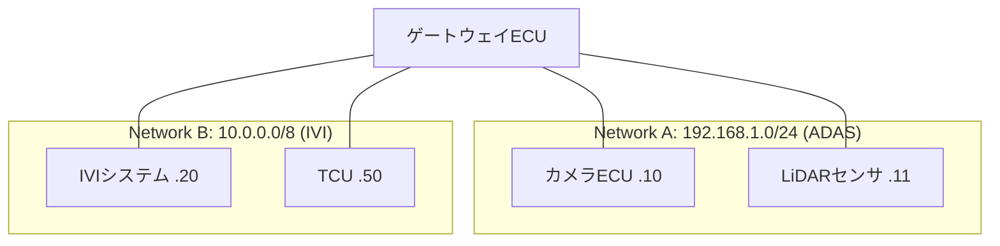

## 概要
サブネットは、[[ip]] アドレス空間を小さなネットワークに区切る考え方です。「ネットワーク部」と「ホスト部」を**サブネットマスク**(例 `255.255.255.0` / **CIDR**表記 `/24`)で分け、どこまでが同じネットワークかを定めます。

## なぜ必要か
すべての機器を1つの巨大なネットワークに置くと、通信効率も管理性も悪化します。サブネットで適切に区切ることで、ブロードキャストの範囲を限定し、ルーティングや管理をしやすくします。

## 自動運転での利用例
ゾーンアーキテクチャの車両では、ゾーンごとにサブネットを割り当てて管理することがあります。あるECUと別ECUが「同じサブネットか」で、直接通信できるかルータ越しかが決まります。

## 関連用語
区切る対象が [[ip]]、アドレス自動割り当てが [[dhcp]]、同一サブネット内の到達に使うのが [[mac-address]] です。

## 次に学ぶべき内容
IPアドレスを自動配布する [[dhcp]] を学びましょう。

## 図解

