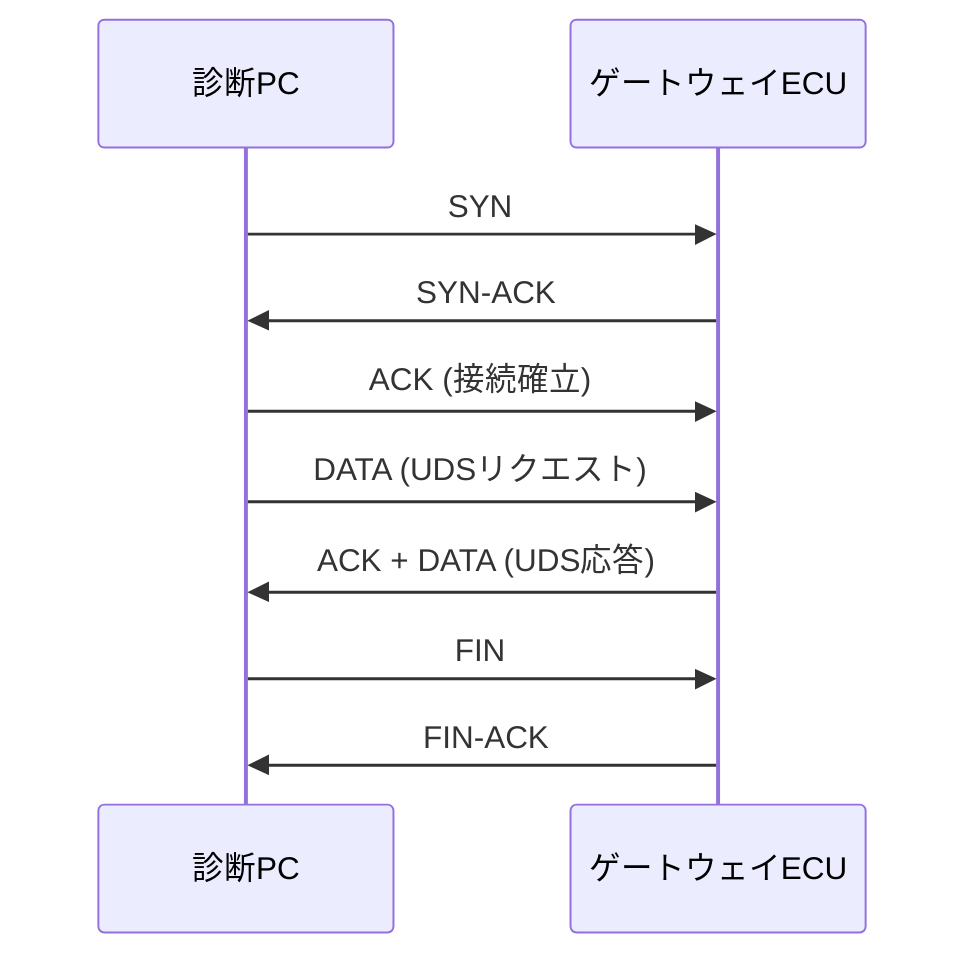

## 概要
TCP(Transmission Control Protocol)はコネクション型のトランスポート層プロトコルです。3wayハンドシェイクで接続を確立し、再送制御・順序保証・フロー制御により「データが確実に正しい順で届く」ことを保証します。

## なぜ必要か
通信路ではパケットの欠落や順序入れ替わりが起こります。TCPはこれを自動で補正するため、アプリは信頼性を意識せずにデータを送れます。確実性が求められる場面の定番です。

## 自動運転での利用例
車載診断通信の DoIP(Diagnostics over IP)や、大きなファイル/ソフトウェア更新(OTA)の転送に使われます。SOME/IPでも、大きなペイロードや確実性が必要な通信はTCP上で行われます。

## 関連用語
対照的な軽量プロトコルが [[udp]]、通信の入り口が [[port]] と [[socket]]、土台が [[ip]] です。

## 次に学ぶべき内容
低遅延を優先する [[udp]] との違いを学びましょう。

## 図解

