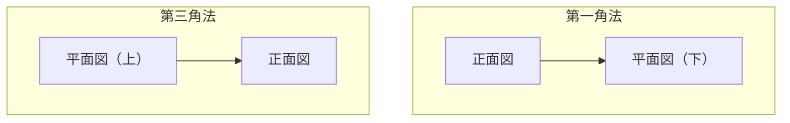

## 第三角投影法とは

**第三角投影法（Third-angle projection）** は、立体を3つの基準面（正面・水平・側面）に投影して描く製図法で、アメリカ・日本の機械製図（JIS、ASME Y14.3）で広く使われています。

立体を「透明なガラス箱」の中に置き、観察者の**手前から見たまま**を投影面に映すのが特徴です（第一角法は逆に、立体の向こう側に投影面を置きます）。


## 三面図の基本配置

第三角法では、**正面図を中心**に、

- **平面図（Top View）**：正面図の **上**
- **右側面図（Right Side View）**：正面図の **右**
- 左側面図が必要な場合は正面図の左、底面図は正面図の下

という決まった配置で並べます。


この配置を守ることで、図面を見る人は正面図を中心に視線を上下左右に動かすだけで、対象物の幅・奥行き・高さの関係を読み取れます。

## 立体から三面図を作る

次のL字形のブロックを例に、3つの図を作ってみましょう。


| 図 | 見る方向 | 表す情報 |
|---|---------|---------|
| ① 立体 | （斜めから見た参考図） | 全体形状の確認用 |
| ② 正面図（Front View） | −Y方向（手前から） | **幅（X）× 高さ（Z）** |
| ③ 平面図（Top View） | −Z方向（上から） | **幅（X）× 奥行き（Y）** |
| ④ 右側面図（Right Side View） | +X方向（右から） | **奥行き（Y）× 高さ（Z）** |

### 読み取りのポイント

- 正面図と平面図は **幅（X方向の長さ）が一致** する（縦の補助線でつながる）
- 正面図と右側面図は **高さ（Z方向の長さ）が一致** する（横の補助線でつながる）
- 平面図と右側面図は **奥行き（Y方向の長さ）が一致** する

```
        平面図
          ↑
          │ 幅が一致
正面図 ──┼──── 右側面図
          │ 高さが一致
```

奥行きの一致は、平面図と右側面図の間で **45°の補助線（マイター線）** を使って転写するのが製図の定石です。

## 隠れ線・中心線の描き方

- **外形線（見える輪郭）**：太い実線
- **隠れ線（裏に隠れた輪郭）**：破線
- **中心線**：一点鎖線（細い線—長い線—短い線の繰り返し）

```
外形線:  ───────────
隠れ線:  - - - - - - -
中心線:  ─ ─ · ─ ─ · ─ ─
```

段差や穴がある部品では、表からは見えない稜線も「隠れ線」として破線で描き込むのが重要です。描き忘れると、図面だけ見た人が形状を誤解してしまいます。

## 第一角法との違い（再確認）

| 項目 | 第一角法（JIS旧来・欧州） | 第三角法（ASME・米国・現在のJIS推奨） |
|------|------------------------|----------------------------------|
| 投影面の位置 | 立体の向こう側 | 立体の手前側（観察者側） |
| 平面図の位置 | 正面図の **下** | 正面図の **上** |
| 右側面図の位置 | 正面図の **左** | 正面図の **右** |
| 図面の記号 | ⊖（円錐の頂点が左） | ⊖（円錐の頂点が右、第一角法と鏡像） |



混在すると図面の解釈を誤るため、**図面の表題欄に第一角法／第三角法の記号を必ず明記**します。

## 演習問題

以下の図形について、第三角投影法での三面図を考えてみましょう（紙に手描きしてから答えを確認するのがおすすめです）。

### 演習1：直方体に円柱の穴があるブロック

幅60mm・奥行き40mm・高さ20mmの直方体の中心に、直径20mmの円柱の貫通穴が高さ方向に空いている。

**問**：正面図・平面図・右側面図をそれぞれ簡単に説明せよ。

<details>
<summary>解説を見る</summary>

- **正面図**：幅60mm×高さ20mmの長方形。円柱の穴は高さ方向に貫通しているため、正面から見ると**穴の外形が見えない**ので、中心線（一点鎖線）のみが縦に1本入る。
- **平面図**：幅60mm×奥行き40mmの長方形の中央に、直径20mmの**円（実線）**が見える（穴が上から丸見えのため）。
- **右側面図**：奥行き40mm×高さ20mmの長方形。正面図と同様、穴は奥行き方向ではなく高さ方向に貫通しているため外形線としては見えず、中心線のみ。

ポイント：**穴の軸方向と同じ方向から見た図には円が見え、軸と垂直な方向から見た図には中心線だけが入る**。
</details>

### 演習2：L字形ブロックの右側面図の高さ

本文中のL字形ブロック（ベース：幅4×奥行き3×高さ1、上段：幅2×奥行き1×高さ1を左奥に追加）について、右側面図の全体の高さは何になるか。

<details>
<summary>解説を見る</summary>

右側面図はY-Z平面（奥行き×高さ）を表す図です。

- ベース部分の高さ：1（Z: 0→1）
- 上段部分の高さ：1（Z: 1→2）

立体の最大高さは Z=0 から Z=2 なので、**右側面図全体の高さは 2**（ベースの高さ1 + 上段の高さ1）になります。正面図と右側面図は高さが一致するため、正面図の高さも同じく2であることが確認できます。
</details>

### 演習3：第一角法と第三角法の見分け方

ある図面の表題欄に「正面図の右に側面図が描かれている」配置が確認できた。これは第一角法・第三角法のどちらか。

<details>
<summary>解説を見る</summary>

**第三角法**。第三角法では右側面図を正面図の**右**に配置するのがルール（観察者側にガラス箱があり、見たままを投影するため）。第一角法では右側面図は正面図の**左**に配置されます。
</details>

## まとめ

- 第三角投影法は **正面図を中心に、上＝平面図、右＝右側面図** という配置ルールを持つ
- 図同士は **補助線（マイター線含む）** で寸法の一致を保ちながら描く
- 隠れた形状は **破線（隠れ線）**、対称軸や穴の中心は **一点鎖線（中心線）** で表現する
- 第一角法との混在を避けるため、図面には投影法の記号を明記する
- 実際の設計では3DCADから自動的に三面図を生成することが多いが、**手で描いて考える練習**が形状理解の力を養う
