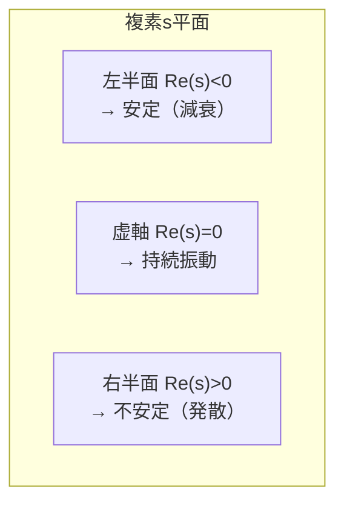

## 伝達関数とは

**伝達関数（Transfer function）** とは、ラプラス変換した「出力」と「入力」の比のことです。初期値ゼロのとき、

$$
G(s) = \frac{Y(s)}{U(s)} = \frac{\text{出力のラプラス変換}}{\text{入力のラプラス変換}}
$$

システムを **1つの分数式** に凝縮したもので、「入力を入れたら出力がどう変わるか」を完全に表します。[[laplace-transform]] で見たばね・質量・ダンパ系なら、

$$
G(s) = \frac{Y(s)}{F(s)} = \frac{1}{m s^2 + c s + k}
$$

がその伝達関数です。


## 分子・分母の意味：零点と極

伝達関数は一般に多項式の比で書けます。

$$
G(s) = \frac{b_m s^m + \cdots + b_1 s + b_0}{a_n s^n + \cdots + a_1 s + a_0}
= K\frac{(s - z_1)(s - z_2)\cdots}{(s - p_1)(s - p_2)\cdots}
$$

- **零点（zero）** \(z_i\)：分子 \(=0\) の根。出力を弱める周波数
- **極（pole）** \(p_i\)：分母 \(=0\) の根。システムの応答の速さ・振動・安定性を決める

**極の位置がすべて** と言ってよいほど重要です。

## 安定性は極の位置で決まる

$$
\text{システムが安定} \iff \text{すべての極 } p_i \text{ の実部が負（複素平面の左半面）}
$$

- 極が **左半面**（\(\mathrm{Re}(p_i) < 0\)）→ 応答は減衰して収束（**安定**）
- 極が **右半面**（\(\mathrm{Re}(p_i) > 0\)）→ 応答が発散（**不安定**）
- 極が **虚軸上** → 持続振動（安定限界）



## 一次系と二次系

### 一次遅れ系

$$
G(s) = \frac{K}{Ts + 1}
$$

- \(K\)：ゲイン（最終的な出力の大きさ）
- \(T\)：時定数（応答の速さ。小さいほど速い）
- 極は \(s = -1/T\)（必ず左半面 → 安定）

### 二次系

$$
G(s) = \frac{\omega_n^2}{s^2 + 2\zeta\omega_n s + \omega_n^2}
$$

- \(\omega_n\)：固有角周波数（振動の速さ）
- \(\zeta\)（ゼータ）：**減衰比**。応答の「暴れ方」を決める最重要パラメータ

| 減衰比 \(\zeta\) | 応答 | 例 |
|---|---|---|
| \(\zeta = 0\) | 持続振動 | 減衰なし |
| \(0 < \zeta < 1\) | 減衰振動（オーバーシュートあり） | 行き過ぎて戻る |
| \(\zeta = 1\) | 臨界制動（最速で振動なし） | 理想的な整定 |
| \(\zeta > 1\) | 過制動（遅いが振動なし） | ゆっくり収束 |

自動駐車では「行き過ぎ（オーバーシュート）」が壁への接触につながるため、\(\zeta\) を 1 近くに設計します（[[auto-parking-control]] 参照）。

## Python（python-control）で扱う

```python
import numpy as np
import control as ct

# 二次系: 固有周波数 wn=2, 減衰比 zeta=0.5
wn, zeta = 2.0, 0.5
G = ct.tf([wn**2], [1, 2*zeta*wn, wn**2])
print(G)

# 極（安定性を決める）
print("極:", ct.poles(G))
```

```
      4
-------------
s^2 + 2 s + 4

極: [-1.+1.732j -1.-1.732j]
```

**数式で表すと**、極は分母 \(s^2 + 2\zeta\omega_n s + \omega_n^2 = 0\) の解

$$
p = -\zeta\omega_n \pm \omega_n\sqrt{\zeta^2 - 1}
$$

で、\(\zeta = 0.5,\ \omega_n = 2\) なら \(p = -1 \pm j\sqrt{3}\)。実部が負なので安定です。

```python
import matplotlib.pyplot as plt

# ステップ応答（入力を1にしたときの出力の時間変化）
t, y = ct.step_response(G)
plt.plot(t, y)
plt.axhline(1.0, ls="--", color="gray")
plt.xlabel("時間 [s]"); plt.ylabel("出力")
plt.title(f"二次系のステップ応答 (ζ={zeta})")
plt.savefig("step_response.png", dpi=120)
```

**数式で表すと**、\(0<\zeta<1\) のステップ応答は減衰振動

$$
y(t) = 1 - \frac{e^{-\zeta\omega_n t}}{\sqrt{1-\zeta^2}}\sin\!\left(\omega_n\sqrt{1-\zeta^2}\,t + \phi\right)
$$

となり、\(\zeta\) が小さいほどオーバーシュート（行き過ぎ）が大きくなります。

## 過渡応答の指標

ステップ応答から読み取る設計指標：

| 指標 | 意味 |
|---|---|
| **立上り時間** \(t_r\) | 出力が目標に近づく速さ |
| **オーバーシュート** \(M_p\) | 目標をどれだけ行き過ぎるか（%） |
| **整定時間** \(t_s\) | 目標の±2〜5%に収まるまでの時間 |
| **定常偏差** \(e_{ss}\) | 最終的に残る目標との誤差 |

オーバーシュートは減衰比だけで決まります。

$$
M_p = \exp\!\left(-\frac{\pi\zeta}{\sqrt{1-\zeta^2}}\right)\times 100\,[\%]
$$

## まとめ

- 伝達関数 \(G(s) = Y(s)/U(s)\) はシステムを1つの分数式に凝縮したもの
- **極**（分母の根）が安定性・応答速度・振動を決める。左半面なら安定
- 二次系は **固有周波数 \(\omega_n\)** と **減衰比 \(\zeta\)** で性格が決まる
- ステップ応答の立上り・オーバーシュート・整定時間が設計の評価軸
- 複数の伝達関数を組み合わせて系全体を描くのが [[block-diagram]]
