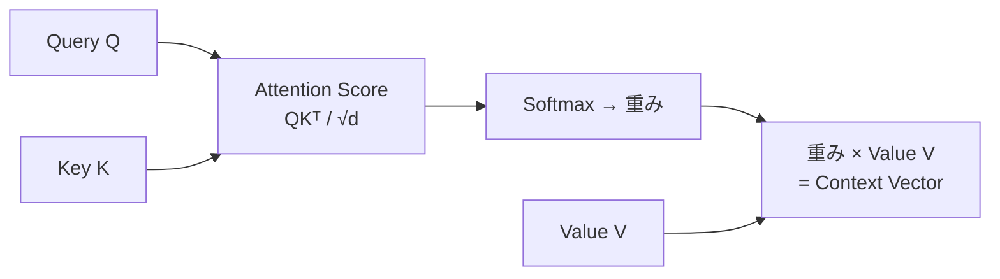

## 概要
Transformerは2017年のGoogle論文「Attention Is All You Need」で発表されたアーキテクチャです。RNN/LSTMを使わず**Self-Attentionのみ**で系列を処理し、並列計算が可能なため大規模データへの学習が劇的に速くなりました。GPT・BERT・LLMすべての基盤技術です。

## なぜTransformerが強いか

| | RNN/LSTM | Transformer |
|---|---|---|
| 並列計算 | ✗（逐次処理） | ✅（全位置同時） |
| 長距離依存 | △（勾配消失） | ✅（Attentionで直接参照）|
| 学習速度 | 遅い | **速い** |
| スケール | 小〜中 | **大規模GPUに最適** |

## Self-Attentionの直感

「I saw a bank near the river」の `bank` の意味は文脈で決まります。Self-Attentionは各単語が他のすべての単語を参照して「どこを注目するか」を重みで表現します。



## Scaled Dot-Product Attention を実装

```python
import torch
import torch.nn as nn
import torch.nn.functional as F
import math

def scaled_dot_product_attention(Q, K, V, mask=None):
    """
    Q, K, V: (batch, heads, seq_len, d_k)
    """
    d_k    = Q.size(-1)
    scores = torch.matmul(Q, K.transpose(-2, -1)) / math.sqrt(d_k)
    if mask is not None:
        scores = scores.masked_fill(mask == 0, float("-inf"))
    weights = F.softmax(scores, dim=-1)
    return torch.matmul(weights, V), weights
```

## Multi-Head Attention

```python
class MultiHeadAttention(nn.Module):
    def __init__(self, d_model: int, n_heads: int):
        super().__init__()
        assert d_model % n_heads == 0
        self.d_k    = d_model // n_heads
        self.n_heads = n_heads
        self.W_q = nn.Linear(d_model, d_model)
        self.W_k = nn.Linear(d_model, d_model)
        self.W_v = nn.Linear(d_model, d_model)
        self.W_o = nn.Linear(d_model, d_model)

    def split_heads(self, x):                          # (B, T, D) → (B, H, T, d_k)
        B, T, D = x.size()
        return x.view(B, T, self.n_heads, self.d_k).transpose(1, 2)

    def forward(self, Q, K, V, mask=None):
        Q = self.split_heads(self.W_q(Q))
        K = self.split_heads(self.W_k(K))
        V = self.split_heads(self.W_v(V))
        attn, weights = scaled_dot_product_attention(Q, K, V, mask)
        attn = attn.transpose(1, 2).contiguous().view(Q.size(0), -1, self.n_heads * self.d_k)
        return self.W_o(attn)
```

## Transformer Encoder Block

```python
class FeedForward(nn.Module):
    def __init__(self, d_model, d_ff, dropout=0.1):
        super().__init__()
        self.net = nn.Sequential(
            nn.Linear(d_model, d_ff),
            nn.GELU(),
            nn.Dropout(dropout),
            nn.Linear(d_ff, d_model),
        )
    def forward(self, x): return self.net(x)


class EncoderBlock(nn.Module):
    def __init__(self, d_model=256, n_heads=8, d_ff=1024, dropout=0.1):
        super().__init__()
        self.attn = MultiHeadAttention(d_model, n_heads)
        self.ff   = FeedForward(d_model, d_ff, dropout)
        self.ln1  = nn.LayerNorm(d_model)
        self.ln2  = nn.LayerNorm(d_model)
        self.drop = nn.Dropout(dropout)

    def forward(self, x, mask=None):
        # Pre-LN (より安定した学習)
        x = x + self.drop(self.attn(self.ln1(x), self.ln1(x), self.ln1(x), mask))
        x = x + self.drop(self.ff(self.ln2(x)))
        return x


class TransformerEncoder(nn.Module):
    def __init__(self, vocab_size, d_model=256, n_heads=8,
                 n_layers=6, d_ff=1024, max_len=512, n_classes=2):
        super().__init__()
        self.embed    = nn.Embedding(vocab_size, d_model)
        self.pos_enc  = nn.Embedding(max_len, d_model)
        self.blocks   = nn.ModuleList([EncoderBlock(d_model, n_heads, d_ff) for _ in range(n_layers)])
        self.ln       = nn.LayerNorm(d_model)
        self.head     = nn.Linear(d_model, n_classes)

    def forward(self, x):
        B, T    = x.shape
        pos     = torch.arange(T, device=x.device).unsqueeze(0)
        h       = self.embed(x) + self.pos_enc(pos)
        for block in self.blocks:
            h = block(h)
        return self.head(self.ln(h[:, 0]))   # [CLS]トークンを使って分類

model = TransformerEncoder(vocab_size=30000, n_classes=5)
x     = torch.randint(0, 30000, (8, 128))
print(model(x).shape)   # (8, 5)
```

## 位置エンコーディング（Sinusoidal）

```python
import numpy as np
import matplotlib.pyplot as plt

def sinusoidal_encoding(max_len=100, d_model=64):
    pos = np.arange(max_len).reshape(-1, 1)
    dim = np.arange(0, d_model, 2)
    enc = np.zeros((max_len, d_model))
    enc[:, 0::2] = np.sin(pos / 10000 ** (dim / d_model))
    enc[:, 1::2] = np.cos(pos / 10000 ** (dim / d_model))
    return enc

pe = sinusoidal_encoding()
plt.figure(figsize=(10, 4))
plt.imshow(pe[:50, :], cmap="RdBu", aspect="auto")
plt.colorbar()
plt.title("位置エンコーディング（50×64）")
plt.xlabel("次元")
plt.ylabel("位置")
plt.tight_layout()
plt.show()
```

## 次に学ぶべき内容
TransformerをスケールアップしたモデルがLLMです。[[llm]] を学びましょう。
