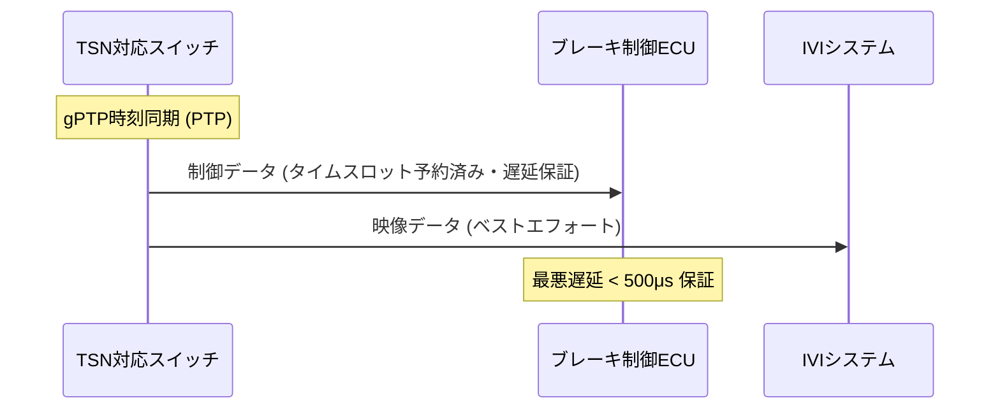

## 概要
TSN(Time-Sensitive Networking)は、標準 [[ethernet]] に「時間保証」を加える一連の規格(IEEE 802.1)です。時刻同期・帯域予約・優先制御により、重要なフレームを決められた時間内に確実に届けます。

## なぜ必要か
通常のEthernetはベストエフォートで、遅延やジッタが保証されません。しかし自動運転の制御通信は「いつ届くか」が安全に直結します。TSNはEthernetにリアルタイムLAN並みの確定性を与え、この要求に応えます。

## 自動運転での利用例
カメラ・センサーの大容量データと、安全に関わる制御コマンドを同じEthernetバックボーンでTSNにより共存させます。[[vlan]] による分離と組み合わせ、制御フレームの遅延を上限内に抑えます。これが [[sdv]] の通信基盤を支えます。

## 関連用語
土台が [[ethernet]]、論理分離が [[vlan]]、応用先が [[adas-comm]] と [[sdv]] です。

## 次に学ぶべき内容
ADAS通信全体の要件 [[adas-comm]] を学びましょう。

## 図解

