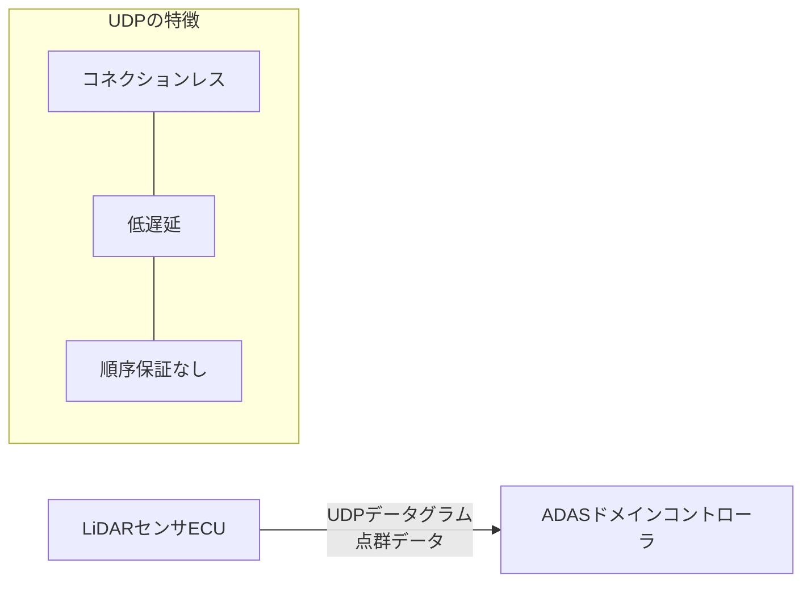

## 概要
UDP(User Datagram Protocol)は**コネクションレス**で、再送や順序保証を持たない軽量なトランスポート層プロトコルです。ハンドシェイクなしで即座に送れるため、**低遅延**・低オーバーヘッドが特長です。

## なぜ必要か
**リアルタイム**性が信頼性より重要な場面があります。例えば映像やセンサーストリームでは、1フレーム届かなくても再送を待つより次のデータを送る方が有益です。UDPはそうした用途に最適です。

## 自動運転での利用例
ADAS ECU間の**低遅延**通信、SOME/IPのイベント通知やサービスディスカバリ(SOME/IP-SD)、カメラ映像ストリームなどで多用されます。遅延が安全に直結する自動運転では、UDPの低遅延性が活きます。

## 関連用語
信頼性重視の [[tcp]] と対をなし、通信エンドポイントは [[socket]] と [[port]] で表します。車載では [[some-ip]] がUDP上で動きます。

## 次に学ぶべき内容
通信の宛先を細かく指定する [[port]] を学びましょう。

## 図解

